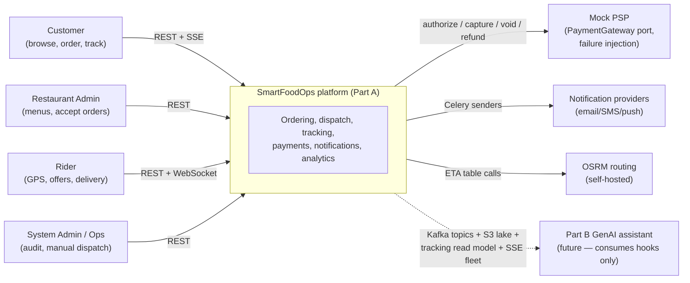
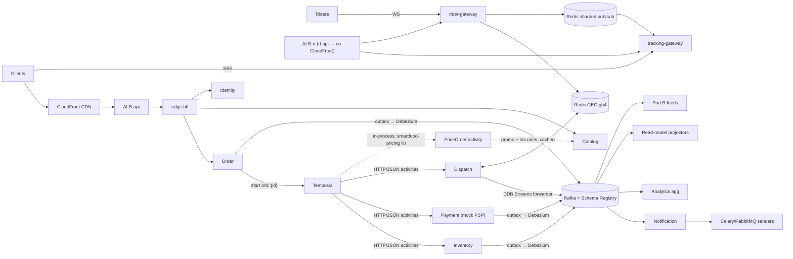
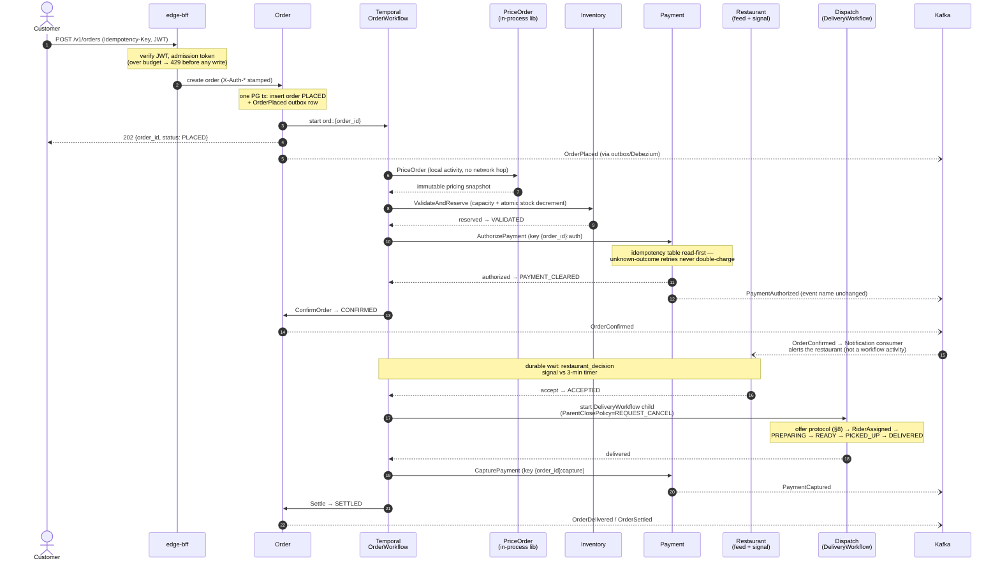
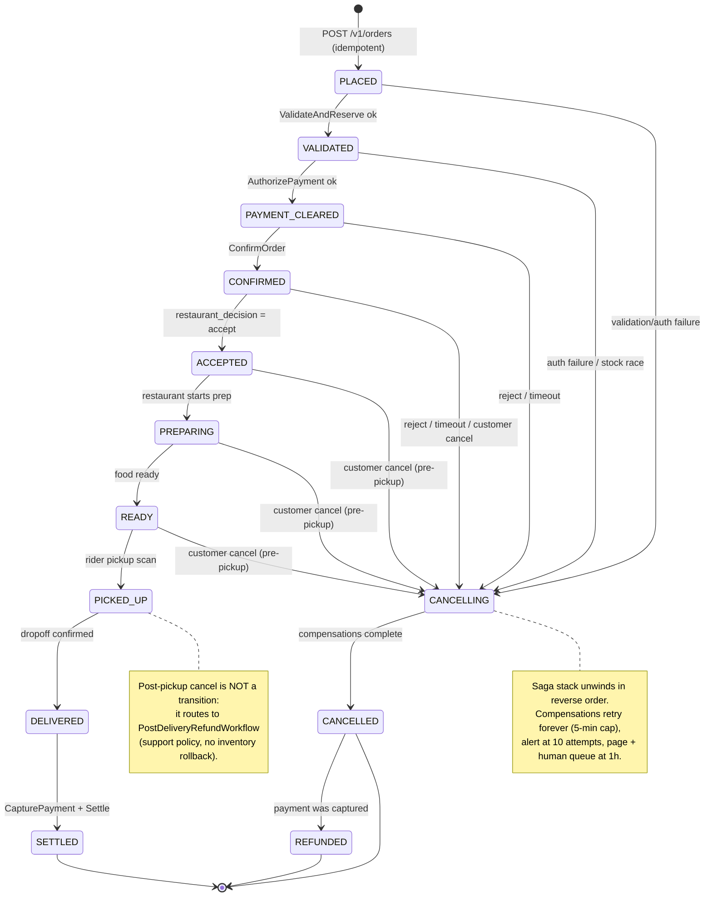
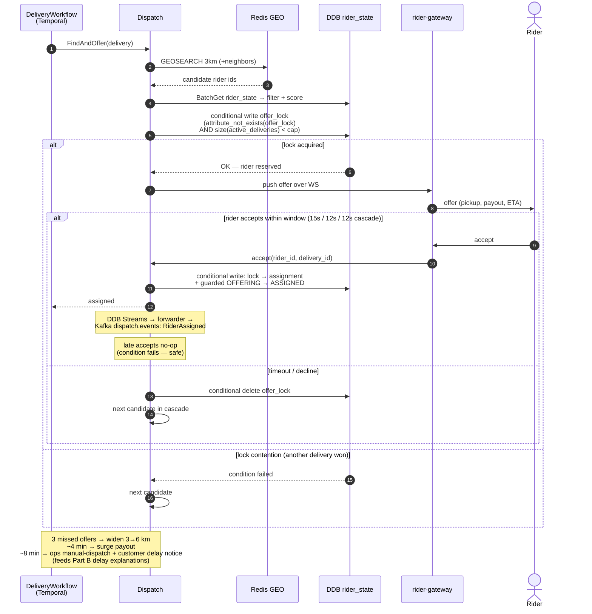
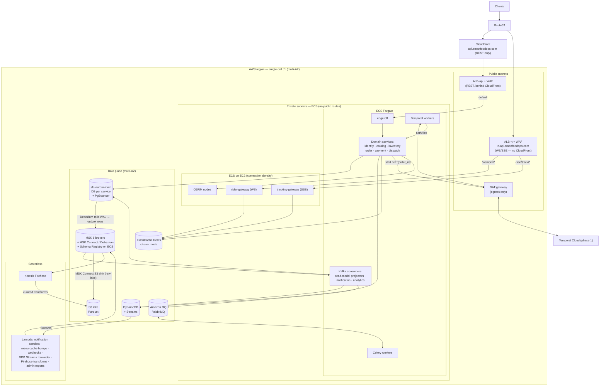

# SmartFoodOps — Architecture (HLD)

**Status**: Part A, built through W2 (single region, single cell `c1`). *(As built, W2: six services + seven libs + React frontend are live — the order lifecycle runs PLACED→SETTLED end to end through the Temporal saga, outbox, and Kafka; 478 tests at an enforced 100% coverage bar. Sections describing dispatch, notification, and analytics remain design-forward; per-section "(As built, W2:)" notes mark where the code refines the design.)*
**Audience**: engineers building or reviewing Part A.
**Source of truth**: this document expands the approved design plan. Requirements live in [PRD.md](PRD.md); sizing math in [capacity-plan.md](capacity-plan.md); onboarding in [local-dev.md](local-dev.md); repo layout in [repo-structure.md](repo-structure.md); individual decisions with alternatives in [adr/](adr/).

---

## Table of contents

1. [Architecture philosophy & invariants](#1-architecture-philosophy--invariants)
2. [System context](#2-system-context)
3. [Container / service view](#3-container--service-view)
4. [Service catalog](#4-service-catalog)
5. [API edge & authentication](#5-api-edge--authentication)
6. [Order lifecycle](#6-order-lifecycle)
7. [Compensation flows](#7-compensation-flows)
8. [Dispatch & real-time tracking](#8-dispatch--real-time-tracking)
9. [Data architecture](#9-data-architecture)
10. [Caching architecture](#10-caching-architecture)
11. [Event backbone](#11-event-backbone)
12. [Scale-out strategy & deferred multi-region](#12-scale-out-strategy--deferred-multi-region)
13. [AWS deployment view](#13-aws-deployment-view)
14. [Observability & SLOs](#14-observability--slos)
15. [Load-shedding ladder](#15-load-shedding-ladder)
16. [Risks](#16-risks)

---

## 1. Architecture philosophy & invariants

An order is a distributed transaction spanning inventory, payment, restaurant acceptance, and dispatch. The system is therefore designed **around the order lifecycle, not around CRUD services**. One Temporal workflow owns each order's saga; everything else is either a synchronous validation inside that saga or an asynchronous reaction to an immutable fact on Kafka.

### Three invariants, enforced everywhere

| # | Invariant | Mechanism |
|---|---|---|
| 1 | Every state change commits **before** it is announced | Transactional outbox in the same DB transaction; Debezium (or the dev poller) publishes to Kafka. No service writes Kafka directly. |
| 2 | Every side-effectful call carries an **idempotency key** | Client keys at the edge; money keys `{order_id}:{op}` at Payment; DDB conditional writes at Dispatch; shared `smartfood-idempotency` library. |
| 3 | Every consumer is **at-least-once + idempotent** | "Exactly-once" is an engineered end-to-end property (guarded transitions, `processed_events` tables, conditional writes) — never an assumed broker feature. |

### Division of labor (enforced in code review)

| Component | Role | Litmus test |
|---|---|---|
| **Temporal** | Decides what happens next: saga control flow, timers, compensation | If losing or double-running a message could corrupt an order or money → it must be a Temporal activity or an outbox-published Kafka event. Never a bare REST call or Celery task. |
| **Kafka** | Tells everyone what already happened: immutable facts, analytics, Part B feeds | Consumers react to facts; they never drive the saga. |
| **Celery + RabbitMQ** | Chores: loss-tolerant work — receipts, thumbnails, reports, cache warming | If a lost task is merely annoying, Celery is fine. |

### Confirmed decisions (user-approved)

1. Domain microservices; serverless (Lambda) evaluated per-API — verdicts in [§13](#13-aws-deployment-view).
2. NoSQL = DynamoDB (LocalStack locally).
3. Payments = mock payment gateway behind a PSP-swappable hexagonal interface, with failure injection.
4. Design ceiling 5–10k orders/sec across cells; **Part A ships one region, one cell** sized at 2,000 orders/s sustained (2,500 provisioned). Multi-region is deferred (§12).

---

## 2. System context

Part B never appears inside Part A: it lands later as ordinary Kafka consumer groups (`partb.embeddings` on `catalog.changes`, `partb.features` on `orders.events`), reads the same tracking read model for delay explanations, and reuses the SSE fleet for streaming LLM responses. Zero Part A changes needed (§11, Part B hooks).

---

## 3. Container / service view

All internal calls are **HTTP/JSON** (§5); Kafka topics are the async interfaces. The WS/SSE gateways bypass edge-bff by design — long-lived connections would pin edge workers and couple scaling.

---

## 4. Service catalog

| Service | Responsibility | Datastore | AWS compute | Interfaces |
|---|---|---|---|---|
| edge-bff | Routing, JWT verification, identity-header stamping, rate limiting/admission, per-client response shaping, read aggregation | Redis (rate limits, JWKS cache) | ECS Fargate behind CloudFront + ALB | REST in; HTTP/JSON to services |
| Identity | Registration, auth, JWTs, roles, addresses | `identity_db` | ECS Fargate | HTTP; JWKS endpoint; `identity.events` |
| Catalog | Restaurant onboarding, menus, pricing rules, promos, availability | `catalog_db` + `catalog:*` Redis keys + CDN | ECS Fargate; **Lambda** for cache version-bump | HTTP; `catalog.changes` CDC |
| Pricing | Price/discount computation, immutable snapshots. **Not a service — a shared library** (`libs/smartfood-pricing`, ADR-0015) consumed in-process by the `PriceOrder` activity (authoritative snapshot) and by the stateless `/v1/quote` endpoint on Order (display estimate; the cart itself is client state — ADR-0017) | None of its own; reads Catalog promo + tax rules (Redis-cached) | Runs inside Order workers and Cart — no deployment unit | In-process function call |
| Inventory | Stock counters, reservations | `inventory_db` (conditional decrements) + `inventory:adm:*` buckets | ECS Fargate | HTTP Reserve/Release; `inventory.events` |
| Order | Order records, state machine, outbox, restaurant order feed, stateless `/v1/quote` estimate endpoint | `order_db` (shard-ready); read models belong to the projectors | ECS Fargate | REST; starts Temporal; `orders.events` |
| Payment | Mock PSP behind hexagonal `PaymentGateway` port (authorize/capture/void/refund, failure injection), double-entry ledger, idempotency table | `payment_db` | ECS Fargate | HTTP activities; `payments.events` |
| Dispatch | Candidate search, scoring/stacking, offer protocol, assignment locks, reassignment | DDB `deliveries`, `rider_state` + Redis GEO | ECS Fargate | HTTP activities; `dispatch.events` via DDB Streams forwarder |
| rider-gateway | Rider WebSocket ingest (GPS), geofence checks, offer push | Redis (latest loc, heartbeats) + DDB breadcrumbs TTL 30d | ECS on **EC2** (connection density needs tuning) | WS; `rider.locations` |
| tracking-gateway | Customer SSE fan-out for live tracking | Redis sharded pub/sub + DDB `order_tracking` read model | ECS on **EC2** | SSE |
| Notification | Decide + log notifications; senders fan out | DDB `notification_log` TTL 90d | Consumer: Fargate; senders: **Lambda** | Consumes all topics; Celery/SQS to providers |
| Analytics | Windowed aggregation, dashboards, lake sink | `sfo-aurora-analytics` (dedicated cluster) + S3 lake (Parquet) | Fargate consumers; raw lake via **MSK Connect S3 sink**; **Firehose + Lambda** for curated transforms | Kafka in; Grafana out |
| Temporal workers | Saga/dispatch/payment/compensation queues | — | ECS Fargate (Temporal Cloud phase 1) | Temporal task queues |
| Celery workers | Receipts, thumbnails, reports, cache warming | — | Fargate + Amazon MQ (RabbitMQ) | RabbitMQ |

Local dev port map (edge-bff 8000 … analytics 8012, nginx gateway 8080) lives in [local-dev.md](local-dev.md).

---

## 5. API edge & authentication

### 5.1 Edge layer

**Decision** ([ADR](adr/)): a single custom FastAPI service (`edge-bff`) behind CloudFront + ALB. **No Kong/Envoy/Traefik in phase 1.** Our edge duties are application logic — per-client response shaping, Redis admission buckets, role gating, identity-header stamping — which is ordinary FastAPI middleware for a Python-first team, not Lua/WASM plugins. Proxy plumbing (TLS, HTTP/2, path routing, health-checked LB, WAF, DDoS) is already covered by ALB + CloudFront. **Revisit trigger**: partner API program or multi-protocol needs → insert Envoy between ALB and services without changing service contracts.

| edge-bff owns | Services own |
|---|---|
| JWT verify (sig/exp/iss/aud), coarse role-per-route gate | Business authorization (ownership, state guards) |
| Identity-header stamping + inbound `X-Auth-*` stripping | Input validation, persistence, domain events |
| Rate limiting / admission token buckets (Redis) | Idempotency keys, saga participation |
| `X-Request-ID` + OTel root span, `traceparent` propagation | Child spans |
| Routing, read aggregation (e.g. order detail = Order read model + latest loc), response shaping | Canonical resources |
| Per-route timeouts, retries on idempotent GETs only, circuit breakers | — |

The edge never writes domain state; writes pass through unshaped to the owning service. It is stateless — no DB access, only Redis + a JWKS cache.

**Protocols**: REST outside, **HTTP/JSON inside — gRPC dropped for phase 1**. Python gRPC's wins don't pay for protoc codegen, `grpcio` asyncio quirks, LB complications, and worse debuggability; the latency budget is dominated by DB round-trips and Temporal scheduling, not JSON parsing. Contracts stay typed via shared Pydantic model packages + OpenAPI-generated clients. Hardening path: move Inventory (the hottest synchronous activity) to gRPC only if profiling shows serialization >10% of p99. Note that pricing needs no protocol at all — it is a library call (ADR-0015), which is the cheapest possible answer to "what protocol should we use."

**Gateway routing** — WS/SSE are separate ECS services, not routed through edge-bff. The realtime plane lives on its **own subdomain**: `rt.api.smartfoodops.com` → a dedicated ALB (ALB-rt), split by listener rules:

| Path | Target | Notes |
|---|---|---|
| `/ws/rider/*` | rider-gateway | WebSocket, rider only (ALB-rt) |
| `/sse/track/*` | tracking-gateway | SSE, customer tracking (ALB-rt) |
| default | edge-bff | All REST — `api.smartfoodops.com` → CloudFront → ALB-api |

CloudFront fronts REST only; **WS/SSE never traverse CloudFront** — not because CloudFront can't proxy them, but because a long-lived stream has zero caching value, CloudFront's origin-timeout model adds friction against the 20s heartbeats, and a dedicated ALB keeps the realtime and REST blast radii apart. ALB idle timeout 300s; heartbeats every 20s.

**Discovery & deployment**: ECS Service Connect, namespace `sfo.local` (`http://order.sfo.local:8000`); service URLs env-injected. CloudFront → ALB-api → edge-bff and Route53 → ALB-rt → gateways (ALBs in public subnets, ECS in private subnets); **domain services have no public routes** — this is load-bearing for the auth trust model. Health: ALB `GET /healthz`, ECS `GET /readyz`; SIGTERM drains. Locally, an nginx container emulates the ALB on `:8080` with identical path-split rules — zero code differs between compose and ECS ([local-dev.md](local-dev.md)).

### 5.2 Authentication & authorization

| Concern | Design |
|---|---|
| Tokens | Identity issues RS256 JWTs, **15-min access** (claims: `sub`, `role` ∈ customer/restaurant_admin/rider/system_admin, scoping `restaurant_id`/`rider_id`, `cell`, `jti`) + **30-day opaque rotating refresh tokens** in PG with family reuse detection — presenting a rotated token revokes the family (theft signal). JWKS endpoint holds two live keys (current+next) for rotation. |
| Verification | **Once, at the edge** (JWKS cached in-process 10 min). Edge strips all inbound `X-Auth-*`, then stamps `X-Auth-Sub`, `X-Auth-Role`, `X-Auth-Restaurant-Id`, `X-Auth-Rider-Id`. Services consume via shared `smartfood-auth` middleware (`AuthContext` dependency) and never parse JWTs — one hardened verifier beats ten mediocre ones. Headers are trustworthy because domain services are network-unreachable except from edge/gateways/peers. Hardening path (documented, deferred): edge-minted short-lived internal JWT, then mTLS — the middleware hides the swap. |
| Service-to-service & Temporal | Internal-network trust phase 1. Calls carry `X-Internal-Caller` (audit) and propagate the original actor's identity (stored in workflow input, restamped by activities); system-initiated work uses `role: system`, `sub: svc:order-worker`. |
| WS auth | JWT in `Sec-WebSocket-Protocol: bearer,<jwt>` (never query strings — they leak into logs); connection bound to `rider_id`; GPS frames attributed from connection state, never payload. |
| SSE auth | `EventSource` can't set headers → `POST /v1/track/ticket` (JWT-authed, ownership-checked) issues a single-use 60s Redis ticket (`GETDEL` on connect). Connections have a uniform-random 15–30 min lifetime (jittered — a fixed lifetime turns one mass-disconnect into a recurring reconnect wave; ADR-0006), then reconnect with fresh credentials. |
| Ownership | Enforced in the owning service, **in the query**: `UPDATE menu_items ... WHERE id=:id AND restaurant_id=:ctx.restaurant_id` (0 rows → 404, not 403 — no existence leaks). Same pattern for customers/riders. `system_admin` bypasses scoping; every admin mutation writes an audit row. |
| Credentials & abuse | argon2id hashing (rehash-on-login when params change); login rate limits per-IP (10/min) and per-account (5 fails → 15-min lockout); uniform errors + success-shaped duplicate-register responses (enumeration resistance). |
| Deferred | OAuth/social login, MFA (hexagonal `CredentialVerifier` seam exists), ABAC, instant `jti` denylist revocation, signed internal tokens/mTLS, partner API keys. |

---

## 6. Order lifecycle

`OrderWorkflow` (`workflow_id = ord::{order_id}`, `REJECT_DUPLICATE`/`USE_EXISTING` — duplicate submits attach to the running execution) is the **single writer** of order transitions. Every transition is guarded (`UPDATE … WHERE status='prev'`; 0 rows → re-read: idempotent-replay no-op or `IllegalTransition`, §6.2), making every retry safe.

### 6.1 Happy path

Key placement properties:

- **PriceOrder** produces an immutable snapshot `{subtotal, discounts, fees, tax, total}`; authorization and refunds are computed **only** from it — money math is replay-deterministic. *(As built, W2: the placement ROUTE prices synchronously via `smartfood-pricing` and persists the snapshot in the placement transaction — the client hears `PRICE_CHANGED` immediately; the `price_order` local activity then LOADS that snapshot from order_db rather than recomputing. Same numbers by construction; the activity name and contract are unchanged.)*
- **ValidateAndReserve** re-reads source of truth (never caches) — browse-time staleness is a display concern only (§10). Restaurant capacity is checked here too, via a conditional increment on `inventory_db.restaurant_load` (`WHERE active < capacity`; 0 rows → `RESTAURANT_AT_CAPACITY`) — the kitchen-slots analogue of the stock decrement, released on terminal states.
- **ConfirmOrder** runs only after all validations — the order is visible as confirmed only after inventory + payment succeed (confirm-only-after-validation requirement).
- SLO: p99 PLACED→CONFIRMED < 6s.

**Action budget.** The happy path across `OrderWorkflow` + `DeliveryWorkflow` is budgeted at **≤12 activities + ≤3 timers + ≤4 signals** (≈20 Temporal actions per order, down from ~40 unbudgeted) — actions/order is the #1 Temporal cost and throughput driver. Concretely: `PriceOrder` runs as a **local activity**; `NotifyRestaurant` is not an activity at all — the Notification service consumes `OrderConfirmed` (same outcome, zero workflow actions); guarded status transitions fold into their owning activities (the guarded `UPDATE` lives inside `ConfirmOrder`, `Settle`, …), never standalone. The replay suite counts commands against the budget — warn-only from W2, a hard merge gate before Phase 3. Before adding an activity, ask: can an existing activity absorb it, or is it a fact (→ event + consumer) rather than a step?

**Saga sweeper.** Placement commits the order + outbox row, then starts the workflow — if the process dies in that gap, an order exists with no saga. Closed structurally: a small consumer of our own `OrderPlaced` events (`order.saga-sweeper.v1`) calls `start_workflow(…, REJECT_DUPLICATE)` and swallows already-started — the outbox row written by the same transaction guarantees the sweeper always fires, and the duplicate policy makes it a no-op in the overwhelming case. Lands in W3; the interim exposure is accepted.

**Money rules.** Only Payment imports the PSP adapter (the `PaymentGateway` port — no other service touches it); money is integer minor units end-to-end (a float anywhere near money fails lint); clients never assert amounts — requests carry item IDs + quantities, and every charge and refund derives from the immutable pricing snapshot.

### 6.2 Order state machine

**`PAYMENT_CLEARED`** (renamed from `PAYMENT_AUTHORIZED`) is deliberately **method-agnostic**: it means "the payment gate for this order's method passed". Part A: the mock-PSP authorization succeeded. Future methods redefine the gate, not the machine — real CARD (D3 trigger, ADR-0018): Stripe PaymentIntent in `requires_capture`; COD (D4 trigger): risk gate passed. `orders.payment_method` (`CHECK (payment_method IN ('CARD','COD'))`, Part A always `'CARD'`) is set at placement and immutable. The **Kafka event names `PaymentAuthorized`/`PaymentCaptured` stay unchanged** (brief-mandated) — the rename is order-state vocabulary only.

**Payment waits are sub-states, not states.** A 3DS-analog `requires_action` or a PSP-outage queue-and-retry is recorded as a `payment_wait_reason` column on `VALIDATED` — never a new machine state. The state machine stays method-agnostic; read models surface the wait.

Every transition is written by the workflow via the `transition()` helper wrapping the guarded `UPDATE` (`… SET status=:new, aggregate_version=aggregate_version+1 WHERE order_id=:id AND status=:expected`). **0 rows is ambiguous, so the helper re-reads**: already at the target status → idempotent-replay no-op (success); anything else → `IllegalTransition` (non-retryable), incrementing `illegal_transition_total` (§14), which should sit at ~0 — a spike means an idempotency bug. Raw `UPDATE … SET status` outside the helper is grep-banned in CI. *(As built, W2: the single-writer rule softened to single-WRITER-HELPER — restaurant-driven PREPARING/READY and the customer-cancel CANCELLING move also go through the same guarded helpers (`transition()` / set-guarded `begin_cancel_from()`), so the invariant is "every status write uses the guarded writer", whoever initiates it.)*

---

## 7. Compensation flows

Saga stack unwinds in reverse order of successful steps. Compensations are Temporal activities: retried forever (5-min backoff cap), alert at 10 attempts, page + human-review queue at 1h — never silently dropped.

| Trigger | Point in saga | Compensation steps (in order) | Terminal state | Facts emitted |
|---|---|---|---|---|
| Stock/capacity check fails | before reserve | none needed (nothing held) | CANCELLED | OrderCancelled |
| Payment declined | after reserve | ReleaseReservation | CANCELLED | OrderCancelled |
| Payment unknown-outcome, retries exhausted | after reserve | resolve via idempotency table / PSP webhook reconciliation; VoidAuthorization if auth exists; ReleaseReservation | CANCELLED | OrderCancelled |
| Restaurant rejects or 3-min accept timer fires | after auth | VoidAuthorization → ReleaseReservation | CANCELLED | OrderCancelled |
| Customer cancels pre-pickup | after accept | cancel DeliveryWorkflow child (`REQUEST_CANCEL`) → Void **or** Refund per capture state → ReleaseReservation | CANCELLED (+ RefundProcessed if captured) | OrderCancelled, RefundProcessed |
| Customer cancels post-pickup | after PICKED_UP | **no state rollback** — routes to `PostDeliveryRefundWorkflow` (support policy, no inventory rollback) | DELIVERED/SETTLED + refund record | RefundProcessed |
| Rider unreachable / no acceptance | dispatch | widen radius → surge payout → ops manual dispatch (§8); order state untouched | — | dispatch.events escalations |

**Guarantee boundaries**: workflow decisions are effectively exactly-once (deterministic replay); activities/Kafka/Celery are at-least-once and idempotent by construction — money keys `{order_id}:{op}`, DDB conditional writes, guarded transitions, per-sink consumer dedupe (§11). The mock PSP's failure injection (`DECLINE_RATE`, `TIMEOUT_RATE`, `UNKNOWN_OUTCOME_RATE`) makes these paths CI-tested: N injected timeouts must still yield ≤1 authorization per order.

---

## 8. Dispatch & real-time tracking

### 8.1 GPS ingest

Riders hold one WebSocket (binary protobuf ~30 B/frame, per-session sequence dedupe). Per ping, rider-gateway performs:

| Action | Purpose |
|---|---|
| `GEOADD geo:{cell}:{gh4}` | Geohash-4 sharded GEO index (~16 shards/metro — no hot slot) |
| `HSET loc:{cell}:{rider_id}` TTL 30s | Latest location, staleness guard |
| `SET hb:{cell}:{rider_id}` TTL 90s | Liveness heartbeat |
| In-memory geofence check | → `rider_arrived` signal at 75 m |
| Every 5th ping → Kafka `rider.locations` | 0.2 Hz analytics/breadcrumb feed |
| Every 2nd ping (en-route deliveries) → pub/sub `shared:trk:<delivery_id>` | Customer tracking fan-out |

### 8.2 Matching

`GEOSEARCH` 3 km (+neighbor shards) → BatchGet DDB `rider_state` filter → score = pickup ETA + food-wait penalty + utilization + detour + acceptance-rate − stacking bonus. Stacking: only if pickup within 800 m of route corridor, detour ≤6 min, cap 2 deliveries. Weights hot-reloaded per-cell. ETA: haversine ÷ learned H3 cell speeds for scoring; self-hosted OSRM `/table` for the top-3 and the customer-facing ETA.

### 8.3 Offer protocol

The DDB conditional write **is** the double-assignment guard — a single lock authority, region-local by design (never a Global Table; LWW replication would silently break the lock).

### 8.4 Reassignment & failure recovery

Watches: geofence arrival, 60s progress monitor, pickup deadline. Liveness is layered — gateway disconnect >45s (primary signal), 90s heartbeat-expiry keyspace notifications → leader-elected sweeper, and a 60s SCAN reconciliation (the guarantee). Revoke = conditional delete (`rider_id=:expected AND state=ASSIGNED`) — a rider who already scanned pickup **wins the race**. Post-pickup failure = ops incident, never silent reassignment.

Three time bounds close every otherwise-unbounded wait:

| Bound | Trigger | Action |
|---|---|---|
| Arrive-by | `ASSIGNED` with no pickup arrival by `pickup_eta + 5 min` | auto-unassign + rider strike + re-offer |
| Unassigned `READY` | no assignment >10 min (per-city config) | auto-cancel through the compensation path, with both-sides notification |
| Post-pickup silence | heartbeat loss >5 min after `PICKED_UP` | `delivery_at_risk` ops queue + proactive customer notice — **never auto-cancel once food is with the rider** |

### 8.5 Customer tracking — SSE, not WS

Unidirectional, LB-friendly, stateless gateways; WS is rider-only. Connect/reconnect: snapshot from the durable DDB `order_tracking` read model (TTL after terminal state), read-repair via workflow query if stale >60s, then subscribe to `shared:trk:<delivery_id>`. Cadence 2s en-route. Pub/sub loss can never strand a customer on stale state — the read model is always the floor.

---

## 9. Data architecture

Ownership rule: each store does what it is best at; nothing is stored twice as truth. Per-service ownership is enumerated in [service-ownership.md](service-ownership.md).

### Naming convention

Every datastore is named for its owner, so a name answers "whose is this?" without a lookup.

| Kind | Name | Example |
|---|---|---|
| Logical DB in the shared cluster | `<service>_db` in `sfo-aurora-main` | `catalog_db` — colloquially "catalog-postgres" |
| Dedicated Aurora cluster | `sfo-aurora-<name>` | `sfo-aurora-analytics`, `sfo-aurora-temporal` |
| DynamoDB table | `sfo-<owner>-<entity>` | `sfo-order-tracking`, `sfo-dispatch-rider-state` |
| Redis keyspace in `global-redis` | `<owner>:…` | `catalog:menu:…`, `edge:rl:…` |
| Deliberately shared Redis key | `shared:…` | `shared:geo:…` — the prefix *is* the warning |
| Kafka topic in `global-kafka` | `<cell>.<domain>.<stream>` — cell-prefixed from day 1 | `c1.orders.events`, `c1.catalog.changes` |

**Placeholder notation**: `<name>` means "substitute a value here." Literal braces `{name}` mean a **Redis cluster hash tag** and are load-bearing — they force keys onto the same shard. `catalog:menu:{rid}:<ver>` deliberately colocates a restaurant's blob and pointer; `shared:geo:<cell>:<gh4>` deliberately does **not** tag, so geo shards spread across nodes instead of collapsing onto one.

**Short names vs deployed names**: prose refers to a table by its entity name (`rider_state`); the deployed resource is `sfo-<owner>-<entity>` (`sfo-dispatch-rider-state`). [service-ownership.md](service-ownership.md) holds the mapping. Redis keys are always written prefix-included — there the prefix *is* the ownership statement.

### PostgreSQL (Aurora) — everything needing ACID

**Topology** ([ADR-0016](adr/0016-postgres-topology-one-cluster-database-per-service.md)): one cluster `sfo-aurora-main` holding one logical database per service (`identity_db`, `catalog_db`, `inventory_db`, `order_db`, `payment_db`), each with its own role and no cross-database grants; applications connect via PgBouncer in transaction mode (asyncpg `statement_cache_size=0`; RDS Proxy is kept only for Lambdas — it pins asyncpg sessions, ADR-0016). Analytics and Temporal persistence run on their own clusters. This buys **schema ownership, not performance isolation** — a service graduates to its own cluster at ~30% of the cluster write budget, or when its access pattern degrades neighbours. Any argument that depends on isolation must say *cluster*, not *database*.

| Data | Notes |
|---|---|
| Orders + `pricing_snapshot` + `order_items` + `delivery_address_snapshot` | Order snapshots (below); hour-partitioned outbox; partitions **dropped** only when the publish-confirmed gate passes (§11) — never row-deletes at 20k rows/s |
| Payment double-entry ledger | Append-only, 7-year retention; idempotency table alongside |
| Inventory | `UPDATE stock SET available=available-q WHERE available>=q` + reservation ledger with expiry reaper; `restaurant_load` capacity counter (`UPDATE … SET active=active+1 WHERE active<capacity` — kitchen slots as stock), released by the same compensation/settlement paths |
| Catalog | `menu_categories` → items → modifiers structure; `menu_versions` bumped in the same transaction as menu rows (category edits included) |
| Analytics aggregates | 5s micro-batch upserts from Kafka consumers |
| Identity | Users, roles, addresses (**soft-delete** — `deleted_at`, never row-deleted), refresh-token families |
| Restaurant order feed | PG index `(restaurant_id, status, placed_at)` — deliberately **not** DDB (see key rule below) |

**Order snapshots** — an order must survive menu edits and address deletion with its contents intact. `order_items` (`order_id`, `line_no`, `menu_item_id`, `name_snapshot`, `unit_price_cents`, `qty` bounded 1..50) snapshots every line at placement and is **immutable after placement**; `delivery_address_snapshot` (jsonb: text, lat, lng, notes) is copied onto the order at placement; `addresses` in `identity_db` soft-delete (`deleted_at`) so a deleted address never invalidates order history.

**Forward-compat payment columns** (forward-compat for the D3 real-PSP trigger, ADR-0018 — not used by the mock PSP): `payments` carries `psp`, `payment_intent_id`, `capture_before` from day 1 (NULL under the mock PSP), and the webhook-dedupe table shape (`event_id` PRIMARY KEY, `type`, `payload`, `received_at`) is fixed now — swapping in a real PSP adds an adapter and fills columns, never a schema migration.

| Table | Owner | Key design | Notes |
|---|---|---|---|
| `sfo-order-history` | Projectors | `PK=<customer>, SK=<ts>#<order>` | customer-keyed, uniform |
| `sfo-order-tracking` | Projectors | order-keyed | TTL after terminal state; rebuildable from Kafka |
| `sfo-dispatch-deliveries` | Dispatch | delivery-keyed + GSI on rider | |
| `sfo-dispatch-rider-state` | Dispatch | rider-keyed | The conditional-write assignment lock |
| `sfo-rider-locations` | rider-gateway | day-bucketed | TTL 30d breadcrumbs |
| `sfo-notification-log` | Notification | notification-keyed | TTL 90d |

**Hard rule (banned by design review): no restaurant-, city-, or status-keyed PK or GSI anywhere** — the only plausible hot partition. On-demand capacity with provisioned floors pre-warmed before meal peaks.

### Redis (`global-redis`) — ephemeral only

One shared ElastiCache cluster, partitioned by **keyspace prefix, not by instance**: each service may write only `<its-own-name>:*`, enforced at runtime by the shared `cache_client` (which takes its namespace from the service identity) and at the server by Redis ACL key patterns. The `shared:*` prefix marks the three deliberate cross-service keys, each with exactly one writer — see [service-ownership.md](service-ownership.md).

Loss degrades, never corrupts. Full cache catalog in §10. TTL-only eviction; `evicted_keys_total > 0` is a hard alert (a provisioning defect, not an operating mode).

### Sharding & retention

- **Order PG sharding**: hash-shard-ready cell-prefixed ULIDs from day 1 (shard bits reserved); split to 2–4 shards by runbook at 60% write budget — a routing change, not a migration.
- **Retention**: Kafka 7d tiered → S3 90d; orders 90d hot then Parquet; ledger 7y; GDPR via tombstones + per-user crypto-shredding in the lake.

**Read models are not caches**: `order_tracking`/`order_history` (DDB) are durable, rebuildable by Kafka replay (a runbook, not a cache warm), never expire while semantically live, and are the primary serving path — fallback is a Temporal workflow query (rate-limit-guarded), then Order PG. Projector lag SLO p99 <2s, alert at 10s.

---

## 10. Caching architecture

**Principles**: caches are read accelerators, never sources of truth. Money/order/inventory state is **never served from cache** — the OrderWorkflow's Pricing and Inventory activities always re-read source of truth at placement, so browse-time staleness is a display concern only. Every cache satisfies: (a) loss degrades, never corrupts; (b) every Redis key carries a TTL (CI lint rejects `SET` without `EX`); (c) staleness is bounded and priced.

| # | Cache | Layer | Key pattern | TTL | Invalidation | Failure mode |
|---|---|---|---|---|---|---|
| 1 | Static assets | CloudFront | `/static/{hash}.js` | 1y immutable | new build = new hash | S3 origin serves |
| 2 | Restaurant images | CloudFront | `/img/{rid}/{asset}_{size}` | 24h | new asset id per upload | S3 origin serves |
| 3 | Versioned menu GET | CloudFront | `/v1/menus/<rid>/v/<ver>` — version in the **path**, not the query string (CloudFront's default cache key ignores query strings; a `?v=` version would silently collapse all versions into one cached entry) | 7d (immutable per version) | never purged — new version = new URL | miss → BFF → Redis #5 |
| 4 | Browse/search pages | CloudFront + Redis | `catalog:browse:<gh5>:<cuisine>:<page>` | CDN 30s; Redis 60s | TTL-only (≤60s staleness OK for discovery) | singleflight lock + stale-while-revalidate; Redis down → PG direct w/ local limiter |
| 5 | Menu blob | Redis | `catalog:menu:{rid}:<ver>` — `{rid}` is a **hash tag**, colocating blob + pointer | 24h | new version written by CDC consumer | singleflight `catalog:lock:menu:{rid}`; down → Catalog PG render |
| 6 | Menu pointer | Redis | `catalog:menu:ptr:{rid}` | 7d, rewritten on publish | `SET` after blob write (blob-then-pointer — no dangling version) | miss → PG `current_version` |
| 7 | Hot-menu LRU | in-process (BFF/Catalog pods) | `(rid,ver)` blob, 512 entries/128MB; `ptr` 2s. In BFF this caches **Catalog's API response**, not Catalog's Redis keys | LRU / 2s | version-keyed blobs never invalidate; ptr staleness ≤2s | miss → Redis |
| 8 | Rate limits / admission | Redis | `edge:rl:<scope>:<subject>`, `edge:adm:place:<cell>`, `inventory:adm:<rid>:<sku>` | window-sized | self-expiring; atomic Lua | down → per-pod local limiter; inventory falls through to PG (the arbiter) |
| 9 | Idempotency fast-path | Redis | `order:idem:<key>`, `payment:idem:<key>` | 15 min (retry window; PG keeps 7d) | write-through after PG commit | miss → PG check; correctness identical |
| 10 | Rider GEO index | Redis | `shared:geo:<cell>:<gh4>` — **no hash tag**, so shards spread across nodes | heartbeat-refreshed; 90s reaper | shift-end removes | cold: rebuilds from heartbeats <60s; Dispatch falls back to the `rider_state` GSI |
| 11 | Rider latest-loc / heartbeat | Redis | `shared:loc:<cell>:<rider_id>` (30s), `shared:hb:<cell>:<rider_id>` (90s) | 30s / 90s, refreshed per ping | overwritten per ping | SSE serves stage-level status from read model |
| 12 | SSE tickets | Redis | `shared:ticket:<rand>` | 60s single-use | `GETDEL` on connect | reconnect issues new ticket |

### Invalidation flows

- **Menu edit** → Catalog PG tx (rows + outbox, version v+1) → CDC → consumer renders blob → pointer swap. CDN needs **no purge** (version-addressed URLs). Worst-case: browse staleness ~60s, open menu ~2s.
- **Price change during active cart** → the client-held cart shows its last quote; the Pricing activity ignores caches at placement and returns a `PRICE_CHANGED` diff → client re-confirms. Caches are structurally incapable of causing a wrong charge.
- **Restaurant pause** → same CDC path; placement re-check rejects with `RESTAURANT_CLOSED`.

### Sizing & parity

At 2,000 orders/s per cell: ElastiCache cluster-mode, 3 shards × (primary+replica), `cache.r7g.large`. Working set ~11 GB (~60% menu blobs, 12% browse pages, rest small) at ~28% utilization — 3× headroom for dinner peak. `volatile-ttl` policy; page on `evicted_keys_total > 0`; warn on menu hit-rate <95% or lock wait p99 >50 ms. Local dev runs the same Redis 7 with identical keys/TTLs/Lua; a CI chaos job stops Redis mid-suite and asserts checkout still succeeds with no 5xx on the money path ([local-dev.md](local-dev.md)).

---

## 11. Event backbone

### Topics

One topic per aggregate domain, keyed by uniform aggregate IDs (order-id, rider-id — never restaurant-id). Sanctioned exception: `c1.catalog.changes` — low-volume (menu edits per day, not order-scale) and log-compacted, which requires the restaurant key; the never-restaurant-id rule targets order-volume topics.

Topics are **cell-prefixed from day 1** (`<cell>.<domain>.<stream>`; one value today: `c1`) — a second cell adds `c2.*` topics, never renames. Prose elsewhere may use the short name (`orders.events`); the deployed topic is the cell-prefixed one.

| Topic | Key | Partitions | Retention | Producer (via) | Primary consumers |
|---|---|---|---|---|---|
| `c1.orders.events` | order_id | 48 | 7d tiered → S3 90d | Order outbox → Debezium | Projectors, Notification, Analytics, Part B features |
| `c1.dispatch.events` | delivery_id | 48 | 7d tiered → S3 90d | Dispatch DDB Streams → forwarder | Projectors, Notification, Analytics |
| `c1.payments.events` | order_id | 12 | 7d tiered → S3 90d | Payment outbox → Debezium | Ledger consumers, Notification, Analytics |
| `c1.rider.locations` | rider_id | 12 | 24h | rider-gateway (0.2 Hz sample) | Analytics, breadcrumb sink |
| `c1.rider.status` | rider_id | 12 (proposed) | 7d | rider-gateway / Dispatch | Dispatch, Analytics |
| `c1.catalog.changes` | restaurant_id-scoped aggregate (compacted CDC) | 6 (proposed) | compacted | Catalog outbox → Debezium | Menu-blob renderer, Part B embeddings |
| `c1.inventory.events` | item aggregate id | 12 (proposed) | 7d | Inventory outbox → Debezium | Analytics, projectors |
| `c1.identity.events` | user_id | 6 (proposed) | 7d | Identity outbox → Debezium | Audit, Analytics |

Sizing rule: partitions = slowest consumer's parallelism × 2 headroom at the 2,500 orders/s ceiling. Aggregate ~35k msg/s, ~17 MB/s → 6-broker MSK at <30% ([capacity-plan.md](capacity-plan.md)).

**Producers: Debezium-from-outbox only** (locally: dual-mode poller, `OUTBOX_MODE=poller|debezium` — byte-identical output, parity enforced by CI). Dispatch publishes via DDB Streams → forwarder, same envelope. **No service writes Kafka directly** — the dual-write gap stays closed.

**Outbox partition drop — the gate is "CDC has published it", never consumer lag.** An hour partition is dropped only when *all* of: age >6h, **and** the DB's Debezium connector is healthy, **and** the slot's `confirmed_flush_lsn` has passed the WAL LSN recorded when the partition aged out of the write window, **and** no post-failover snapshot is in progress. Gating on downstream consumer lag would couple Postgres retention to the slowest Kafka consumer — Kafka's own retention covers late consumers.

**Debezium failover runbook** (replication slots do not survive an Aurora failover — they live only on the old writer): automation detects slot absence / heartbeat stall → recreates the connector with an initial snapshot **scoped to the outbox tables only**. The snapshot re-emits every outbox row still present (≤6h window); consumer dedupe collapses the duplicates; the run is **gap-free by construction**, because rows are never partition-dropped until publish is confirmed (the rule above). Partition drops freeze until the snapshot completes. Alerts: slot WAL retention growth, and `confirmed_flush_lsn` stall pages at 5 min.

The brief's required behaviors map onto these topics as event types: `OrderPlaced`, `OrderConfirmed`, `OrderCancelled` → `orders.events`; `PaymentAuthorized`/`PaymentCaptured` (together, the brief's umbrella term "PaymentSuccessful"), `RefundProcessed` → `payments.events`; `RiderAssigned`, `OrderPickedUp`, `OrderDelivered` → `dispatch.events`/`orders.events`.

### Envelope

Avro, Confluent Schema Registry, `BACKWARD_TRANSITIVE` compatibility, CI compatibility gate. Subjects use **RecordNameStrategy** (subject = record FQN) — TopicRecordNameStrategy would fork every subject per cell prefix and turn cell activation into a registry migration.

| Field | Purpose |
|---|---|
| `event_id` — deterministic **UUIDv5** of `aggregate:{id}:{version}:{type}` | Dedupe key. Identity is derived, not minted: even a bug that double-emits produces an *identical* id that every dedupe layer collapses; random `uuid4()` event ids are banned |
| `event_type` | e.g. `OrderConfirmed` |
| `aggregate_id` | Partition key |
| `aggregate_version` | Projectors apply only if `version > stored` — a late `OrderConfirmed` after `OrderCancelled` no-ops |
| `occurred_at` | Event time |
| `cell_id` | `c1` today; multi-cell routing later |
| header: `traceparent` | W3C trace context — async hop stays stitched (§14) |

Two emit rules keep that identity honest: (1) for transition-driven events, the outbox emit runs **only when the guarded transition actually applied** — on the idempotent-replay path the transition no-ops *and* the emit is skipped, otherwise every activity retry would mint a fresh event; (2) **no Schema Registry or network calls inside the transaction** — payloads are serialized to the SR wire format from a boot-time schema map (a schema missing from the map fails `/readyz`, never the transaction).

Consumer groups are named `<service>.<purpose>.v<n>` (e.g. `projectors.order-history.v1`); bumping `.v{n}` is how a consumer re-reads from scratch — never by resetting a live group's offsets.

### Retry / DLQ policy

| Consumer class | Policy |
|---|---|
| Ordering-tolerant (notifications, analytics) | Retry tiers `retry.1m` → `retry.10m` → `<topic>.dlq.<group>` |
| Ordering-sensitive (projectors) | **Pause the partition** (retry ≤5 min, page) — retry topics would reorder a key |
| Poison pills | Straight to DLQ with `error.class`, offsets, `traceparent` |

Effectively-once per sink: every consumer **declares its dedupe mode** to the mandatory `smartfood-kafka` library — `PG_TX` (a `processed_events` row + offsets in the same PG transaction; only for consumers whose effect lands in PG), `VERSION_GUARD` (DDB projectors — the `aggregate_version` conditional write *is* the dedupe), `NATURAL_KEY` (ledger `txn_id` uniqueness; workflow-start `REJECT_DUPLICATE`), deterministic file naming (S3). `processed_events` is one mode, not the mechanism — a universal `processed_events` write would be ~100k needless inserts/s at the ceiling. Chaos-tested in CI by double-delivering every event.

### Analytics pipeline

Consumers aggregate in memory, 5s micro-batch upserts to PG (~2k rows/s); raw events → S3 via Connect. Nightly Athena recompute diffs vs streaming aggregates; drift >0.1% alarms. All nine required metrics (total orders, orders/restaurant, peak-hour load, avg delivery time, rider utilization, cancellation rate, acceptance rate, delivery success rate, failed events) come from this pipeline; duration metrics avoid stream joins — terminal events are enriched with prior timestamps by the emitter.

### Part B hooks (readiness only)

`partb.embeddings` consumer on `catalog.changes` (30s debounce per restaurant, embeds keyed `restaurant:item:menu_version`); `partb.features` on `orders.events`; delay-explanation reads the tracking read model; streaming LLM responses reuse the SSE fleet. Zero Part A changes needed later.

---

## 12. Scale-out strategy & deferred multi-region

**Part A ships one region, one cell** — a cell is the full write path + data planes (order/payment/inventory Aurora, dispatch+tracking DDB, Redis, Temporal namespace, Kafka topics). One cell is sized for 2,000 orders/s sustained (2,500 provisioned) — the realistic Part A ceiling, far above launch traffic. The 5–10k orders/s design ceiling is reached by adding cells, not by growing one.

**Done NOW so multi-region stays a deployment change, not a re-architecture** (near-zero cost):

| Hook | Why it matters |
|---|---|
| Cell-prefixed ULIDs (shard bits reserved) for order/delivery IDs | Any tier can route by ID forever |
| All config, Kafka topic names, Redis keyspaces, Temporal namespaces parameterized by `cell_id` (one value: `c1`) | Second cell is configuration, not surgery |
| **No cross-city joins or queries anywhere** (enforced in review) | The invariant that makes cells possible |
| Dispatch's DDB assignment lock stays region-local — never a Global Table | LWW replication would silently break the lock |

**Deferred** (documented, not designed): additional cells/regions, routing global table, Aurora Global, MSK Replicator, Temporal cross-region failover, RTO/RPO targets, multi-region game-days. Single-region HA comes from multi-AZ: Aurora multi-AZ, MSK 3+ brokers across AZs, ECS spread across AZs.

Cell-ceiling budgets (Aurora, Kafka, Redis, gateways, DDB, OSRM, Temporal) with the ≥2× headroom rule and the 60%-triggers-runbook policy are detailed in [capacity-plan.md](capacity-plan.md).

---

## 13. AWS deployment view

**Serverless rule**: request-shaped + bursty + loss-tolerant → Lambda; sustained-hot, stream-shaped, or connection-shaped → containers. Fargate before EKS.

**Region rule**: the cell runs in the in-country AWS region if one exists, else the nearest — always 3 AZs, and **avoid us-east-1** (blast-radius hygiene: region-level control-plane incidents concentrate there).

Reading the saga path on this diagram: `edge-bff → Order (in DOM) → Temporal Cloud` starts the workflow; **Temporal workers poll Temporal Cloud** and call back into domain services to run each activity. Nothing in the diagram lets a service publish to Kafka directly — the only inbound edges to MSK are Debezium reading the Aurora WAL and the DynamoDB Streams forwarder, which is the invariant from §1 drawn as topology.

### Serverless verdicts

| Workload | Verdict | Rationale |
|---|---|---|
| Notification senders | **Lambda** | Canonical fit: bursty, loss-tolerant, request-shaped |
| Menu-cache version bumps, webhook receivers, admin reports, presigned uploads, Firehose transforms, DDB Streams forwarder, Part B triggers | **Lambda** | Same profile |
| Placement saga's synchronous path | **Not Lambda** | Sustained rate makes per-invoke pricing and PG pooling lose even with RDS Proxy; p99 can't eat cold starts |
| Hot Kafka consumers, Temporal workers | **Not Lambda** | Stream-shaped, sustained-hot |
| WS/SSE termination | **Not Lambda / not API GW** | API GW WebSocket pricing prohibitive at this volume — ALB for both |
| Temporal | **Temporal Cloud phase 1** → self-hosted on EKS when sustained load exceeds ~200–300 orders/s (per-action pricing tripwire) |

**Managed services**: Aurora PG (PgBouncer pooling; RDS Proxy for Lambdas only); DynamoDB; ElastiCache; MSK + MSK Connect (Debezium) + Confluent Schema Registry on ECS; Amazon MQ (RabbitMQ); Amazon Managed Prometheus + Grafana; Route53 + CloudFront. **Cost governance day 1**: `svc`+`cell` tags, CUR → Athena → Grafana; cost-per-order is the tripwire for the Temporal and MSK revisits.

### Backups & disaster recovery

Targets: **RPO ≤5 min** (in-region, via PITR/streams) and **RTO ≤4 h** for a full-region rebuild. Mechanisms, all provisioned in CDK:

| Store | Mechanism |
|---|---|
| Aurora — every cluster, **including `sfo-aurora-temporal`** | PITR (35-day window) + automated daily snapshot copies to a second region — a region loss without cross-region snapshots means restoring from nothing. Temporal is not backed up as workflow state; its Aurora persistence *is* the backup |
| DynamoDB — every table | PITR |
| S3 (lake + assets) | Versioning + lifecycle |
| Schema Registry | `_schemas` topic RF=3 + weekly export to S3 — losing the registry orphans every Avro payload in the lake |

**Quarterly restore game-day is a Phase-3 exit criterion**: restore order-db + temporal-db to a scratch cell from snapshots and replay the canary order. A backup that has never been restored is a hypothesis.

---

## 14. Observability & SLOs

### Tracing

OTel everywhere; `order_id`/`delivery_id` in W3C baggage. Outbox rows store `traceparent` as columns; a Debezium SMT (and the dev poller) lift them into Kafka headers — **the async hop stays stitched**. Temporal `TracingInterceptor` (replay-safe); `workflow_id=order_id` as a search attribute so Jaeger and Temporal Web cross-navigate on one key. Tail-based sampling keeps 100% of error/slow/payment/dispatch traces; no per-GPS-ping spans. Structured JSON logs with `trace_id` + `order_id` on every line; no PII.

**Metrics backend**: Prometheus scrapes every service (`/metrics`, RED/USE); Grafana renders dashboards and alerts. On AWS: **Amazon Managed Prometheus + Amazon Managed Grafana** — same PromQL and dashboards as the local `obs` profile, zero rewrite between laptop and prod.

**Metric naming**: `smartfood_{service}_{noun}_{unit}`; counters end `_total`; durations are histograms using the shared bucket sets from `smartfood-otel` (`BUCKETS_FAST`/`BUCKETS_SLOW`) — one bucket vocabulary, so latency panels compare like-for-like across services.

### Key signals

| Signal | Meaning / action |
|---|---|
| `illegal_transition_total` | ~0 expected; spike = idempotency bug |
| `outbox_publish_lag_seconds` | p99 <5s; the freshness of every downstream fact |
| `ledger_imbalance_cents` | ≠0 alerts — double-entry must balance |
| `pg_row_lock_wait` | Viral-item early warning on inventory rows |
| Consumer-lag **derivative** | Trending lag beats absolute lag for paging |
| `activity_schedule_to_start_latency` | Temporal worker starvation; HPA key; reserved compensation workers |
| Synthetic canary orders | 1/min, full saga end-to-end |
| RabbitMQ queue depth + Celery task-failure rate | Per queue; Celery tasks are OTel-instrumented via `smartfood-otel` (trace context in message headers); exhausted retries land in per-queue dead-letter queues with alerts |

### SLOs

| Path | SLO |
|---|---|
| Order placement availability | 99.95% |
| Placement latency | p95 <3s (excl. restaurant accept); p99 PLACED→CONFIRMED <6s |
| Dispatch READY→ASSIGNED | 95% <90s |
| Tracking device→screen | 99% <5s |
| Notifications | 99% <30s |
| Outbox publish lag | p99 <5s |
| Projector lag | p99 <2s, alert at 10s |

Every alert carries a runbook URL + dashboard + pre-built Jaeger query; alert-without-runbook fails CI lint. This directly serves the brief's observability requirement: ordering, payment, dispatch, rider-tracking, notification, and background-job failures are each diagnosable from one trace id.

---

## 15. Load-shedding ladder

Edge admission = token bucket at 1.5× load-tested capacity — 429 **before any state is written**. **The money path is queued, never shed** — Temporal backlog is the sanctioned buffer.

Degradation order (steps 1–4 automated, 5–6 ops-approved):

| Step | Action | Cost |
|---|---|---|
| 1 | CDN serves stale browse pages | Discovery staleness only |
| 2 | Pause analytics / Part B consumers | Dashboards lag; facts retained in Kafka |
| 3 | GPS sampling 0.2 → 0.05 Hz | Coarser analytics breadcrumbs |
| 4 | Tracking cadence 2s → 5s | Slightly staler customer map |
| 5 | Serve stale menu cache | Bounded menu staleness (placement still re-validates) |
| 6 | Restaurant capacity gating | Fewer orders accepted — last resort |

---

## 16. Risks

| # | Risk | Mitigation |
|---|---|---|
| 1 | **Temporal as correctness bottleneck / SPOF** | Per-cell namespaces; 3× load tests; fail-closed 503 (degraded, never corrupt); Cloud→self-hosted migration pre-planned with cost tripwire |
| 2 | **Idempotency drift** as consumers/activities ship | Mandatory shared libraries; CI chaos suite double-delivers every event and retries every activity mid-flight; nightly lake-vs-stream drift check |
| 3 | **Viral-restaurant hot spots** | Per-item Redis token bucket ahead of PG; order-id (never restaurant-id) Kafka keys; restaurant-keyed DDB keys banned; key-design launch checklist |
| 4 | **Dispatch starvation / double-assignment under churn** | DDB conditional write is the single lock authority; widening→surge→manual escalation; mass-disconnect chaos drills |
| 5 | **Recovery paths are the least-exercised paths** | Daily CI chaos suite (event double-delivery, PSP failure injection, worker kills); multi-AZ failover tested per release; multi-region game-days deferred with multi-region itself |

---

## Related documents

| Doc | Contents |
|---|---|
| [PRD.md](PRD.md) | Use-cases, functional requirements, NFRs, milestones, traceability matrix |
| [capacity-plan.md](capacity-plan.md) | Cell-ceiling math with assumptions (Aurora, Kafka, Redis, DDB, gateways, OSRM, Temporal) |
| [local-dev.md](local-dev.md) | Compose profiles, port map, slim mode, simulators, chaos suite, first-30-minutes tour |
| [repo-structure.md](repo-structure.md) | Monorepo layout (uv workspaces, services/, libs/, deploy/, tools/) |
| [architecture-walkthrough.md](architecture-walkthrough.md) | narrative guided tour of this architecture |
| [service-ownership.md](service-ownership.md) | per-service datastore/topic ownership map |
| [api-standards.md](api-standards.md) | error envelope, DTO rules, idempotency semantics, API inventory |
| [engineering-checklists.md](engineering-checklists.md) | Definition-of-Done + anti-pattern catalog |
| [adr/](adr/) | One ADR per decision: Temporal-owns-saga, outbox-only publication, custom edge, HTTP/JSON internal, edge-verifies-JWT, SSE-vs-WS split, DDB key rules, serverless verdicts, Temporal Cloud tripwire, mock-PSP port, dispatch lock in DDB, OUTBOX_MODE dual-mode, multi-region deferral, degradation ladder |
