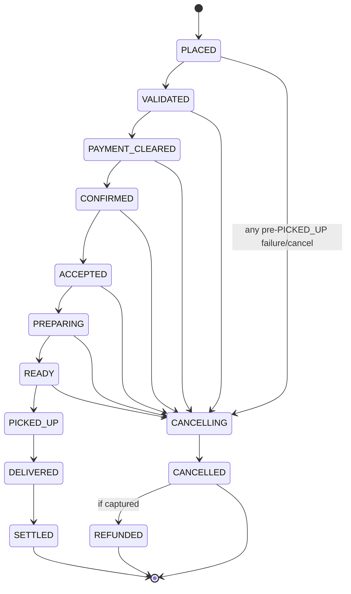

# SmartFoodOps — Product Requirements Document (Part A)

| | |
|---|---|
| **Status** | Approved design baseline |
| **Owner** | QuickServe Platform Engineering |
| **Source of truth** | System Design Plan (`smartfoodops-intelligent-food-cuddly-cerf`) |
| **Companion docs** | `docs/ARCHITECTURE.md`, `docs/adr/`, `docs/capacity-plan.md`, `docs/local-dev.md`, `docs/repo-structure.md` |
| **Scope** | Part A — foundational backend. Part B (GenAI assistant) consumes hooks only (§7). |

---

## 1. Overview & problem statement

QuickServe operates food ordering and delivery at scale for four user populations: customers, restaurant admins, delivery riders, and system admins. Current systems suffer from:

- **Slow, manual ordering workflows** — no automated validation of menu availability, restaurant capacity, or payment before confirmation; partial failures corrupt order state.
- **Inconsistent menu/inventory data** — stale menus and overselling.
- **Peak-hour latency** — meal-time spikes degrade placement and dispatch.
- **Inefficient dispatch** — no proximity-based assignment, no failure recovery/reassignment, duplicate assignments under concurrency.
- **Unreliable notifications** — restaurants and customers miss state changes.
- **Fragmented analytics** — no single pipeline for operational metrics or workflow-failure visibility.

**Part A** builds the foundational backend: a domain-microservice system designed around the **order lifecycle** — one Temporal workflow owns each order's saga; Kafka carries immutable facts; every state change commits via transactional outbox; every consumer is at-least-once + idempotent. Single region, single cell, sized for **2,000 orders/s sustained (2,500 provisioned ceiling)** with a multi-cell path to the 5–10k orders/s design ceiling kept open at near-zero cost.

**Success criteria (product-level):**

1. An order can never be confirmed before availability, capacity, pricing, and payment authorization all succeed; partial failures always compensate to a clean terminal state.
2. No customer is ever double-charged; no delivery is ever double-assigned — under injected failures, proven in CI.
3. All nine required analytics metrics are produced by one traceable event pipeline.
4. Any ordering/payment/dispatch/tracking/notification issue is diagnosable from one trace ID.
5. Part B lands later as ordinary Kafka consumer groups with **zero Part A changes**.

---

## 2. Personas & key use-cases

| Persona | Description | Primary interfaces |
|---|---|---|
| **Customer** | Places and tracks orders; millions of concurrent users at design ceiling | REST via edge-bff; SSE via tracking-gateway |
| **Restaurant admin** | Manages menu/availability; accepts and prepares orders (scoped to `restaurant_id`) | REST via edge-bff |
| **Rider** | Goes online, streams GPS, receives offers, delivers (scoped to `rider_id`) | WebSocket via rider-gateway; REST |
| **System admin** | Manages accounts, monitors operations, intervenes on stuck workflows | REST admin routes; Grafana/Jaeger/Temporal UI |

Failure-handling references (right column) point at the functional requirements in §3 that define the behavior.

### Customer

| UC | Name | Trigger | Main flow | Failure handling |
|---|---|---|---|---|
| UC-1 | Register & sign in | New/returning user opens app | Register (email/password) → Identity issues 15-min access JWT + 30-day rotating refresh token → subsequent calls carry JWT, verified once at edge-bff | FR-2, FR-5 (lockout, enumeration resistance, refresh-family reuse detection) |
| UC-2 | Browse & search restaurants | Customer opens discovery view | edge-bff serves CDN/Redis-cached browse pages (`catalog:browse:<gh5>:<cuisine>:<page>`, ≤60s staleness) → versioned menu GET (immutable per version) | FR-11; cache loss falls through to Catalog PG (NFR-13) |
| UC-3 | Build cart | Customer adds items | Cart is **client state** (ADR-0017): FE persists item IDs/quantities/modifiers locally; on cart review the FE re-fetches the versioned menu and calls stateless `POST /v1/quote` (same `smartfood-pricing` code as placement) for the estimate | FR-13; price changed at checkout → FR-16 `PRICE_CHANGED` re-confirm |
| UC-4 | Place order & pay | Customer checks out | `POST /v1/orders` (client idempotency key, per-cell admission) → OrderWorkflow: PriceOrder → ValidateAndReserve → AuthorizePayment → ConfirmOrder (restaurant alerted via the `OrderConfirmed` consumer). Visible as confirmed **only after all validations** | FR-14–FR-19, FR-21–FR-22; over-capacity → 429 before any write (NFR-8); any step fails → saga compensation (FR-19) |
| UC-5 | Track order live | Order confirmed; customer opens tracking | Ticket-authed SSE connect → snapshot from `order_tracking` read model → live updates at 2s cadence en-route | FR-36–FR-38; pub/sub loss → read-model snapshot + read-repair, never stale-stranded |
| UC-6 | Cancel order | Customer cancels pre-pickup | Cancel signal → OrderWorkflow compensates: cancel DeliveryWorkflow child → void-or-refund per capture state → release reservation → `CANCELLED` | FR-19, FR-24; post-pickup → support-policy `PostDeliveryRefundWorkflow` |
| UC-7 | View order history & receipts | Customer opens history | DDB `order_history` read model (`PK=customer`); receipts generated by Celery | FR-20, FR-41; projector lag SLO NFR-7 |

### Restaurant admin

| UC | Name | Trigger | Main flow | Failure handling |
|---|---|---|---|---|
| UC-8 | Onboard restaurant & manage menu | Admin edits profile/menu/promos | Catalog PG transaction bumps `menu_versions` in same tx → CDC on `catalog.changes` → new cached blob + pointer swap; CDN never purged (version-addressed URLs) | FR-7–FR-10, FR-12; ownership enforced in the query (0 rows → 404) |
| UC-9 | Accept / reject incoming order | `OrderConfirmed` notification arrives | Order feed served from PG index `(restaurant_id, status, placed_at)` → accept/reject sends `restaurant_decision` signal to OrderWorkflow within 3-min timer | FR-18; timeout or reject → VoidAuthorization → ReleaseReservation → `CANCELLED` (FR-19) |
| UC-10 | Progress preparation | Kitchen state changes | Guarded transitions `ACCEPTED → PREPARING → READY`; `READY` triggers dispatch via DeliveryWorkflow | FR-17; illegal transitions are 0-row no-ops, metered (`illegal_transition_total`) |
| UC-11 | Pause availability / set capacity | Restaurant overloaded or item out | Pause/capacity via Catalog → CDC path; placement re-check rejects `RESTAURANT_CLOSED`; per-item Redis token bucket gates viral items ahead of PG | FR-9, FR-15; browse staleness ≤60s is display-only — placement always re-reads source of truth |
| UC-18 | Review own performance | Restaurant admin opens performance tab | edge-bff serves restaurant-scoped metrics from analytics aggregates (orders, acceptance rate, cancellations, prep time) | FR-55; scoping enforced by `restaurant_id` claim in the query |

### Rider

| UC | Name | Trigger | Main flow | Failure handling |
|---|---|---|---|---|
| UC-12 | Go online & stream GPS | Rider starts shift | One WebSocket to rider-gateway (JWT in `Sec-WebSocket-Protocol`) → binary protobuf pings ~1 Hz → Redis GEO + latest-loc + heartbeat; every 5th ping → Kafka `rider.locations` | FR-27; disconnect >45s / heartbeat expiry 90s / 60s SCAN reconciliation feed reassignment (FR-32) |
| UC-13 | Receive & accept offer | Dispatch selects rider | DDB conditional-write reserve (offer lock) → offer pushed over WS → accept within 15s converts lock→assignment + guarded `OFFERING→ASSIGNED` | FR-29–FR-30; miss → 12s/12s cascade → next candidate; 3 misses → widen 3→6 km; late accept no-ops |
| UC-14 | Pick up & deliver | Rider en route | Geofence arrival at 75m → `rider_arrived` signal → pickup scan → `PICKED_UP` → deliver → `DELIVERED` → CapturePayment → Settle | FR-32, FR-34; revoke is conditional delete — a rider who already scanned pickup wins the race; post-pickup failure = ops incident, never silent reassignment |

### System admin

| UC | Name | Trigger | Main flow | Failure handling |
|---|---|---|---|---|
| UC-15 | Manage accounts & audit | Support/compliance task | Admin CRUD over customers/restaurants/riders; `system_admin` bypasses scoping; **every admin mutation writes an audit row** | FR-4, FR-46, FR-48 |
| UC-16 | Monitor & intervene | Alert fires (runbook URL attached) | Grafana dashboards + Jaeger traces + Temporal Web cross-navigate on `order_id`; DLQ inspection; manual dispatch at ~8-min escalation; compensation human-review queue at 1h | FR-47, FR-52; every alert carries runbook + dashboard + pre-built Jaeger query (NFR-12) |
| UC-17 | Review business metrics | Daily/weekly ops review | Analytics pipeline → PG aggregates → Grafana: all nine required metrics (§3.8) | FR-43–FR-45; nightly lake-vs-stream drift >0.1% alarms |

---

## 3. Functional requirements

Priorities: **P0** = required for Part A acceptance; **P1** = required for Part A completeness, may land in later phases; **P2** = stretch within Part A.

### 3.1 Identity & auth

| ID | Requirement | Pri | Acceptance criteria |
|---|---|---|---|
| FR-1 | Registration and login for all four roles (customer, restaurant_admin, rider, system_admin) with role-based structure | P0 | Each role can register/login; JWT claims carry `sub`, `role`, scoping `restaurant_id`/`rider_id`, `cell`, `jti` |
| FR-2 | RS256 JWT issuance (15-min access) + 30-day opaque rotating refresh tokens with family reuse detection | P0 | Presenting a rotated refresh token revokes the whole family; JWKS endpoint serves current+next keys; edge verifies once and stamps `X-Auth-*` headers |
| FR-3 | Role-based route gating at edge + ownership enforcement in owning service | P0 | Cross-tenant access returns 404 (not 403); scoping applied in the query (`WHERE … AND restaurant_id=:ctx`) — tested per role |
| FR-4 | Audit trail for privileged mutations | P0 | Every admin mutation writes an audit row (actor, action, target, timestamp); queryable (FR-48) |
| FR-5 | Credential abuse protection | P1 | argon2id hashing with rehash-on-login; 10/min per-IP and 5-fail/15-min-lockout per-account; uniform errors + success-shaped duplicate-register responses |
| FR-6 | Customer address management | P1 | CRUD addresses under Identity; delivery address snapshotted into the order |

### 3.2 Catalog & menu

| ID | Requirement | Pri | Acceptance criteria |
|---|---|---|---|
| FR-7 | Restaurant onboarding & profile management | P0 | Restaurant admin creates/edits profile; changes visible in browse within 60s |
| FR-8 | Menu CRUD with **categories** and versioning | P0 | Menus are structured as categories → items → modifiers (`menu_categories` table in `catalog_db`: name, sort order, item membership); category CRUD versions like any menu edit — bump `menu_versions` in the same PG transaction; rendered menu blob and `catalog.changes` payload carry the category structure; menu GET is version-addressed, immutable per version |
| FR-9 | Availability control: item out-of-stock, restaurant pause, capacity gating | P0 | Paused restaurant/item is rejected at placement with `RESTAURANT_CLOSED`/validation error even if caches are stale |
| FR-10 | Pricing rules, discounts, promotions | P1 | Pricing activity computes discounts from Catalog promotion rules; result recorded in immutable pricing snapshot |
| FR-11 | Browse by location/cuisine + production fuzzy search over restaurant **and item** names, with filters (cuisine, item tags) | P0 | `GET /v1/search`: typo-tolerant matching (`pg_trgm` + `tsvector`, ADR-0019) on restaurant and menu-item names; filters: city, cuisine (`restaurant_cuisines`), item tags (`item_tags` — "vegetarian", "halal", …); ranked + paginated. Browse pages cached ≤60s; Redis-down falls through to PG with local limiter. OpenSearch swap is trigger-gated behind `SearchPort` (ADR-0019) |
| FR-12 | Menu change feed (CDC) | P0 | Every menu/availability change appears on `catalog.changes` via outbox/CDC — this is the Part B embeddings hook |

### 3.3 Cart & ordering

Order state machine (single writer: `OrderWorkflow`, `workflow_id = ord::{order_id}`):

| ID | Requirement | Pri | Acceptance criteria |
|---|---|---|---|
| FR-13 | Client-side cart + server quote | P0 | FE persists the cart locally (IDs + quantities only — **never prices**); `POST /v1/quote` (Order service, stateless, `smartfood-pricing`) returns the authoritative estimate; `POST /v1/orders` accepts IDs/quantities and re-resolves everything server-side (ADR-0017) |
| FR-14 | Idempotent order placement | P0 | Client idempotency key; duplicate `POST /v1/orders` attaches to the running workflow (`REJECT_DUPLICATE`/`USE_EXISTING`) — never a second order. Placement writes `order_items` line snapshots (`menu_item_id`, `name_snapshot`, `unit_price_cents`, `qty` bounded 1..50) and the order's `delivery_address_snapshot` in the same transaction — both immutable after placement |
| FR-15 | Placement validation: menu availability + restaurant capacity + atomic stock reservation | P0 | ValidateAndReserve does conditional decrement (`WHERE available >= q`) + reservation ledger with expiry reaper; oversell impossible under concurrent placement. **Restaurant capacity is enforced the same way**: `restaurant_load` row in `inventory_db` (`UPDATE restaurant_load SET active = active + 1 WHERE active < capacity`; 0 rows → `RESTAURANT_AT_CAPACITY`), capacity set by the restaurant via Catalog (UC-11), slot released by the same compensation/settlement paths that release stock |
| FR-16 | Immutable pricing snapshot | P0 | PriceOrder writes `{subtotal, discounts, fees, tax, total}`; authorization and refunds computed only from it; price drift at checkout returns `PRICE_CHANGED` diff for client re-confirm. Snapshots extend to lines and address: `order_items` name/price snapshots + `delivery_address_snapshot` mean an order survives menu edits and address deletion intact (addresses soft-delete, `deleted_at`) |
| FR-17 | Guarded, single-writer order state machine | P0 | All transitions `UPDATE … WHERE status='prev'` (0 rows → re-read: idempotent-replay no-op or illegal transition); `illegal_transition_total` ≈ 0; order visible as confirmed only after validation succeeds and the payment gate clears (`PAYMENT_CLEARED` — method-agnostic; Part A: mock-PSP authorization ok) |
| FR-18 | Restaurant accept/reject with timeout | P0 | `restaurant_decision` signal vs 3-min timer; timeout/reject triggers full compensation |
| FR-19 | Saga compensation — partial failures never corrupt state | P0 | Reverse-order compensation (void auth → release reservation → CANCELLED); compensations retry forever (5-min cap), alert at 10 attempts, page + human-review at 1h; CI chaos proves every injected failure reaches a clean terminal state |
| FR-20 | Order history | P1 | DDB read model projected from `orders.events`; rebuildable by Kafka replay |

### 3.4 Payment

| ID | Requirement | Pri | Acceptance criteria |
|---|---|---|---|
| FR-21 | Authorize / capture / void / refund behind hexagonal `PaymentGateway` port | P0 | Authorization (→ `PAYMENT_CLEARED`) before confirmation; capture only after `DELIVERED`; PSP swap requires no caller changes; `PaymentAuthorized`/`PaymentCaptured` event names unchanged |
| FR-22 | Payment idempotency — never double-charge | P0 | Money keys `{order_id}:{op}`; handler reads idempotency table before executing; CI: N injected timeouts still yield ≤1 authorization per order |
| FR-23 | Double-entry ledger | P0 | Append-only, 7-year retention; `ledger_imbalance_cents` ≠ 0 alerts |
| FR-24 | Refunds with `RefundProcessed` event | P0 | Void if uncaptured, refund if captured — chosen automatically per capture state; event published via outbox |
| FR-25 | Mock PSP with failure injection | P0 | `DECLINE_RATE`/`TIMEOUT_RATE`/`UNKNOWN_OUTCOME_RATE` env knobs + deterministic magic tokens (`tok_decline`, `tok_timeout`, `tok_unknown`) |
| FR-26 | Unknown-outcome reconciliation | P1 | `UNKNOWN` outcomes later fire a webhook; reconciliation resolves to authorized/declined without double-charging — exercised locally |

### 3.5 Dispatch & delivery

| ID | Requirement | Pri | Acceptance criteria |
|---|---|---|---|
| FR-27 | Rider GPS ingest at scale | P0 | One WS per rider; per-session seq dedupe; Redis GEO (`shared:geo:<cell>:<gh4>`) + latest-loc TTL 30s + heartbeat TTL 90s; 0.2 Hz downsample to `rider.locations` |
| FR-28 | Proximity-based candidate search & scoring | P0 | GEOSEARCH 3 km (+neighbors) → DDB `rider_state` filter → score(pickup ETA, food-wait, utilization, detour, acceptance rate); weights hot-reloadable per cell |
| FR-29 | Offer protocol with timed cascade | P0 | 15s/12s/12s offers; 3 misses widen 3→6 km; late accepts no-op |
| FR-30 | Double-assignment prevention | P0 | DDB conditional write (`attribute_not_exists(offer_lock) AND size(active_deliveries) < cap`) is the single lock authority; chaos drill: concurrent offers to same rider yield exactly one assignment. An assignment holds only while progress is made: `ASSIGNED` with no pickup arrival by `pickup_eta + 5 min` → auto-unassign + rider strike + re-offer |
| FR-31 | Escalation ladder | P1 | ~4 min unassigned → surge payout; ~8 min → ops manual-dispatch + customer delay notice |
| FR-32 | Failure recovery & reassignment | P0 | Liveness via disconnect >45s, heartbeat expiry 90s, 60s SCAN reconciliation; revoke is conditional (`rider_id=:expected AND state=ASSIGNED`); post-pickup failure escalates to ops, never silent. Time bounds: `READY` unassigned >10 min (per-city config) → auto-cancel through the compensation path with both-sides notification; post-`PICKED_UP` heartbeat loss >5 min → `delivery_at_risk` ops queue + proactive customer notice — never auto-cancel once food is with the rider |
| FR-33 | Pickup & delivery ETA | P1 | Haversine ÷ learned H3 cell speeds for scoring; OSRM `/table` for top-3 + customer ETA |
| FR-34 | Completion settlement | P0 | `DELIVERED` → CapturePayment → Settle → `SETTLED`; rider utilization data recorded for analytics |
| FR-35 | Order stacking | P2 | Stack iff pickup within 800m of route corridor, detour ≤6 min, cap 2 |

### 3.6 Tracking

| ID | Requirement | Pri | Acceptance criteria |
|---|---|---|---|
| FR-36 | Real-time customer tracking over SSE | P0 | 2s cadence en-route via Redis sharded pub/sub → tracking-gateway; jittered 15–30 min connection lifetime (uniform-random per connection, full-jitter reconnect backoff) |
| FR-37 | Durable tracking read model | P0 | Connect/reconnect serves snapshot from DDB `order_tracking`; read-repair via workflow query if stale >60s; pub/sub loss can never strand a customer on stale state |
| FR-38 | SSE ticket auth | P0 | `POST /v1/track/ticket` (JWT-authed, ownership-checked) issues single-use 60s Redis ticket (`GETDEL` on connect); no tokens in query strings |
| FR-56 | Rider route guidance | P2 | Offer payload and active-delivery view include pickup/dropoff coordinates, OSRM route polyline, and ETA; rider app renders the route or deep-links to the device's navigation. Riders drive freely — GPS is the truth of the actual route (FR-27); custom in-app route editing is explicitly out of scope (§7) |
| FR-39 | Geofence arrival detection | P1 | In-memory check at rider-gateway fires `rider_arrived` signal at 75m |

### 3.7 Notifications

| ID | Requirement | Pri | Acceptance criteria |
|---|---|---|---|
| FR-40 | Event-driven notifications for all lifecycle events | P0 | Notification service consumes all topics; restaurant notified on `OrderConfirmed`; customer notified on confirm/assign/pickup/deliver/cancel/refund *(As built, W3: the notification service is live as a durable per-recipient inbox consuming `c1.orders.events` + `c1.payments.events` — restaurant + customer on `OrderConfirmed`; customer on cancel/deliver/refund, with the restaurant additionally notified on a customer-initiated cancel; deliberately none for placed/settled/authorized/captured; assign/pickup await the dispatch topics)* |
| FR-41 | Exactly-once user-visible delivery + log | P0 | `processed_events` dedupe; DDB `notification_log` TTL 90d; CI double-delivery chaos yields no duplicate notifications; senders fan out via Celery/SQS Lambda *(As built, W3: dedupe is the notification's natural key — `ntf_<uuid5(event_id+recipient)>`, no `processed_events` table; the durable record is PG `notification_db.notifications`)* |
| FR-42 | Delay notices | P1 | ~8-min dispatch escalation sends customer delay notice (data feeds Part B delay explanations) |

### 3.8 Analytics

| ID | Requirement | Pri | Acceptance criteria |
|---|---|---|---|
| FR-43 | Nine required metrics from the event pipeline | P0 | Total orders; orders per restaurant; peak-hour load; avg delivery time; rider utilization rate; cancellation rate; restaurant acceptance rate; delivery success rate; failed events/workflow issues — all derived from Kafka consumers, 5s micro-batch upserts to PG; duration metrics via emitter-enriched terminal events (no stream joins) |
| FR-44 | Raw event lake + drift check | P1 | Raw events → S3 (Parquet) via Connect; nightly Athena recompute; drift >0.1% alarms |
| FR-45 | Dashboards | P1 | Grafana dashboards over PG aggregates for UC-17 |
| FR-55 | Restaurant-facing performance view | P2 | Restaurant admin reads **their own** metrics (orders, acceptance rate, cancellation rate, avg prep time, revenue) via edge-bff from `sfo-aurora-analytics` aggregates, scoped by the `restaurant_id` claim — the same pipeline that feeds ops dashboards (FR-43), exposed per-tenant |

### 3.9 Admin & operations

| ID | Requirement | Pri | Acceptance criteria |
|---|---|---|---|
| FR-46 | Account lifecycle management for all roles | P0 | System admin CRUD over customers/restaurants/riders with audit rows (FR-4) |
| FR-47 | Operational intervention tooling | P1 | DLQ inspection per consumer group; manual dispatch; compensation human-review queue; workflow inspection via Temporal Web keyed by `order_id` |
| FR-48 | Audit query | P1 | Admin can query audit trail by actor/target/time range |

### 3.10 Event backbone & Part B hooks (cross-cutting)

| ID | Requirement | Pri | Acceptance criteria |
|---|---|---|---|
| FR-49 | Outbox-only event publication | P0 | All nine canonical events (`OrderPlaced`, `OrderConfirmed`, `PaymentAuthorized`/`PaymentCaptured` (the brief's "PaymentSuccessful"), `RiderAssigned`, `OrderPickedUp`, `OrderDelivered`, `OrderCancelled`, `RefundProcessed`) commit via transactional outbox (Debezium; Dispatch via DDB Streams forwarder) — no service writes Kafka directly |
| FR-50 | Governed event envelope | P0 | Avro + Schema Registry, `BACKWARD_TRANSITIVE`, CI compatibility gate; envelope: `event_id` (deterministic UUIDv5 of `aggregate:{id}:{version}:{type}`), `event_type`, `aggregate_id`, `aggregate_version`, `occurred_at`, `cell_id`; `traceparent` in headers |
| FR-51 | No double-processing | P0 | All consumers at-least-once + idempotent via mandatory `smartfood-kafka` library (offsets-in-transaction / conditional writes / processed-events table / deterministic S3 names); projectors apply only if `version > stored`; CI chaos double-delivers every event |
| FR-52 | Retry & DLQ handling — events recoverable, traceable | P0 | Ordering-tolerant consumers: `retry.1m`/`retry.10m` → `<topic>.dlq.<group>`; ordering-sensitive projectors pause the partition (≤5 min, page); DLQ records carry `error.class`, offsets, `traceparent`. **Celery jobs**: exponential-backoff retries → per-queue RabbitMQ dead-letter queue with alert; `smartfood-otel` instruments Celery tasks (trace context propagated via message headers), and queue depth + task-failure rate are first-class metrics (ARCHITECTURE §14) |
| FR-53 | Spike tolerance | P0 | Edge admission token bucket at 1.5× load-tested capacity returns 429 before any write; money path queued in Temporal, never shed; automated degradation ladder steps 1–4 (§ NFR-16) |
| FR-54 | Part B readiness hooks | P1 | `partb.embeddings` consumer group on `catalog.changes` (30s per-restaurant debounce, embed key `restaurant:item:menu_version`); `partb.features` group on `orders.events`; delay-explanation reads `order_tracking`; streaming responses reuse the SSE fleet — verified as consumer-group registrations with zero Part A code changes |

---

> Topic names in this document use the domain shorthand (`orders.events`); on the wire every topic is cell-prefixed from day 1 (`c1.orders.events`) per ARCHITECTURE §11.

## 4. Non-functional requirements

All NFRs are measurable; alert thresholds and runbooks per §12 of the design plan.

| ID | Category | Requirement (measurable) |
|---|---|---|
| NFR-1 | Availability | Order placement 99.95% availability (single region, multi-AZ: Aurora multi-AZ, MSK 3 brokers across AZs, ECS spread) |
| NFR-2 | Latency — placement | p95 < 3s placement (excl. restaurant accept); p99 PLACED→CONFIRMED < 6s |
| NFR-3 | Latency — dispatch | READY→ASSIGNED: 95% < 90s |
| NFR-4 | Latency — tracking | Rider device → customer screen: 99% < 5s |
| NFR-5 | Latency — notifications | 99% delivered < 30s from triggering event |
| NFR-6 | Latency — eventing | Outbox publish lag p99 < 5s; read-model projector lag p99 < 2s (alert at 10s) |
| NFR-7 | Capacity | One cell: 2,000 orders/s sustained, 2,500 provisioned ceiling; ~30k concurrent rider WS at ~30k pings/s; 400–500k SSE connections at ceiling; ~15k order-PG inserts/s; ~35k Kafka msg/s; ~90–110k Redis ops/s; 3.2k conditional offers/s. Platform design ceiling 5–10k orders/s and 50–100k pings/s via additional cells (deferred) |
| NFR-8 | Elasticity / spike tolerance | Admission control sheds above 1.5× load-tested capacity with 429 before any state write; every capacity figure carries ≥2× headroom; 60% of any budget triggers the scale runbook |
| NFR-9 | Consistency — money | ≤1 payment authorization per order under N injected timeouts (CI-enforced); `ledger_imbalance_cents` = 0; refund/auth math replay-deterministic from the pricing snapshot |
| NFR-10 | Consistency — state | Workflow decisions effectively exactly-once (deterministic replay); all consumers idempotent; `illegal_transition_total` ≈ 0; caches structurally unable to cause a wrong charge (money/order/inventory never served from cache) |
| NFR-11 | Durability & retention | Kafka 7d tiered → S3 90d; orders 90d hot then Parquet; payment ledger 7y; GDPR via tombstones + per-user crypto-shredding in the lake; Redis is ephemeral-only (loss degrades, never corrupts; any eviction pages) |
| NFR-12 | Security | RS256 JWTs 15-min; refresh-family theft detection; argon2id; login limits 10/min/IP and 5-fail lockout; domain services network-unreachable except from edge/gateways (no public routes); inbound `X-Auth-*` stripped at edge; WS auth via `Sec-WebSocket-Protocol` (never query strings); no PII in logs |
| NFR-13 | Cache correctness | Every Redis key has a TTL (CI lint); menu cache hit-rate ≥95% (warn below); `evicted_keys_total > 0` pages; browse staleness ≤60s; open-menu staleness ≤2s |
| NFR-14 | Observability | OTel end-to-end incl. outbox→Kafka header propagation; 100% retention of error/slow/payment/dispatch traces (tail sampling); `trace_id` + `order_id` on every log line; synthetic canary order 1/min full-saga; every alert ships runbook URL + dashboard + Jaeger query (CI lint fails otherwise) |
| NFR-15 | Recoverability | Compensations never dropped: retry forever (5-min cap), alert at 10 attempts, page + human review at 1h; nightly chaos suite green: (1) double-deliver every event → ledger balances, no duplicate notifications; (2) `TIMEOUT_RATE=1.0` window → all workflows compensate; (3) kill Connect mid-run → outbox drains, no gaps/reorders |
| NFR-16 | Degradation | Ordered shed ladder — automated: (1) CDN stale browse, (2) pause analytics/Part B consumers, (3) GPS 0.2→0.05 Hz, (4) tracking 2s→5s; ops-approved: (5) stale menu cache, (6) restaurant capacity gating. Money path never shed |
| NFR-17 | Developer experience | `git clone && make up && make seed` → working end-to-end order flow on a 16 GB laptop in <15 min; slim mode (core ≈3 GB); CI runs identical compose with `OUTBOX_MODE=debezium` |
| NFR-18 | Evolvability | Multi-cell/multi-region stays a deployment change: cell-prefixed ULIDs with reserved shard bits; all config/topics/keyspaces/namespaces parameterized by `cell_id`; no cross-city joins (review-enforced); order-PG shard split 2→4 is a routing runbook, not a migration |
| NFR-19 | Cost governance | `svc`+`cell` tags day 1; CUR→Athena→Grafana; cost-per-order is the tripwire for Temporal Cloud→self-hosted (~200–300 orders/s sustained) and MSK revisits |
| NFR-20 | Backup & disaster recovery | RPO ≤5 min (in-region, PITR/streams) / RTO ≤4 h (full-region rebuild); Aurora PITR 35d on every cluster incl. Temporal persistence + daily cross-region snapshot copies; DDB PITR on every table; S3 versioning; SR `_schemas` RF=3 + weekly S3 export; quarterly restore game-day (Phase-3 exit criterion) — a backup never restored is a hypothesis |

---

## 5. Milestones

Four phases per the design plan (§15). Indicative durations (proposed, single team; refine at sprint planning): Phase 1 ≈ 4–6 weeks, Phase 2 ≈ 5–7 weeks, Phase 3 ≈ 3–4 weeks — ~3.5 months to a load-tested single-cell system. Part B readiness ships **throughout**, not as a phase: `catalog.changes` CDC, Avro-governed topics, S3 lake, tracking read model, SSE fleet.

| Phase | Scope | Entry criteria | Exit criteria |
|---|---|---|---|
| **1 — Walking skeleton** (compose-first) | Compose/LocalStack + CI parity; shared libs first (`smartfood-outbox` dual-mode, `smartfood-idempotency`, `smartfood-kafka`, `smartfood-auth`, guarded transitions); edge-bff, Identity (full auth), Catalog, Order with exactly two workflows (happy path + cancellation/compensation); mock PSP with failure injection | Design doc set approved; repo scaffolded per `docs/repo-structure.md` | `make up && make seed` green on 16 GB laptop; end-to-end place→confirm→cancel demo through Temporal UI; **chaos suite green** (double-delivery, PSP injection); CI runs compose with `OUTBOX_MODE=debezium` |
| **2 — Dispatch & realtime** | DeliveryWorkflow, offer protocol, rider-gateway GPS ingest, tracking-gateway SSE + read model, notification pipeline, `/v1/quote` endpoint, `smartfood-pricing` library + PriceOrder activity, shed-ladder steps 1–4, rider-sim/order-gen simulators | Phase 1 exit; DDB tables + `dispatch.events` forwarder in place | Full order→dispatch→deliver→settle demo with `rider-sim`/`order-gen`; double-assignment chaos drill passes; SSE reconnect serves read-model snapshot; notification dedupe proven under double-delivery |
| **3 — Scale & hardening** (single region) | Load tests to 2k orders/s, DDB pre-warming, shed ladder 5–6, cost dashboards vs tripwires, AWS deployment via CDK | Phase 2 exit; CDK stacks reviewed; staging cell provisioned | Sustained 2k orders/s meets NFR-1–NFR-6 SLOs; multi-AZ failover tested; cost-per-order dashboard live with tripwires armed; all P0 FRs accepted |
| **4 — Multi-region** (**DEFERRED**) | Second cell + routing map, Aurora Global, MSK Replicator, Temporal failover, game-days | Traffic demand signal (sustained >60% of cell budget) — explicit user/business decision to un-defer | N/A for Part A — day-1 hooks (NFR-18) keep this additive |

---

## 6. Traceability matrix

Every FR maps to implementing component(s), workflow(s)/topic(s), and delivering phase. Reviewers: this is the completeness check against the business brief.

| FR | Summary | Component(s) | Workflow / Kafka topic(s) | Phase |
|---|---|---|---|---|
| FR-1 | Role-based registration/login | Identity, edge-bff | `identity.events` | 1 |
| FR-2 | JWT + rotating refresh | Identity (JWKS), edge-bff | — | 1 |
| FR-3 | RBAC + ownership scoping | edge-bff, all domain services (`smartfood-auth`) | — | 1 |
| FR-4 | Audit trail | Identity, all services (audit rows) | `identity.events` | 1 |
| FR-5 | Credential abuse protection | Identity, edge-bff (Redis rate limits) | — | 1 |
| FR-6 | Address management | Identity | — | 1 |
| FR-7 | Restaurant onboarding | Catalog | `catalog.changes` | 1 |
| FR-8 | Versioned menu CRUD | Catalog (+ Redis blob/pointer, CDN) | `catalog.changes` | 1 |
| FR-9 | Availability/pause/capacity | Catalog, Inventory, Order (placement re-check) | `catalog.changes`, `inventory.events` | 1 |
| FR-10 | Pricing rules & promos | Catalog (owns rules), `smartfood-pricing` lib | — (PriceOrder activity) | 2 |
| FR-11 | Browse/search | edge-bff, Catalog, Redis/CDN | — | 2 |
| FR-12 | Menu CDC feed (Part B hook) | Catalog + Debezium | `catalog.changes` | 1 |
| FR-13 | Client cart + quote | FE storage; Order service (`/v1/quote`, `smartfood-pricing`) | — | 2 |
| FR-14 | Idempotent placement | Order, edge-bff | OrderWorkflow (`ord::{id}`) | 1 |
| FR-15 | Validation + reservation | Inventory, Catalog | OrderWorkflow / ValidateAndReserve; `inventory.events` | 1 |
| FR-16 | Pricing snapshot | `smartfood-pricing` lib (Order workers + `/v1/quote`), Order | OrderWorkflow / PriceOrder | 2 (fixed-price stub in 1) (proposed) |
| FR-17 | Guarded state machine | Order | OrderWorkflow; `orders.events` | 1 |
| FR-18 | Accept/reject + timeout | Order, Notification | OrderWorkflow (`restaurant_decision` signal, 3-min timer) | 1 |
| FR-19 | Saga compensation | Order, Payment, Inventory, Temporal workers | OrderWorkflow compensation stack; `orders.events` (`OrderCancelled`) | 1 |
| FR-20 | Order history | Read-model projectors (DDB `order_history`) | `orders.events` | 2 |
| FR-21 | Payment gateway port | Payment, mock-psp | AuthorizePayment/CapturePayment/Void/Refund activities; `payments.events` | 1 |
| FR-22 | No double-charge | Payment (idempotency table + `smartfood-idempotency`) | `payments.events` (`PaymentAuthorized`/`PaymentCaptured`) | 1 |
| FR-23 | Double-entry ledger | Payment (Aurora PG) | `payments.events` | 1 |
| FR-24 | Refunds | Payment, Order | OrderWorkflow / PostDeliveryRefundWorkflow; `payments.events` (`RefundProcessed`) | 1 |
| FR-25 | Mock PSP failure injection | mock-psp | — | 1 |
| FR-26 | Unknown-outcome reconciliation | Payment, mock-psp (webhook) | `payments.events` | 3 (proposed) |
| FR-27 | GPS ingest | rider-gateway, Redis GEO | `rider.locations`, `rider.status` | 2 |
| FR-28 | Candidate search & scoring | Dispatch (Redis GEO + DDB `rider_state`), OSRM | DeliveryWorkflow; `dispatch.events` | 2 |
| FR-29 | Offer cascade | Dispatch, rider-gateway | DeliveryWorkflow; `dispatch.events` | 2 |
| FR-30 | Double-assignment guard | Dispatch (DDB conditional writes) | DeliveryWorkflow; `dispatch.events` (`RiderAssigned`) | 2 |
| FR-31 | Escalation ladder | Dispatch, Notification, ops tooling | DeliveryWorkflow timers | 2 |
| FR-32 | Reassignment & liveness | Dispatch, rider-gateway (sweeper) | DeliveryWorkflow; `rider.status` | 2 |
| FR-33 | ETAs | Dispatch, OSRM | DeliveryWorkflow | 2 |
| FR-34 | Completion settlement | Dispatch, Payment, Order | DeliveryWorkflow → CapturePayment → Settle; `orders.events` (`OrderDelivered`), `dispatch.events` | 2 |
| FR-35 | Stacking | Dispatch | DeliveryWorkflow | 3 |
| FR-36 | Live tracking SSE | tracking-gateway, Redis pub/sub | `shared:trk:<delivery_id>` channels; fed directly by rider-gateway (every 2nd ping) | 2 |
| FR-37 | Tracking read model | Projectors → DDB `order_tracking` | `orders.events`, `dispatch.events` | 2 |
| FR-38 | SSE ticket auth | edge-bff, tracking-gateway, Redis | — | 2 |
| FR-39 | Geofence arrival | rider-gateway | `rider_arrived` signal → DeliveryWorkflow | 2 |
| FR-40 | Lifecycle notifications | Notification, Celery/Lambda senders | all topics (esp. `orders.events` `OrderConfirmed`, `OrderPickedUp`) | 2 (restaurant notify in 1) |
| FR-41 | Notification dedupe + log | Notification (`processed_events`, DDB `notification_log`) *(As built, W3: PG `notification_db` natural-key dedupe — no `processed_events`/DDB log; consumes `c1.orders.events` + `c1.payments.events`)* | all topics | 2 |
| FR-42 | Delay notices | Dispatch, Notification | DeliveryWorkflow escalation; `dispatch.events` | 2 |
| FR-43 | Nine analytics metrics | Analytics (PG aggregates), Grafana | `orders.events`, `payments.events`, `dispatch.events`, `rider.status`, DLQ metrics | 2–3 |
| FR-44 | Event lake + drift check | Kafka Connect → S3, Athena, Firehose+Lambda | all topics | 3 |
| FR-45 | Dashboards | Analytics, Grafana | — | 3 |
| FR-55 | Restaurant performance view | edge-bff, Analytics (`sfo-aurora-analytics`) | — | 3 |
| FR-56 | Rider route guidance | Dispatch (OSRM), rider-gateway | DeliveryWorkflow offer payload | 2 |
| FR-46 | Account management | Identity, Catalog (restaurants), Dispatch (riders) | `identity.events` | 1 |
| FR-47 | Ops intervention tooling | Temporal Web, DLQ tooling, Dispatch manual-dispatch | `<topic>.dlq.<group>` | 3 |
| FR-48 | Audit query | Identity (audit store) | — | 3 |
| FR-49 | Outbox-only publication | `smartfood-outbox`, Debezium/MSK Connect, DDB Streams forwarder | all `*.events` topics | 1 |
| FR-50 | Governed envelope | `smartfood-kafka`, Schema Registry | all topics | 1 |
| FR-51 | No double-processing | `smartfood-kafka` + `smartfood-idempotency` (all consumers) | all topics | 1 |
| FR-52 | Retry/DLQ | `smartfood-kafka` (all consumers) | `retry.1m`, `retry.10m`, `<topic>.dlq.<group>` | 2 |
| FR-53 | Spike tolerance | edge-bff admission, Temporal backlog, shed ladder | — | 1 (admission) / 2–3 (ladder) |
| FR-54 | Part B hooks | Kafka consumer-group registrations, S3 lake, SSE fleet | `catalog.changes` (`partb.embeddings` group), `orders.events` (`partb.features` group) | 1–3 (throughout) |

---

## 7. Out of scope / deferred

| Item | Status | Hook that keeps it cheap later |
|---|---|---|
| **Multi-region / multi-cell** (2nd cell, routing global table, Aurora Global, MSK Replicator, Temporal cross-region failover, RTO/RPO targets, game-days) | Deferred by explicit user decision (Phase 4) | Cell-prefixed ULIDs with reserved shard bits; everything parameterized by `cell_id` (one value `c1`); no cross-city joins; dispatch lock deliberately region-local (design plan §9) |
| **Real PSP integration** | Out of scope — mock PSP only | Hexagonal `PaymentGateway` port (authorize/capture/void/refund); swap is an adapter, callers unchanged (§ FR-21) |
| **OAuth / social login, MFA** | Deferred | Hexagonal `CredentialVerifier` seam in Identity (design plan §3) |
| **ABAC, instant `jti` denylist revocation, signed internal tokens / mTLS, partner API keys** | Deferred | `smartfood-auth` middleware hides the edge-token→internal-JWT→mTLS swap; documented hardening path |
| **gRPC internals; Envoy/gateway product** | Deferred | Typed Pydantic contracts + OpenAPI clients; revisit triggers documented (serialization >10% of p99; partner API program) |
| **Temporal self-hosted on EKS** | Deferred — Temporal Cloud phase 1 | Cost-per-order tripwire at ~200–300 orders/s sustained |
| **Customer order amendment** (edit items/address after placement) | Out of scope — amendment = cancel (full compensation) + re-place in Part A | The saga's cancellation path is already total; an AmendOrder signal (re-price → re-reserve → re-authorize delta) slots into OrderWorkflow later without state-machine changes before ACCEPTED |
| **Cloud kitchens** | Supported implicitly — a cloud kitchen is a restaurant with no dine-in; nothing in Part A assumes a storefront | Multiple virtual brands from one kitchen = multiple `restaurants` rows sharing an address; capacity per brand via FR-15's `restaurant_load` |
| **Enterprise food programs** (corporate cafeterias, events, subscriptions/recurring group orders) | Deferred — B2B ordering, scheduled/recurring orders, and group carts are distinct product surfaces | Order placement is API-first behind edge-bff; a future B2B service places orders through the same idempotent `POST /v1/orders` + saga; `orders.events` already carries everything billing/reporting would consume |
| **Part B — GenAI assistant** (RAG over menus, embeddings pipeline, recommendations, delay explanations, streaming responses) | Future part; Part A ships hooks only | Embeddings feed: `catalog.changes` CDC + `partb.embeddings` consumer (30s debounce, key `restaurant:item:menu_version`). Features feed: `partb.features` on `orders.events` + S3 lake. Delay explanations: `order_tracking` read model + FR-42 delay-notice data. Streaming responses: reuse tracking-gateway SSE fleet. Zero Part A changes required (FR-54) |
