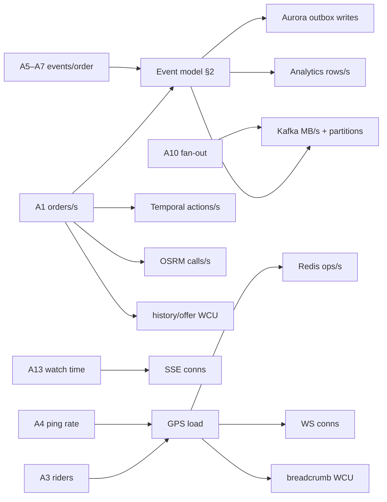

# SmartFoodOps — Capacity Plan (Single Cell, Part A)

**Scope**: one region, one cell (`c1`), sized to a **2,500 orders/s provisioned ceiling** (2,000 orders/s sustained design point) per the approved design plan §13. Multi-region/multi-cell is deferred; scaling beyond this ceiling means adding cells, not growing this one.

**How to read this document**: §1 states every input assumption. §2 derives the cell-wide load model from them. §3 walks each resource from assumptions → arithmetic → provisioned size → unit budget → scale trigger. §4 separates day-1 deployment from the provisioned ceiling. §5 is the load-test plan that validates the budgets. §6 explains how to re-derive everything when an assumption changes.

**Governing rule**: every provisioned figure is a *budget* with **≥2× headroom** at the ceiling. **60% of any budget triggers the named scale runbook** — scaling is a planned action executed with slack, never an incident response.

---

## 1. Assumptions

All downstream arithmetic traces to this table. Figures marked **[plan]** are fixed by the approved design plan and must not be changed without a design review; **(derived)** figures reconcile plan numbers; **(proposed)** figures are the smallest reasonable choice where the plan is silent.

| # | Assumption | Value | Source |
|---|---|---|---|
| A1 | Provisioned order ceiling | 2,500 orders/s | [plan] §13 |
| A2 | Sustained design point / load-test target | 2,000 orders/s | [plan] §9, §15 |
| A3 | Active riders at peak (connected, pinging) | ~30,000 | [plan] §13 |
| A4 | GPS ping rate per rider | 1 Hz, ~30 B binary protobuf | [plan] §5 |
| A5 | `orders.events` published per order (avg) | 6 (Placed, Confirmed, Accepted, PickedUp, Delivered, Settled; cancel paths substitute tail events) | (derived — reconciles §13's ~15k inserts/s and ~35k msg/s) |
| A6 | `payments.events` per order (avg) | 2 (Authorized, Captured; voids/refunds in the tail) | (derived) |
| A7 | `dispatch.events` per order (avg) | 3.5 (offers ~1.3, accept, assigned, arrived/picked-up markers) | (derived) |
| A8 | Kafka sampling of GPS pings | every 5th ping → `rider.locations` (0.2 Hz/rider) | [plan] §5 |
| A9 | Avg Kafka message size (Avro + envelope) | orders/payments ~600 B, dispatch ~450 B, GPS ~80 B → weighted ~500 B | (proposed) |
| A10 | Kafka consumer fan-out (groups per event, avg) | ~4× (projectors, analytics, notification, Part B feeds) | (proposed) |
| A11 | Offer attempts per delivery (avg) | 1.3 (15s/12s/12s cascade; most first offers accepted) | (derived — reconciles §13's 3.2k offers/s) |
| A12 | Customer-visible history writes per order | 8 | (derived — reconciles §13's 20k WCU) |
| A13 | Cumulative live-tracking watch time per order (peak) | ~180 s | (derived — Little's law reconciles §13's 400–500k SSE conns) |
| A14 | Notifications per order (avg) | 4 (confirmed, assigned, picked up, delivered) | (proposed) |
| A15 | Temporal actions per order (both workflows) | **~20 budgeted** — ≤12 activities + ≤3 timers + ≤4 signals + 2 workflow starts (was ~40; the three reductions per ADR-0018: `NotifyRestaurant` deleted as an activity — Notification consumes `OrderConfirmed` instead; `PriceOrder` runs as a local activity; status transitions fold into their owning activities, never standalone) | [plan] §13, amended by ADR-0018 |
| A16 | OSRM `/table` calls per order | 1 (top-3 ETA at dispatch; scoring pre-filter uses haversine ÷ H3 speeds, no OSRM) | (derived — reconciles §13's 2.5k calls/s) |
| A17 | Headroom rule / scale trigger | ≥2× at ceiling / runbook at 60% of budget | [plan] §13 |
| A18 | Day-1 launch traffic planning figure | 50 orders/s peak | (proposed) |

> **Deliberate decoupling**: A1 (orders/s) and A3 (riders) are independent axes from the plan. The order path is sized for spike **admission** (meal-peak bursts, edge token buckets at 1.5× tested capacity); the dispatch/tracking planes are sized for the 30k-rider fleet and the delivery concurrency it can actually carry (~20–25k concurrent active deliveries at ~70% utilization with stacking). We do not pretend the marketplace math balances at the ceiling — infrastructure is sized to survive the stated loads on each axis.

---

## 2. Derived load model at the ceiling

Event throughput (2,500 orders/s, 30k riders):

| Topic | Formula | msg/s | Partitions [plan] | msg/s per partition |
|---|---|---|---|---|
| `c1.orders.events` | 2,500 × A5 (6) | 15,000 | 48 | ~310 |
| `c1.payments.events` | 2,500 × A6 (2) | 5,000 | 12 | ~420 |
| `c1.dispatch.events` | 2,500 × A7 (3.5) | 8,750 | 48 | ~180 |
| `c1.rider.locations` | 30,000 × A8 (÷5) | 6,000 | 12 | 500 |
| `rider.status` + `catalog.changes` | background | ~300 | — | — |
| **Total** | | **~35,000** | | |

Byte throughput: (15k + 5k) × 600 B + 8.75k × 450 B + 6k × 80 B ≈ **17 MB/s ingress** — matching plan §13's "~35k msg/s, 17 MB/s". Egress ≈ ingress × A10 (4×) ≈ **~70 MB/s** cluster-wide.

Partition counts follow the plan's rule — *slowest consumer's parallelism × 2 headroom* — and are **fixed at ceiling values from day 1** (repartitioning re-shuffles keys; cheap to over-partition now, expensive to fix later).

---

## 3. Per-resource budgets

Each section: arithmetic → provisioned size → unit budget → headroom → **60% trigger** with its runbook action.

### 3.1 `order_db` write budget (PostgreSQL)

**Topology note** ([ADR-0016](adr/0016-postgres-topology-one-cluster-database-per-service.md)): `order_db` is a logical database inside the shared `sfo-aurora-main` cluster, so the sizing below is a **budget within a shared writer**, not a dedicated instance. Order is the expected first service to graduate to its own cluster — the split trigger is ~30% of the cluster write budget, and cell-prefixed ULIDs make the move a routing change.

**Arithmetic** (per order, at 2,500/s):

| Write | Rows/order | Rows/s |
|---|---|---|
| Order insert (placement tx, with `pricing_snapshot`) | 1 | 2,500 |
| Outbox inserts (A5 — `orders.events` only; payments and dispatch publish from their own stores) | 6 | 15,000 |
| Guarded status `UPDATE … WHERE status='prev'` | ~6 | 15,000 |
| **Total row writes** | ~13 | **~32,500** |

The headline **~15k inserts/s** [plan §13] is the outbox stream — the dominant insert path. The outbox is hour-partitioned with partitions **dropped** ≤6h after publish confirmation; at a 20k rows/s burst bound (cancel storms add events), row-level `DELETE` is infeasible by design [plan §6].

**Provisioned**: 2 hash shards (cell-prefixed ULIDs carry shard bits from day 1), each **writer + 2 readers**, writer class `db.r7g.4xlarge` (proposed), behind per-service PgBouncer (transaction mode; ADR-0016 as amended). Per-shard load ≈ 16k row writes/s — roughly 50% of a load-tested ~32k row-writes/s unit budget → ~2× headroom.

**Unit budget**: 32k row writes/s per shard writer (validate in Phase 3 load test; adjust this line with the measured figure).

**60% trigger** (≈19k row writes/s per shard, or 60% writer CPU sustained 15 min): execute the **shard-split runbook 2→4** — a routing change on the reserved shard bits, not a migration [plan §6]. Reader CPU >60% → add a reader (read models absorb most reads; restaurant order feed is an indexed PG read, watch it separately).

### 3.2 Kafka / MSK

**Arithmetic**: §2 gives 35k msg/s, 17 MB/s ingress. With RF=3: replicated write ≈ 51 MB/s ÷ 6 brokers ≈ 8.5 MB/s/broker. Egress ≈ 70 MB/s + follower fetch ≈ ~20 MB/s/broker. Storage (hot, local): 17 MB/s × 24 h ≈ 1.5 TB × RF3 ≈ 4.4 TB → ~750 GB/broker (provision 2 TB EBS each); tiered storage → S3 covers the 7-day retention, lake covers 90 d [plan §6]. `rider.locations` keeps 24 h only [plan §8].

**Provisioned**: **6 brokers** across 3 AZs, `kafka.m7g.large` (proposed), RF=3, partitions 48/48/12/12 per §2.

**Unit budget**: <30% broker utilization at ceiling [plan §13] — CPU, NIC, and disk each. Per-partition budget ~1,000 msg/s (hottest is `rider.locations` at 500).

**60% trigger** (broker CPU/NIC/disk at 18–20% is fine; trigger = 60% of the 30% envelope ⇒ ~2× headroom already priced in — operationally: any broker metric >60% absolute, or per-partition rate >600 msg/s): **add 3 brokers (6→9) and rebalance partition replicas** (counts are already ceiling-sized, so this is replica placement only). Consumer-lag *derivative* positive for >5 min pages independently [plan §12].

### 3.3 Redis (ElastiCache, cluster mode)

**Arithmetic** (ops/s at ceiling):

| Workload | Formula | ops/s |
|---|---|---|
| GPS ingest: `GEOADD` + `HSET loc` + `SET hb` per ping (pipelined) | 3 × 30,000 | 90,000 |
| Tracking pub/sub publishes (en-route subset, every 2nd ping) | ~20k en-route × 0.5 Hz | ~10,000 |
| Cache/rate-limit/idempotency (menu misses past in-process LRU, browse, admission buckets) | — | ~10,000 |
| **Total** | | **~110,000** (≈90k at ~25k riders — the plan's 90–110k band) |

**Memory**: cache working set ~11 GB (~60% menu blobs) [plan §7]; rider keys (30k × ~350 B for geo+loc+hb) ≈ 10 MB — noise. 11 GB ÷ (3 × 13.07 GiB `cache.r7g.large`) ≈ **28% utilization** [plan §7].

**Provisioned**: **3 shards × (primary + replica)**, `cache.r7g.large`, TTL-only eviction (`volatile-ttl`), GEO keys sharded by `gh4` (~16 shards/metro — no hot slot).

**Unit budget**: ~100k simple ops/s per primary at <40% CPU; 13 GiB memory per shard with working set ≤40%.

**60% trigger** (any primary >60% of the 40% CPU envelope — i.e., ~24% absolute climbing, or memory >60% of shard): **online reshard 3→4+** (cluster mode; slot migration, no downtime). `evicted_keys_total > 0` is not a scale trigger — it is a **page** and a provisioning defect [plan §7].

### 3.4 Rider WebSocket gateways

**Arithmetic**: 30k concurrent conns, 1 msg/s each (30 B in). Per-node bandwidth is trivial (~250 KB/s in at 8k conns); the real budget is protobuf decode + pipelined Redis writes + geofence checks per ping.

**Provisioned**: **5 nodes (N+1)** on ECS-on-EC2 [plan §2] — design point 7.5k conns/node across 4, one spare; `c7g.2xlarge` (proposed).

**Unit budget**: 8k conns + 8k pings/s per node at <50% CPU (validate with `rider-sim` at scale).

**60% trigger** (avg >4.8k conns/node, or CPU >30% absolute): **add a node to the ASG**. Gateways are stateless (conn state in Redis); new riders spread naturally, and the jittered 15–30 min connection lifetime (ADR-0006 as amended) rebalances existing ones within half an hour. Mass-reconnect storms are drilled in chaos tests (risk #4).

### 3.5 Customer SSE gateways

**Arithmetic** (Little's law): concurrent conns = arrival rate × watch time = 2,500 orders/s × A13 (180 s) ≈ **450k concurrent SSE connections** (plan band 400–500k). Per-conn egress: stage events + 2s-cadence location for the en-route watched subset → ~0.3 msg/s × ~300 B avg ≈ 90 B/s/conn.

**Per node** at 45k conns: ~4 MB/s egress, ~2.3 GB conn memory (~50 KB/conn) — memory- and FD-bound, not CPU-bound.

**Provisioned (ceiling)**: **10–12 nodes (N+2)** on ECS-on-EC2, `c7g.2xlarge` (proposed), 45k conns/node budget. **Day 1: 2–3 nodes** [plan §13].

**Unit budget**: 45k conns/node, <60% memory, FD limits raised accordingly.

**ALB-rt cost check** (ADR-0018): ~450–500k concurrent connections on the dedicated realtime ALB ≈ **~160–176 LCUs ≈ ~$1k/mo** — a non-issue; the realtime plane's own ALB is bought for blast-radius isolation, not saved on.

**60% trigger** (avg >27k conns/node): **add nodes**; the jittered 15–30 min lifetime (ADR-0006 as amended) + ticket-reconnect naturally redistributes. Degradation ladder (tracking cadence 2s→5s) buys ~2.5× per-conn slack before scaling if a spike outruns the ASG [plan §12].

### 3.6 DynamoDB

**Arithmetic** (WCU at ceiling; items <1 KB unless noted):

| Table | Formula | WCU / rate |
|---|---|---|
| `order_history` | A12 (8) × 2,500 | **20,000 WCU** [plan] |
| `order_tracking` | ~8 stage writes/order + 1/min ETA refresh × ~25k en-route | ~20,400 WCU |
| `deliveries` | ~6 writes/delivery × 2,500 | 15,000 WCU |
| `rider_state` | offer conditional writes **3.2k/s** [plan] (A11 × 2,500) + assign/clear | ~6,000 WCU |
| `rider_locations` (breadcrumbs) | 0.2 Hz × 30k, day-bucketed, TTL 30 d | 6,000 WCU |
| `notification_log` | A14 (4) × 2,500 | 10,000 WCU |
| **Cell total** | | **~77k WCU** (carts removed — client-side per ADR-0017) |

Reads: matching `BatchGet` on `rider_state` (~20 candidates × 2,500/s, eventually consistent) ≈ 25k RCU; history/tracking reads served per request.

**Provisioned**: **on-demand everywhere**, with **provisioned floors pre-warmed before meal peaks** [plan §6] at ~50% of the table figures above. Every PK is uniform-cardinality; restaurant-/city-/status-keyed PKs and GSIs are banned [plan §6] — so throughput scales with table totals, not partitions.

**Unit budget**: on-demand absorbs 2× previous peak instantly; the floors are the guarantee that meal-peak ramp never throttles.

**60% trigger** (consumed capacity >60% of a table's pre-warmed floor during peak): **raise the floor** and check key-distribution dashboards (CloudWatch partition-level throttles). `ThrottledRequests > 0` on `rider_state` is a page — the offer lock is correctness-bearing.

### 3.7 OSRM (self-hosted routing)

**Arithmetic**: A16 → 2,500 `/table` calls/s (small matrices: ~4 sources × 3 destinations, ~3–5 ms CPU each). Scoring never calls OSRM (haversine ÷ learned H3 cell speeds).

**Provisioned**: **3 + 1 nodes** [plan §13], `c7g.4xlarge` (proposed), city extract in RAM.

**Unit budget**: ~850 calls/s per node at <50% CPU.

**60% trigger** (>510 calls/s/node or CPU >30% absolute): **add a node behind the internal LB** — stateless, map data is a static artifact per release, cold start = image pull + mmap (~1 min). If OSRM is down entirely, dispatch degrades to haversine ETAs (scoring already works without it); customer ETA shows a stage-based estimate.

### 3.8 Temporal

**Arithmetic**: **2.5k OrderWorkflow starts/s** [plan §13]; each spawns one `DeliveryWorkflow` child on accept. A15 (~20 actions/order budgeted, both workflows: activities, timers, signals, starts) → **~50k actions/s** at ceiling (was ~100k at the old ~40/order figure). The budget is CI-enforced — the replay suite counts commands, warns in W2, gates at Phase 3 (ADR-0018). Activity work is I/O-bound (HTTP/JSON to Inventory/Payment/Dispatch; PriceOrder is in-process — ADR-0015); aggregate ~1.5 s of activity wall-time per order → ~3,750 concurrent activity executions (wall-time barely moves with the budget — the deleted actions were cheap ones).

**Provisioned**:
- **Day 1: Temporal Cloud** [plan §10] — capacity is their problem; ours is the worker fleet. The **self-host migration executes at Phase 3 production readiness, before sustained traffic** (ADR-0009 as amended by ADR-0018 — the old ~200–300 orders/s cost tripwire was arithmetic error; true crossover is ~10–30 orders/s sustained).
- **Ceiling (self-hosted)**: **≥4,096 history shards** [plan §13] → ~12 actions/s/shard at the budgeted A15, comfortably inside a ~50–100/s per-shard write budget (proposed). Persistence on its own Aurora cluster, sized by load test at 3× [plan risk #1].
- **Workers**: ~40 async worker pods × 100 concurrent activity slots (proposed) ≈ 4,000 slots vs 3,750 needed — plus **reserved compensation workers** on a dedicated task queue so saga rollback never starves behind happy-path load [plan §12].

**Unit budget**: `activity_schedule_to_start_latency` p95 < 500 ms (proposed) — this, not CPU, is the worker-fleet scaling signal and HPA key [plan §12].

**60% trigger**: schedule-to-start p95 > 300 ms sustained 10 min → **scale worker deployment**; shard-level persistence latency p99 > 60% of budget → grow the persistence cluster (self-hosted phase). Fail-closed: Temporal unreachable ⇒ placement returns 503 — degraded, never corrupt.

### 3.9 Analytics PostgreSQL

**Arithmetic**: consumers read ~35k events/s (§2), aggregate in memory, and flush **5 s micro-batches ≈ 2k upserted rows/s** [plan §8] into windowed aggregate tables (orders/restaurant, peak load, delivery times, utilization, cancellation/acceptance/success rates, failed events). Raw events go to S3 via Connect — the lake, not this PG, is the heavy store.

**Provisioned**: Aurora PG, writer + 1 reader, `db.r7g.xlarge` (proposed). Grafana reads the reader.

**Unit budget**: batch flush completes in <2 s of each 5 s window; 2k upserts/s is ~15% of what this class sustains for single-row upserts.

**60% trigger** (flush time > 3 s, or nightly Athena-vs-stream drift check >0.1% [plan §8]): first **widen the batch window 5s→10s** (halves upsert rate at a 5 s freshness cost — analytics tolerates this), then split consumer groups by topic, then grow the instance. Analytics consumers are also **pause step 2 of the shed ladder** — they are sacrificial by design.

---

## 4. Launch vs ceiling

What we actually deploy on day 1 (A18: ~50 orders/s peak) versus the provisioned ceiling. Column 3 is the point: some things are cheap to grow later and start small; the **bold** items are expensive to change later and ship ceiling-shaped from day 1.

| Resource | Day-1 deployment | Ceiling (2,500 orders/s) | Fixed day 1 regardless |
|---|---|---|---|
| `order_db` (in `sfo-aurora-main`) | 1 shard, `db.r7g.xlarge` writer + 1 reader (proposed) | 2 shards, `db.r7g.4xlarge` writer + 2 readers each; runbook to 4 | **Cell-prefixed ULIDs with reserved shard bits; hour-partitioned outbox schema** |
| Kafka / MSK | 3 × `kafka.m7g.large`, RF=3 | 6 brokers, <30% util | **Partition counts 48/48/12/12; Avro envelope + Schema Registry; outbox-only publication** |
| Redis | 3 shards × (primary+replica), `cache.r7g.large` — same as ceiling (cheap; keeps failover topology honest) | Same; reshard 3→4+ on trigger | **Key patterns, TTL discipline, `gh4` GEO sharding, cluster mode** |
| Rider WS gateways | 2 nodes (N+1) (proposed) | 5 nodes (N+1) | **WS protocol, jittered 15–30 min conn lifetime, Redis-held conn state** |
| SSE gateways | 2–3 nodes [plan] | 10–12 nodes (N+2) | **SSE + ticket auth, snapshot-then-subscribe reconnect** |
| DynamoDB | On-demand, no floors | On-demand + pre-warmed peak floors | **Table schemas, uniform-cardinality PKs, GSI set, TTLs** |
| OSRM | 1 + 1 nodes (proposed) | 3 + 1 nodes | Map-release pipeline |
| Temporal | **Temporal Cloud**, one namespace per cell | Self-hosted EKS, ≥4,096 history shards | **Workflow/activity contracts, task-queue layout, `ord::{id}` IDs** (portable across the migration) |
| `sfo-aurora-analytics` | `db.r7g.large` writer (proposed) | `db.r7g.xlarge` writer + reader | **Aggregate schemas; S3 lake layout** |
| Edge / services (Fargate) | 2 tasks/service (N+1) | HPA-scaled; admission buckets at 1.5× tested capacity | **Service Connect names, `cell_id` parameterization** |

Cost note: day-1 shape is a small fraction of ceiling cost; `svc`+`cell` tagging and CUR→Athena→Grafana cost-per-order dashboards run from day 1 [plan §10] — cost-per-order verifies the Temporal crossover math (migration now scheduled at Phase 3 per ADR-0009 as amended) and remains the tripwire for the MSK revisit.

---

## 5. Load-test plan (Phase 3, target 2,000 orders/s)

**Environment**: full staging cell deployed by the same CDK app, ceiling-shaped instance classes (§3 "Provisioned" column), synthetic data only. 2,000/s = 80% of the provisioned ceiling; passing here *is* the evidence behind every unit budget above.

**Tools**:

| Tool | Role |
|---|---|
| `order-gen` (distributed, N runners) | Real orders through the BFF with seeded JWTs; `--rate` ramp; `--card-mix` injects PSP declines/timeouts/unknowns during load |
| `rider-sim` (distributed) | 30k WS riders replaying GPS polylines at 1 Hz, auto-accepting offers |
| k6 (proposed) | Browse/menu/search read traffic (cache path), 10× order rate |
| Grafana + §12 signal dashboards | Pass/fail measurement — the same dashboards ops will use |

**Scenarios**:

| # | Scenario | Shape |
|---|---|---|
| S1 | Steady state | 2,000 orders/s + 30k riders + read traffic, 30 min |
| S2 | Meal-peak spike | 0 → 2,000/s ramp in 60 s |
| S3 | Admission overload | 3,000/s offered → expect clean 429s at the edge, zero partial writes |
| S4 | Chaos at load (each separately, at 1,000/s) | AZ kill; Redis primary failover; MSK broker kill; Temporal worker kill; Kafka Connect kill mid-run |
| S5 | Mass rider reconnect | Drop and reconnect all 30k WS conns inside 60 s (risk #4 drill) |
| S6 | Soak | 1,000/s for 2 h (leak/lag-creep detection) |

**Pass criteria** (all must hold; any miss blocks Phase 3 exit):

| Criterion | Threshold |
|---|---|
| Placement availability / latency | 99.95%; p95 < 3 s; p99 PLACED→CONFIRMED < 6 s |
| Dispatch READY→ASSIGNED | 95% < 90 s |
| Tracking device→screen | 99% < 5 s |
| Outbox publish lag | p99 < 5 s; projector lag p99 < 2 s |
| Correctness | `ledger_imbalance_cents = 0`; `illegal_transition_total = 0`; ≤1 payment authorization per order under injected timeouts; DLQs empty except injected poison |
| Overload behavior (S3) | 429 before any state write; money path queues (Temporal backlog), never sheds |
| Recovery (S2/S4/S5) | Consumer lag derivative back to ≤0 within 2 min; compensations complete; no stranded workflows |
| Resource utilization at 2k/s | Every §3 unit budget ≤ its stated envelope (MSK <30%, Redis <40% CPU, etc.); `evicted_keys_total = 0` |

Record the measured per-unit ceilings (row-writes/s per Aurora shard, conns per gateway node, calls/s per OSRM node) back into §3 — the budgets must be measured numbers, not estimates, by Phase 3 exit.

---

## 6. How to re-derive these numbers

Every provisioned figure is `formula(assumptions in §1)` — nothing in §3 is free-standing. The derivation chain:

**To update**: (1) change the assumption row in §1; (2) recompute the affected §2/§3 formulas — they are all one-line arithmetic on purpose; (3) compare new load against each unit budget; anything past 60% schedules its runbook *now*, at planning time; (4) if a *unit budget* itself changes (new instance class, new measured ceiling), rerun the relevant load-test scenario before editing the budget line. Worked example — fleet doubles (A3: 30k→60k): GPS ops 90k→180k ⇒ Redis needs ~6 shards (reshard runbook); WS nodes 5→9 (N+1 at 8k/node); `rider.locations` 12k msg/s still <1k/partition — no Kafka change; nothing else moves.

**Ownership**: this file is the canonical capacity record. PRs that change an assumption, a budget, or a provisioned size must update this document in the same change; the quarterly capacity review re-walks §1 against observed production ratios (events/order, watch time, offers/delivery are all measurable in Grafana) and replaces (derived)/(proposed) values with measured ones.
