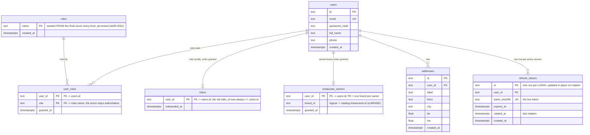
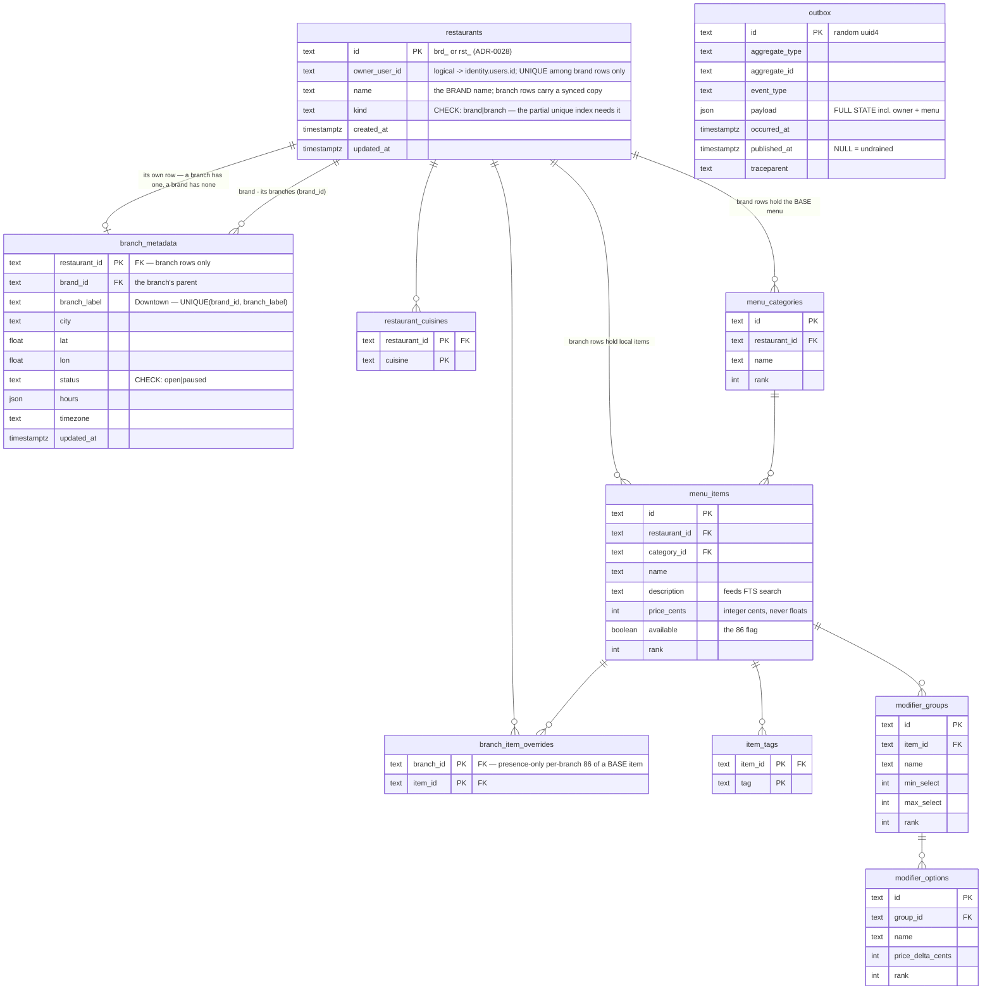
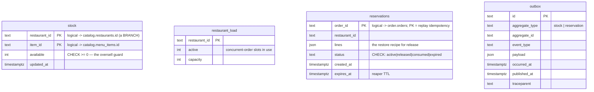
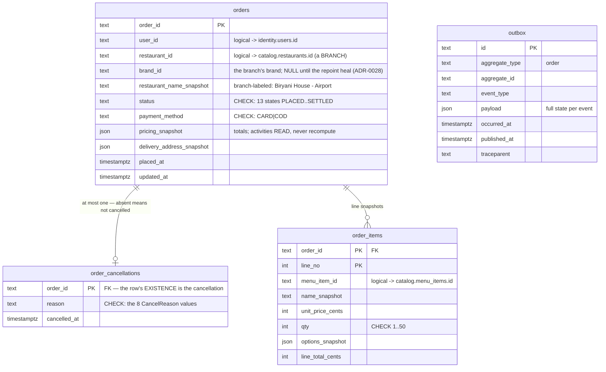
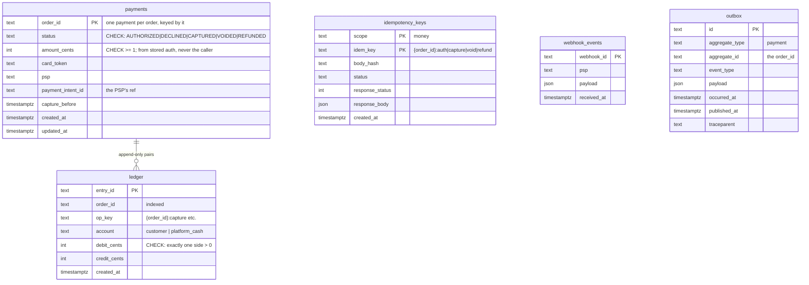
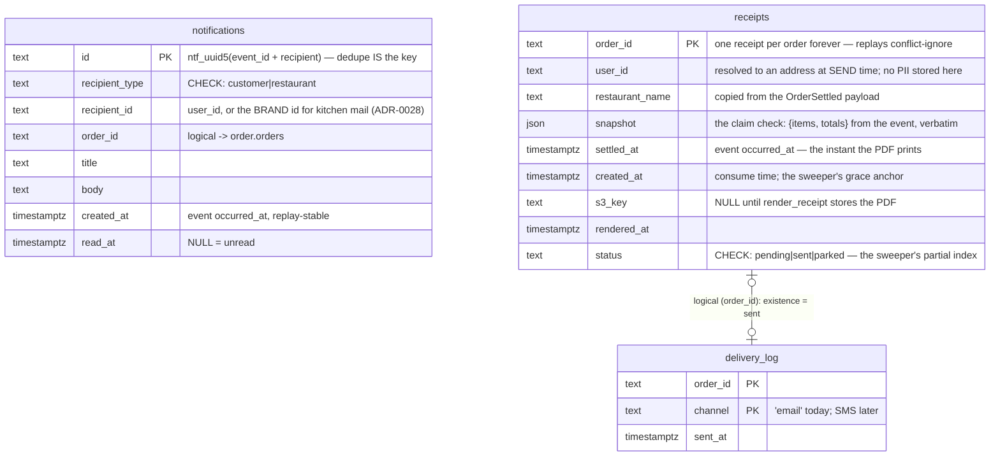
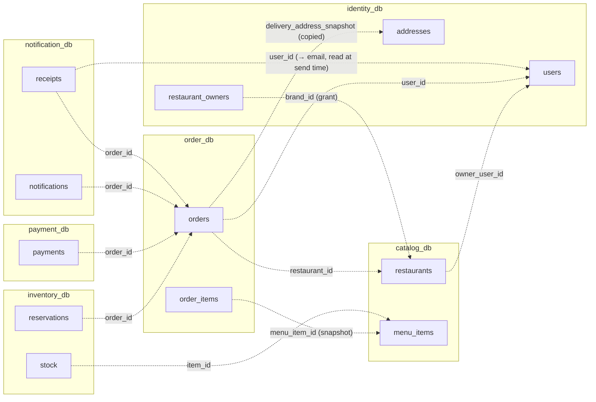

# SmartFoodOps — ERD (as built, W3)

**Read this first:** the platform is database-per-service — six PostgreSQL databases, one per owning service, and **no foreign keys ever cross a database**. Real FK lines appear only inside each diagram; references _between_ services travel as plain id columns (shown in the last diagram) and are kept consistent by events + idempotent consumers, not constraints. Two table shapes come from shared libs: `outbox` (smartfood-outbox, 8 columns) repeats across services; `idempotency_keys` (smartfood-idempotency) survives only in payment_db — order's copy was retired by ADR-0024 (the orders row itself is placement's idempotency record). Identity's `processed_events` ledger is likewise **retired** (design review, 2026-09-08): `grant_restaurant_admin` already short-circuits an already-applied grant, so the seen-check traded one indexed read for one indexed read while adding two statements per event — dedupe now rides the write in all five consumers, per ADR-0018's per-sink modes.

---

## identity_db — who you are

### Example rows — the tricky identity tables

`roles` — the seeded lookup (ADR-0022): five rows, one per `Role` enum member, written only by boot-time seeding — a test pins table == enum, both directions:

| name             | created_at |
| ---------------- | ---------- |
| customer         | 12:00      |
| restaurant_admin | 12:00      |
| rider            | 12:00      |
| system_admin     | 12:00      |
| system           | 12:00      |

`user_roles` — a promoted owner **keeps** `customer`, which is what the old single `users.role` column threw away (and why every customer-facing endpoint had to list both):

| user_id | role             | granted_at |
| ------- | ---------------- | ---------- |
| usr_1   | customer         | 12:00      |
| usr_1   | restaurant_admin | 12:05      |

`refresh_tokens` — one row per **login**, not per token: rotation UPDATES the row in place. Two devices are two rows:

| id         | user_id | token_sha256 | expires_at |
| ---------- | ------- | ------------ | ---------- |
| ses_phone  | usr_1   | h(rt_3)      | +30d       |
| ses_laptop | usr_1   | h(rt_9)      | +30d       |

## catalog_db — what can be ordered

A branch's **effective menu** = the brand's rows ∪ its own rows, minus its
`branch_item_overrides` (rendered `available: false`) — computed at read
time by `get_menu`/`pricing_read`, never materialized (ADR-0028).

Search indexes worth knowing (Postgres-only — they live in migration 0001, not `db.py`, so sqlite's `create_all` never sees them): `pg_trgm` GIN indexes on `restaurants.name` and `menu_items.name` (typo-tolerant fuzzy match) plus FTS expression indexes over names + item descriptions — these four indexes ARE the search engine (ADR-0019).

### Example rows — the outbox, concretely

One restaurant, three mutations — the outbox holds one event **per mutation**. (The once-planned `menu_versions` audit table was dropped unread in migration 0005.)

`restaurants` (current state only — the brand row owns the base menu, its
branch rows are the places customers order from, ADR-0028):

| id    | owner_user_id | name          | kind   |
| ----- | ------------- | ------------- | ------ |
| brd_9 | usr_1         | Biryani House | brand  |
| rst_9 | usr_1         | Biryani House | branch |

`branch_metadata` — only `rst_9` has a row; the brand has none:

| restaurant_id | brand_id | branch_label | city    | status |
| ------------- | -------- | ------------ | ------- | ------ |
| rst_9         | brd_9    | Main         | Chicago | open   |

(A base-menu edit stages one full-effective-state event per aggregate in one
all-or-nothing transaction — the fan-out.)

`outbox` — `aggregate_type` + `aggregate_id` say _whose fact_, `event_type` says _what kind_:

| id (random uuid4) | aggregate_type | aggregate_id | event_type        | payload (full state!)                                       | published_at                                   |
| ----------------- | -------------- | ------------ | ----------------- | ----------------------------------------------------------- | ---------------------------------------------- |
| `a3f1…`           | restaurant     | rst_9        | RestaurantCreated | {owner_user_id: usr_1, name: …, menu: {…}}                  | 12:00                                          |
| `5c88…`           | restaurant     | rst_9        | ItemAdded         | {owner_user_id: usr_1, …, menu: {full menu incl. new item}} | 12:10                                          |
| `d901…`           | restaurant     | rst_9        | ItemUpdated       | {owner_user_id: usr_1, …, menu: {full menu, new price}}     | **NULL** _(staged, poller hasn't drained yet)_ |

## inventory_db — what can actually be sold

Index worth knowing: `ix_reservations_reaper (status, expires_at)` — the reaper's scan for overdue actives.

### Example rows — a reservation's life against the stock it holds

`stock` — before `ord_42` reserves 2 portions, and after (the oversell guard is the `WHERE available >= :qty` on the decrement):

| item_id                        | restaurant_id | available |
| ------------------------------ | ------------- | --------- |
| itm*biryani *(before)\_        | rst_9         | 100       |
| itm*biryani *(after reserve)\_ | rst_9         | **98**    |

`reservations` — three orders, three fates. `lines` is the restore-recipe; `expires_at` is the reaper's clock:

| order_id | status       | lines                            | expires_at | what happened                                          |
| -------- | ------------ | -------------------------------- | ---------- | ------------------------------------------------------ |
| ord_42   | **consumed** | [{item_id: itm_biryani, qty: 2}] | 12:52      | settled — stock stays sold, slot freed                 |
| ord_43   | **released** | [{item_id: itm_biryani, qty: 1}] | 12:55      | card declined — stock restored                         |
| ord_44   | **expired**  | [{item_id: itm_raita, qty: 3}]   | 12:58      | saga died holding it — the reaper released it at 12:58 |

`restaurant_load` — slots as stock; two orders currently cooking:

| restaurant_id | active | capacity |
| ------------- | ------ | -------- |
| rst_9         | 2      | 10       |

## order_db — the state machine

Indexes worth knowing: `ix_orders_history (user_id, placed_at DESC, order_id DESC)` — customer keyset paging; `ix_orders_feed (restaurant_id, status, placed_at)` — kitchen queues.

### Example rows — one order and its event trail

`orders` — the finished `ord_42`:

| order_id | user_id | restaurant_id | status  | pricing_snapshot                                        |
| -------- | ------- | ------------- | ------- | ------------------------------------------------------- |
| ord_42   | usr_1   | rst_9         | SETTLED | {subtotal: 3000, fee: 199, tax: 247, total_cents: 3446} |

`order_items` — the cart snapshot (survives any future menu edit):

| order_id | line_no | menu_item_id | name_snapshot   | unit_price_cents | qty | options_snapshot                                           | line_total_cents |
| -------- | ------- | ------------ | --------------- | ---------------- | --- | ---------------------------------------------------------- | ---------------- |
| ord_42   | 1       | itm_biryani  | Chicken Biryani | 1200             | 2   | [{group_name: Size, name: Family, price_delta_cents: 600}] | 3600             |

`outbox` — nine guarded transitions, but only four staged events (the in-between statuses transition silently). Per-order ordering comes from the Kafka key (`aggregate_id`):

| event_type     | id (random uuid4) | note                                         |
| -------------- | ----------------- | -------------------------------------------- |
| OrderPlaced    | `7c1e…`           |                                              |
| OrderConfirmed | `b7e4…`           | VALIDATED and PAYMENT_CLEARED staged nothing |
| OrderDelivered | `4f2a…`           | kitchen + pickup transitions are silent      |
| OrderSettled   | `9d03…`           |                                              |

**Idempotency without a table (ADR-0024)** — `order_id = ord_ + uuid5(NS, "usr_1:K-7f3a…")`, so the ROW is the record:

| retry with key K-7f3a… finds | answer                                                                  |
| ---------------------------- | ----------------------------------------------------------------------- |
| row, `request_hash` matches  | 202 `{order_id: ord_42, status: <current>}` + `Idempotent-Replay: true` |
| row, hash differs            | 422 `IDEMPOTENCY_KEY_REUSE` — same key, different cart                  |
| no row, workflow running     | attaches via `USE_EXISTING` / the `await_placement` probe               |
| no row, nothing running      | places fresh — same derived id either way                               |

## payment_db — the money

`ledger` is append-only (a source-scan test bans UPDATE/DELETE): corrections are reversing pairs, never edits. `webhook_events` is built but unwritten until a real PSP replaces the mock.

### Example rows — money keys and balanced pairs

`idempotency_keys` (scope "money") — one row per money verb, the natural key IS `{order_id}:{op}`:

| scope | idem_key       | status   | response_status                                       |
| ----- | -------------- | -------- | ----------------------------------------------------- |
| money | ord_42:auth    | COMPLETE | 200                                                   |
| money | ord_42:capture | COMPLETE | 200                                                   |
| money | ord_43:auth    | COMPLETE | 402 _(a DECLINE is also a stored, replayable answer)_ |

`ledger` — append-only pairs. `ord_42` was captured; `ord_45` was captured then refunded — note the refund is a **reversing pair**, never an edit:

| entry_id | order_id | op_key         | account       | debit_cents | credit_cents |
| -------- | -------- | -------------- | ------------- | ----------- | ------------ |
| led_01   | ord_42   | ord_42:capture | customer      | 3446        | 0            |
| led_02   | ord_42   | ord_42:capture | platform_cash | 0           | 3446         |
| led_03   | ord_45   | ord_45:capture | customer      | 2100        | 0            |
| led_04   | ord_45   | ord_45:capture | platform_cash | 0           | 2100         |
| led_05   | ord_45   | ord_45:refund  | platform_cash | 2100        | 0            |
| led_06   | ord_45   | ord_45:refund  | customer      | 0           | 2100         |

Every row has exactly one non-zero side (the CHECK); every op sums to zero across accounts — the books always balance.

## notification_db — the inbox and the receipts (consumer-only: no outbox)

Index: `ix_notifications_inbox (recipient_type, recipient_id, created_at DESC, id DESC)` — one keyset walk per bell poll.

The two halves of this database answer different questions and never join. `notifications` is the **bell** (in-app, minted from every notifying event — except the refund, which ADR-0040 mints from a Temporal workflow because payment events carry no `user_id`). `receipts` + `delivery_log` are the **receipt pipeline** (S10, FR-41): `OrderSettled` writes the `receipts` row in the same transaction as the inbox rows — that row is a **claim check**: `snapshot` holds everything the PDF needs — the line items and the pricing totals, copied verbatim — so the Celery chain can be handed only an `order_id` and never call another service for data. `delivery_log` is the send ledger: a row exists ⇔ that channel was accepted by the provider, which is what makes `receipts.send` re-runnable and the beat sweeper (`receipts.sweep`) safe to be dumb. Neither table has a FK — even inside one database these are id conventions, because the writers are independent tasks.

---

### Example rows — one event fanning out to two inboxes

`notifications` — the single `OrderConfirmed` event (id `b7e4…`) minted **two** rows, each with its own deterministic id, so each recipient's copy dedupes independently on redelivery:

| id = ntf_uuid5 of…       | recipient_type | recipient_id | title               | read_at                          |
| ------------------------ | -------------- | ------------ | ------------------- | -------------------------------- |
| "b7e4…:restaurant:rst_9" | restaurant     | rst_9        | New order to accept | 12:03                            |
| "b7e4…:customer:usr_1"   | customer       | usr_1        | Order confirmed     | NULL _(unread — the bell badge)_ |

`receipts` — three orders mid-pipeline, showing every state the row can be in. Note `ord_42` settled but minted **no** notification: settlement is a deliberate silence in the bell (`mapping.py`), and the receipt is the only thing the customer sees:

| order_id | settled_at | s3_key              | rendered_at | status  | means                                         |
| -------- | ---------- | ------------------- | ----------- | ------- | --------------------------------------------- |
| ord_42   | 12:40      | receipts/ord_42.pdf | 12:40       | sent    | rendered and sent (see the log below)         |
| ord_43   | 12:41      | NULL                | NULL        | pending | owed — render hasn't run (or is retrying) yet |
| ord_44   | 12:38      | receipts/ord_44.pdf | 12:38       | parked  | the mailer 4xx'd, or identity has no user     |

`delivery_log` — the per-CHANNEL send ledger, holding the provider's message id. `ord_42` has a row, so a sweeper re-enqueue or a Celery retry short-circuits to a no-op. It is written in the SAME transaction that moves `status` to `sent`: the log answers "which channels went out", `status` answers "is this receipt done", and the sweeper indexes the second:

| order_id | channel | sent_at | provider_message_id |
| -------- | ------- | ------- | ------------------- |
| ord_42   | email   | 12:40   | msg_a1c9…           |

The sweeper's query is exactly that reading, and now it is one table: `status = 'pending' AND created_at < now() - grace`, served by a partial index over only the pending rows. It used to anti-join `delivery_log`, which made the STEADY state the expensive one — proving nothing was owed hash-joined both tables in full (measured: 7,395 buffers to return zero rows on 300k receipts, growing forever). Against the partial index the same sweep reads one page.

---

## Cross-service references — ids, not FKs

These lines are _conventions kept true by events and idempotent consumers_, never constraints the databases enforce:

Two idioms to notice while reading:

- **Snapshots over joins.** `orders` copies the restaurant _name_, the _address_, the _prices_ at placement time. The order is a historical fact; a later menu edit or address change must not rewrite what you bought. Where a normalized design would join, this design copies-at-commit.
- **The same service-local shapes everywhere.** `status` with a CHECK against a closed vocabulary, an `outbox` staged in-transaction, and a natural key (or a guarding WHERE) for consumer dedupe. No table carries a `version` column: event ids are random, and a priced cart's drift is caught by comparing the recomputed total against `expected_total_cents`.
