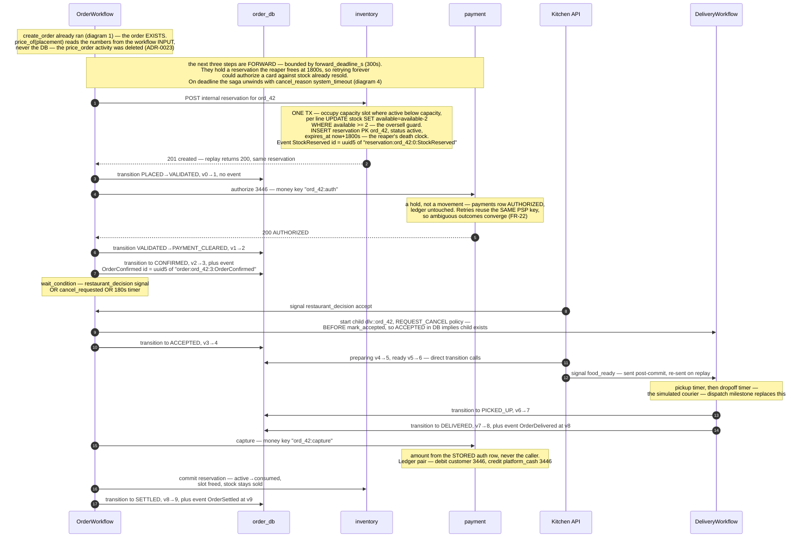
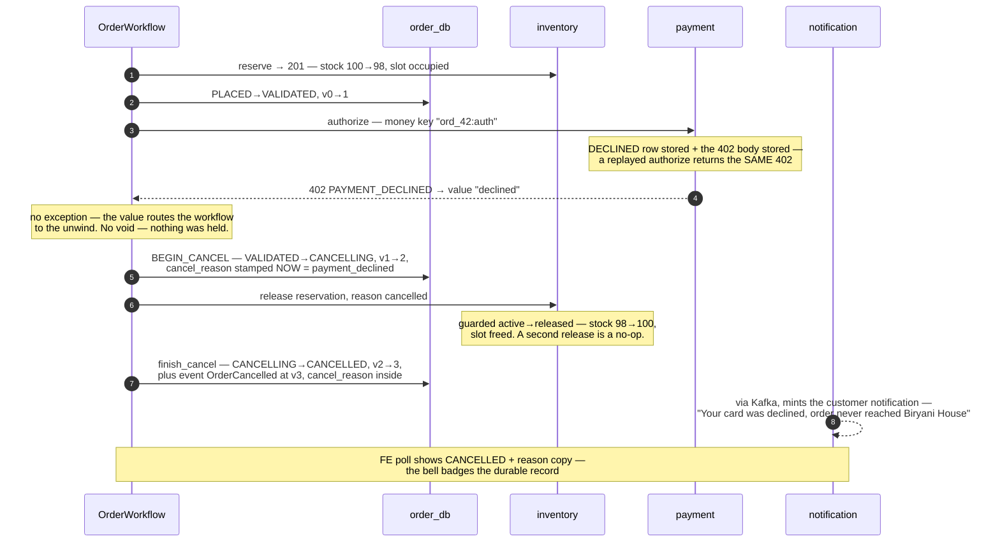
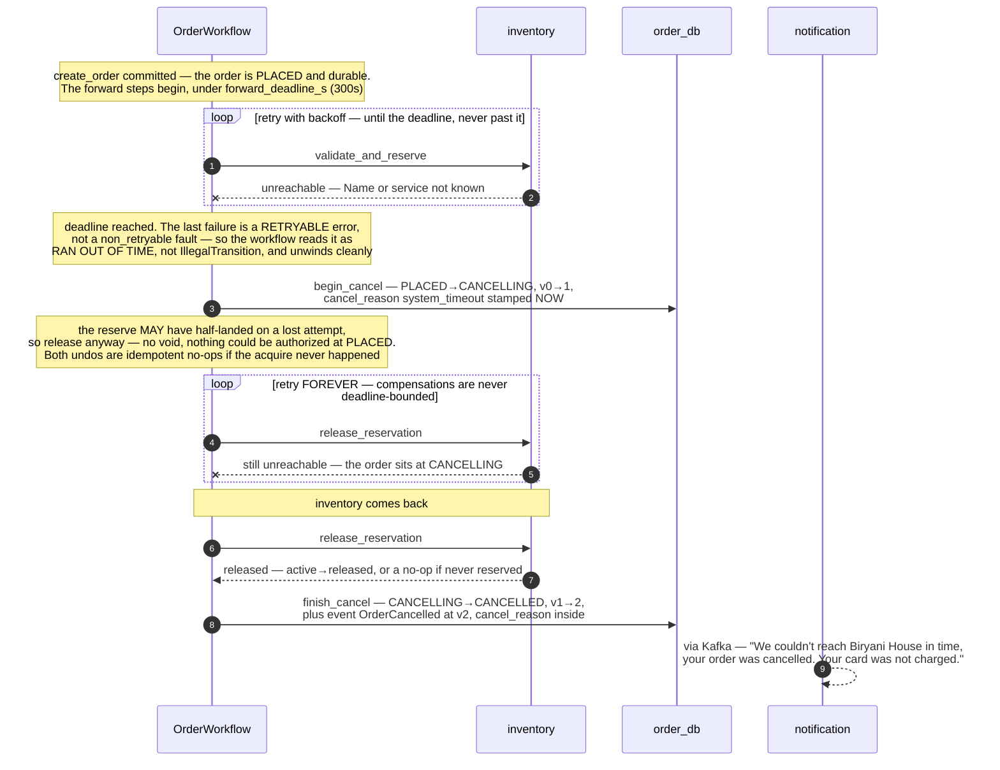
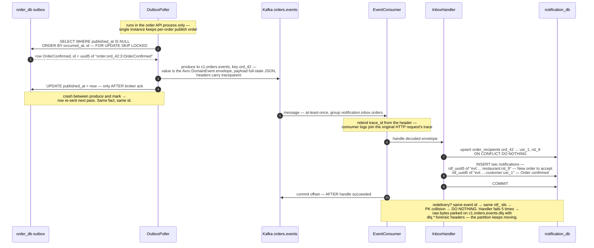

# SmartFoodOps — Flow Sequence Diagrams (as built, W3)

Companion to [erd.md](erd.md): the ERD shows what is stored; this shows **how data travels, how every id is computed, and what gets written where** — with one example order (`ord_42`, 2x Family Chicken Biryani from Biryani House) threaded through all diagrams.

## The identity cheat-sheet — every id in the system and its formula

| Id                    | Formula                                                               | Example                                  | Why deterministic / why not                                                   |
| --------------------- | --------------------------------------------------------------------- | ---------------------------------------- | ----------------------------------------------------------------------------- |
| Entity ids            | `prefix_ + uuid4().hex`                                               | `ord_42…`, `rst_9…`, `usr_1…`            | Random — entities are _created_, not derived                                  |
| Event id              | `uuid5(NS, "{aggregate_type}:{aggregate_id}:{version}:{event_type}")` | `uuid5("order:ord_42:3:OrderConfirmed")` | Deterministic — same fact, same id, always → consumer dedupe, safe replays    |
| Notification id       | `ntf_ + uuid5(NS, "{event_id}:{recipient_type}:{recipient_id}").hex`  | `ntf_e9cd…`                              | Deterministic per (event, recipient) → redelivery collides on PK, absorbed    |
| Money idempotency key | `"{order_id}:{op}"`                                                   | `ord_42:auth`, `ord_42:capture`          | Natural key — one auth per order, ever                                        |
| HTTP idempotency key  | client uuid, minted per **cart-body-hash**, persisted in localStorage | header `Idempotency-Key: K`              | The DERIVATION SEED, not a ledger (ADR-0024): `order_id = uuid5(sub:K)`, and the orders row is the record — same cart = same key = same order; changed cart = new key = new order |
| Workflow ids          | `ord::{order_id}` / `dlv::{order_id}`                                 | `ord::ord_42`                            | Identity, not randomness → `REJECT_DUPLICATE` makes every re-start a no-op    |
| Consumer dedupe       | `(consumer_group, event_id)` row, or the deterministic PK itself      | —                                        | "Have I seen this fact?" answerable only because facts have stable names      |

`aggregate_version` bumps on **every** guarded transition, but only some transitions stage events — so published versions are monotone **with gaps** (this order publishes at 0, 3, 8, 9).

---

## 1. Order placement — `POST /v1/orders`

Placement, written by the SAGA (ADR-0023) with the orders row as its own idempotency record (ADR-0024): the HTTP request reads the row, prices, then waits on one update-with-start RPC.

```mermaid
sequenceDiagram
    autonumber
    participant FE as Frontend
    participant E as edge-bff
    participant O as order API
    participant I as identity
    participant C as catalog
    participant T as Temporal
    participant W as order worker
    participant DB as order_db

    FE->>E: POST /v1/orders + Bearer JWT<br/>Idempotency-Key K = uuid per body-hash, from localStorage
    Note over E: verify JWT once via JWKS<br/>STRIP client identity headers<br/>STAMP X-Auth-Sub usr_1, X-Auth-Role customer
    E->>O: forward with stamped headers
    O->>DB: SELECT orders WHERE order_id = derived id<br/>row + hash match → 202 replay, current status — STOP<br/>row + hash differs → 422 reuse — STOP<br/>no row → continue (fresh placement)
    O->>I: GET internal address adr_1 for usr_1<br/>system headers sub=svc:order + traceparent
    I-->>O: address → delivery_address_snapshot
    O->>C: GET internal pricing snapshot for rst_9
    C-->>O: menu snapshot at menu_version 7
    Note over O: price_order with expected version 7<br/>version moved → 409 PRICE_CHANGED, synchronously<br/>ok → PricedOrder total_cents 3446
    Note over O: order_id = ord_ + uuid5 of "usr_1:K" → ord_42<br/>DERIVED, not random — a retry re-derives THIS id
    O->>T: execute_update_with_start_workflow — ONE RPC<br/>start ord::ord_42, USE_EXISTING + REJECT_DUPLICATE<br/>update await_placement
    T->>W: workflow task → activity create_order
    rect rgb(0,0,0)
        Note over W,DB: ONE TRANSACTION — the three writes
        W->>DB: INSERT orders: status PLACED, aggregate_version 0,<br/>menu_version 7, request_hash, pricing/address/name snapshots
        W->>DB: INSERT order_items: name, unit_price 1200,<br/>option Family +600, line_total 3600
        W->>DB: INSERT outbox: OrderPlaced<br/>id = uuid5 of "order:ord_42:0:OrderPlaced"
        W->>DB: COMMIT
    end
    W-->>T: PlacementAck ord_42 PLACED — the update resolves
    T-->>O: ack
    O-->>FE: 202 order_id ord_42, status PLACED
    Note over O,T: waited past 2s? still 202 — the workflow is durable<br/>Temporal unreachable? 503 with NOTHING written —<br/>the retry re-derives ord_42 and just runs again
    Note over FE: navigate to /orders/ord_42 — the poll drives<br/>the placing-your-order → confirmed screen
    Note over W: the same workflow runs straight on into<br/>validate_and_reserve → authorize_payment → confirm_order
```

**Replay (ADR-0024):** same `K` again → the row-read at the top answers — 202 with the order's **current** status and `Idempotent-Replay: true`; nothing below it re-executes (so a replay is immune to menu drift). Same key + different body → `422 IDEMPOTENCY_KEY_REUSE` via the row's `request_hash`. Retry landing in the pending window (no row yet)? It attaches to the running workflow — and if pricing refuses because the menu drifted meanwhile, the running workflow's ack **outranks the refusal**.

---

## 2. The saga — happy path to SETTLED

Every status write goes through `transition()` (guarded UPDATE + version bump + event in the same tx). Money ops carry natural keys; holds are taken early (reversible) and finalized late. The parent workflow is `ord::ord_42`; the courier child is `dlv::ord_42`.

---

## 3. Compensation — card declined (`tok_decline`)

Business outcomes travel as **values** (never exceptions — replay determinism). Two triggers reach the same unwind: a business _value_ (declined, below) or a forward-step _deadline_ (diagram 4). Either way the unwind runs in reverse order of acquisition and — unlike the bounded forward steps — its compensations retry **forever**.

---

## 4. Compensation — forward-step timeout (`system_timeout`)

The split retry policy, made visible. A **forward** step (reserve/authorize/confirm) is bounded: if a dependency stays unreachable past `forward_deadline_s`, the saga stops trying and unwinds. The **compensation** that unwinds it is _not_ bounded — it retries forever, so the order reaches CANCELLED even while the dependency is still down. (Watched live: with inventory stopped, the order sat at CANCELLING until inventory returned, then settled to CANCELLED.)

---

## 5. The event pipeline — outbox → Kafka → notification inbox

Where the deterministic ids pay off: publish-then-mark on the producer side, commit-after-handle plus natural-key dedupe on the consumer side — duplicates are absorbed at every hop.

---

## 6. Restaurant onboarding — sync grant + async convergence

Two services must change state with no shared transaction; every layer is idempotent so replay is the repair mechanism. The topic `c1.catalog.changes` is **compacted** — which is why payloads are full-state.

```mermaid
sequenceDiagram
    autonumber
    participant FE as Frontend
    participant E as edge-bff
    participant C as catalog
    participant CDB as catalog_db
    participant I as identity
    participant KF as Kafka catalog.changes
    participant INV as inventory

    FE->>E: POST /v1/restaurants — Bearer token, role customer
    E->>C: forward, X-Auth-Sub usr_1
    rect rgb(0,0,0)
        Note over C,CDB: ONE TRANSACTION
        C->>CDB: INSERT restaurant rst_9, owner_user_id usr_1 —<br/>UNIQUE owner — race loser rolls back and adopts the winner
        C->>CDB: version bump to 1, INSERT menu_versions rst_9 v1
        C->>CDB: INSERT outbox RestaurantCreated<br/>id = uuid5 of "restaurant:rst_9:1:RestaurantCreated"<br/>payload FULL STATE — owner_user_id on EVERY event
        C->>CDB: COMMIT
    end
    C->>I: POST internal grant — post-commit, retry x3,<br/>4xx permanent, 5xx and network retried
    I->>I: users row — role restaurant_admin, restaurant_id rst_9.<br/>Idempotent: replay of an applied grant is silent success
    I-->>C: 200
    C-->>FE: 201 — a replay of the POST returns 200, same restaurant
    FE->>E: refreshTokens — the new JWT claims carry the grant
    Note over FE: grant call failed instead? 503 + pending flag,<br/>the app replays the POST on every launch
    par async fan-out — always, regardless of the sync outcome
        CDB->>KF: poller publishes RestaurantCreated, key rst_9
        KF->>I: grant-convergence consumer — type-AGNOSTIC,<br/>compaction may keep ANY event and every payload<br/>carries owner_user_id → processed_events check →<br/>same idempotent grant → marked processed
        KF->>INV: stock provisioning — diff full menu vs known rows,<br/>INSERT stock rows at 0 (STRICT) + default capacity,<br/>ON CONFLICT DO NOTHING, replay-safe
    end
```

---

## Reading these diagrams in a presentation

Three patterns repeat in every diagram — point at them and the architecture explains itself:

1. **Green boxes are atomic.** State + its event + its stored response commit together; there is no moment where they can disagree.
2. **Every step is idempotent and re-runnable** — placement (derived order id + caught IntegrityError), saga starts (`REJECT_DUPLICATE`/`USE_EXISTING`), grants (silent replay), consumer handling (deterministic ids). Reconcilers (reaper, poller) and Temporal's own activity retries re-run these paths freely, which is _why_ crashes anywhere leave debts, never damage.
3. **Ids are the load-bearing walls**: deterministic where facts need dedup-able names, natural keys where the business rule is the uniqueness, random only where entities are truly born.
