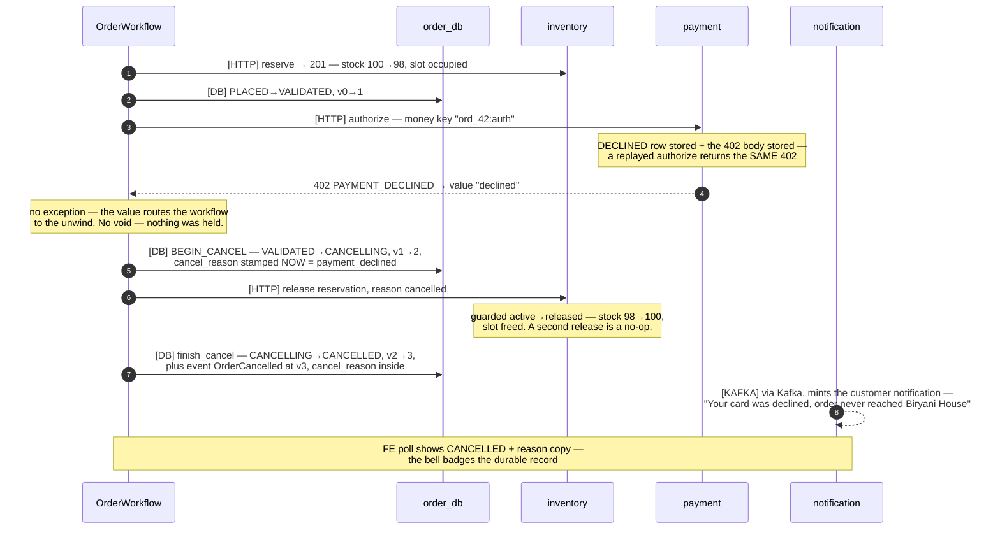
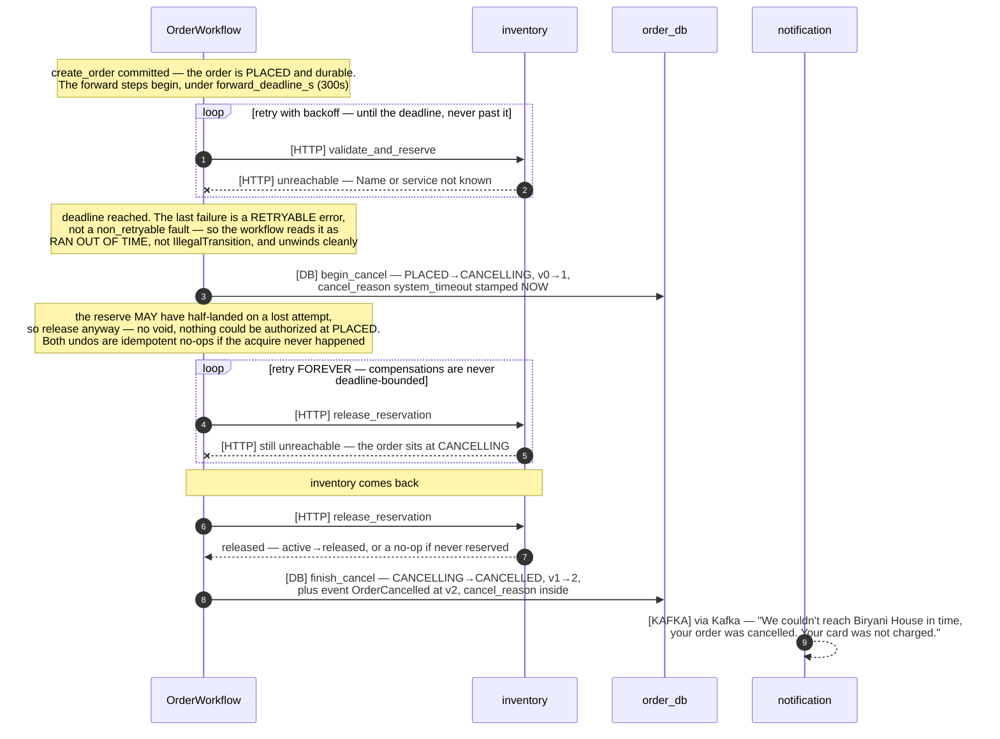
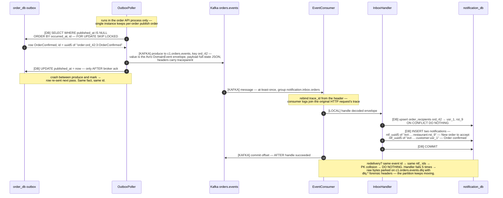

# SmartFoodOps — Flow Sequence Diagrams (as built, W3)

Companion to [erd.md](erd.md): the ERD shows what is stored; this shows **how data travels, how every id is computed, and what gets written where** — with one example order (`ord_42`, 2x Family Chicken Biryani from Biryani House) threaded through all diagrams.

## Transport legend — what kind of call is each arrow

Every request arrow is tagged with **how** it travels. Reply arrows are left
untagged: they are the return leg of the tagged call above them.

| Tag | Transport | What it means | Failure mode when the other side is down |
| --- | --------- | ------------- | ---------------------------------------- |
| `[HTTP]` | JSON over HTTP, service→service | A **question** the caller cannot proceed without: "is there stock?", "did the card authorize?". Synchronous by necessity — the saga branches on the answer. | Caller blocks up to its timeout, then the activity retries under Temporal's policy. Bounded by `forward_deadline_s` (300s) on forward steps; compensations retry forever. |
| `[DB]` | SQL over the connection pool | Direct SQL against a database **the calling service owns**. The order worker writes `order_db` because it *is* the order service's second process — it never touches `inventory_db` or `payment_db`, which are HTTP away. | Connection checkout waits (pool 5 + 10 overflow), then `TimeoutError` → activity retry. |
| `[KAFKA]` | Avro event on a topic | A **fact already committed**, announced to whoever cares. Fire-and-forget: the producer never learns who consumed it. At-least-once, deduped by deterministic event id. | Nothing upstream blocks. Events queue in the outbox (visible as `outbox_pending`) and publish when the broker returns. |
| `[TEMPORAL]` | gRPC to the Temporal service | Workflow orchestration: start-with-update, activity dispatch, signals, child-workflow starts. **Not** a service call and **not** an event — the durable execution layer. | On the checkout path, so an outage is a checkout outage: `SagaUnavailable` → 503 + `Retry-After`, nothing written. The retry re-derives the same order id. |
| `[LOCAL]` | In-process function call | Same process, no network, no serialization. | Cannot fail independently. |
| `[REDIS]` | Pub/sub hint on a channel | A **"look again" nudge** to whoever is listening right now — never a payload, never a record. Published post-commit, fire-and-forget. | Nothing blocks, nothing is stored: a lost hint costs seconds of staleness — the FE's poll floor still exists beneath every stream. |
| `[SSE]` | Server-sent frames on a held connection | The browser's live wire: one long HTTP response streaming `event:`/`data:` frames. Auth is a single-use ticket (FR-38) because EventSource cannot send headers. | Connection death is NORMAL (jittered lifetime ends every stream on purpose); the client re-tickets and reopens, and falls back to polling meanwhile. |

**The rule these tags reveal:** `[HTTP]` and `[TEMPORAL]` are on the critical path — a customer is waiting. `[KAFKA]` never is. `[DB]` only crosses a **process** boundary, never a **service** boundary. `[REDIS]` and `[SSE]` carry HINTS, never truth — every render still comes from a `[HTTP]`+`[DB]` read, which is what lets both fail freely.

---

## The identity cheat-sheet — every id in the system and its formula

| Id                    | Formula                                                               | Example                                  | Why deterministic / why not                                                   |
| --------------------- | --------------------------------------------------------------------- | ---------------------------------------- | ----------------------------------------------------------------------------- |
| Entity ids            | `prefix_ + uuid4().hex`                                               | `ord_42…`, `rst_9…`, `usr_1…`            | Random — entities are _created_, not derived                                  |
| Event id              | `uuid5(NS, "{aggregate_type}:{aggregate_id}:{version}:{event_type}")` | `uuid5("order:ord_42:3:OrderConfirmed")` | Deterministic — same fact, same id, always → consumer dedupe, safe replays    |
| Notification id       | `ntf_ + uuid5(NS, "{event_id}:{recipient_type}:{recipient_id}").hex`  | `ntf_e9cd…`                              | Deterministic per (event, recipient) → redelivery collides on PK, absorbed    |
| Money idempotency key | `"{order_id}:{op}"`                                                   | `ord_42:auth`, `ord_42:capture`          | Natural key — one auth per order, ever                                        |
| HTTP idempotency key  | client uuid, minted per **cart-body-hash**, persisted in localStorage | header `Idempotency-Key: K`              | The DERIVATION SEED, not a ledger (ADR-0024): `order_id = uuid5(sub:K)`, and the orders row is the record — same cart = same key = same order; changed cart = new key = new order |
| Workflow ids          | `ord::{order_id}` / `dlv::{order_id}`                                 | `ord::ord_42`                            | Identity, not randomness → `REJECT_DUPLICATE` makes every re-start a no-op    |
| Consumer dedupe       | `(consumer_group, event_id)` row, or the deterministic PK itself      | —                                        | "Have I seen this fact?" answerable only because facts have stable names      |

`aggregate_version` bumps on **every** guarded transition, but only some transitions stage events — so published versions are monotone **with gaps** (this order publishes at 0, 3, 8, 9).

---

## 1. Order placement — `POST /v1/orders`

Placement, written by the SAGA (ADR-0023) with the orders row as its own idempotency record (ADR-0024): the HTTP request reads the row, prices, then waits on one update-with-start RPC.

```mermaid
sequenceDiagram
    autonumber
    participant FE as Frontend
    participant E as edge-bff
    participant O as order API
    participant I as identity
    participant C as catalog
    participant T as Temporal
    participant W as order worker
    participant DB as order_db

    FE->>E: [HTTP] POST /v1/orders + Bearer JWT<br/>Idempotency-Key K = uuid per body-hash, from localStorage
    Note over E: verify JWT once via JWKS<br/>STRIP client identity headers<br/>STAMP X-Auth-Sub usr_1, X-Auth-Role customer
    E->>O: [HTTP] forward with stamped headers
    O->>DB: [DB] SELECT orders WHERE order_id = derived id<br/>row + hash match → 202 replay, current status — STOP<br/>row + hash differs → 422 reuse — STOP<br/>no row → continue (fresh placement)
    O->>I: [HTTP] GET internal address adr_1 for usr_1<br/>system headers sub=svc:order + traceparent
    I-->>O: address → delivery_address_snapshot
    O->>C: [HTTP] GET internal pricing snapshot for rst_9
    C-->>O: menu snapshot at menu_version 7
    Note over O: price_order with expected version 7<br/>version moved → 409 PRICE_CHANGED, synchronously<br/>ok → PricedOrder total_cents 3446
    Note over O: order_id = ord_ + uuid5 of "usr_1:K" → ord_42<br/>DERIVED, not random — a retry re-derives THIS id
    O->>T: [TEMPORAL] execute_update_with_start_workflow — ONE RPC<br/>start ord::ord_42, USE_EXISTING + REJECT_DUPLICATE<br/>update await_placement
    T->>W: [TEMPORAL] workflow task → activity create_order
    rect rgb(0,0,0)
        Note over W,DB: ONE TRANSACTION — the three writes
        W->>DB: [DB] INSERT orders: status PLACED, aggregate_version 0,<br/>menu_version 7, request_hash, pricing/address/name snapshots
        W->>DB: [DB] INSERT order_items: name, unit_price 1200,<br/>option Family +600, line_total 3600
        W->>DB: [DB] INSERT outbox: OrderPlaced<br/>id = uuid5 of "order:ord_42:0:OrderPlaced"
        W->>DB: [DB] COMMIT
    end
    W-->>T: PlacementAck ord_42 PLACED — the update resolves
    T-->>O: ack
    O-->>FE: 202 order_id ord_42, status PLACED
    Note over O,T: waited past 2s? still 202 — the workflow is durable<br/>Temporal unreachable? 503 with NOTHING written —<br/>the retry re-derives ord_42 and just runs again
    Note over FE: navigate to /orders/ord_42 — the poll drives<br/>the placing-your-order → confirmed screen
    Note over W: the same workflow runs straight on into<br/>validate_and_reserve → authorize_payment → confirm_order
```



**Replay (ADR-0024):** same `K` again → the row-read at the top answers — 202 with the order's **current** status and `Idempotent-Replay: true`; nothing below it re-executes (so a replay is immune to menu drift). Same key + different body → `422 IDEMPOTENCY_KEY_REUSE` via the row's `request_hash`. Retry landing in the pending window (no row yet)? It attaches to the running workflow — and if pricing refuses because the menu drifted meanwhile, the running workflow's ack **outranks the refusal**.

---

## 2. The saga — happy path to SETTLED

Every status write goes through `transition()` (guarded UPDATE + version bump + event in the same tx). Money ops carry natural keys; holds are taken early (reversible) and finalized late. The parent workflow is `ord::ord_42`; the courier child is `dlv::ord_42`.

```mermaid
sequenceDiagram
    autonumber
    participant W as OrderWorkflow
    participant DB as order_db
    participant INV as inventory
    participant PAY as payment
    participant K as Kitchen API
    participant D as DeliveryWorkflow

    Note over W: create_order already ran (diagram 1) — the order EXISTS.<br/>price_of(placement) reads the numbers from the workflow INPUT,<br/>never the DB — the price_order activity was deleted (ADR-0023)
    Note over W,PAY: the next three steps are FORWARD — bounded by forward_deadline_s (300s).<br/>They hold a reservation the reaper frees at 1800s, so retrying forever<br/>could authorize a card against stock already resold.<br/>On deadline the saga unwinds with cancel_reason system_timeout (diagram 4)
    W->>INV: [HTTP] POST internal reservation for ord_42
    Note over INV: ONE TX — occupy capacity slot where active below capacity,<br/>per line UPDATE stock SET available=available-2<br/>WHERE available >= 2 — the oversell guard.<br/>INSERT reservation PK ord_42, status active,<br/>expires_at now+1800s — the reaper's death clock.<br/>Event StockReserved id = uuid5 of "reservation:ord_42:0:StockReserved"
    INV-->>W: 201 created — replay returns 200, same reservation
    W->>DB: [DB] transition PLACED→VALIDATED, v0→1, no event
    rect rgb(0,0,0)
        Note over W,PAY: ONE ACTIVITY — authorize_payment.<br/>The call AND the write that records its answer
        W->>PAY: [HTTP] authorize 3446 — money key "ord_42:auth"
        Note over PAY: a hold, not a movement — payments row AUTHORIZED,<br/>ledger untouched. Retries reuse the SAME PSP key,<br/>so ambiguous outcomes converge (FR-22)
        PAY-->>W: 200 AUTHORIZED
        W->>DB: [DB] transition VALIDATED→PAYMENT_CLEARED, v1→2, no event.<br/>NOT a second round trip from the workflow — it is the tail of<br/>this activity: the instant money is held, a void is owed, so<br/>that fact is written before the activity is allowed to finish
    end
    W->>DB: [DB] confirm_order — a SEPARATE activity:<br/>PAYMENT_CLEARED→CONFIRMED, v2→3, plus event<br/>OrderConfirmed id = uuid5 of "order:ord_42:3:OrderConfirmed"
    Note over W,DB: Why two, not one VALIDATED→CONFIRMED write:<br/>(1) PAYMENT_CLEARED is the only state meaning "money held, order not yet<br/>confirmed" — what the unwind reads to decide void AND release;<br/>(2) expected= makes each write a compare-and-swap, so a cancel landing<br/>between them fails confirm_order instead of overwriting the cancel;<br/>(3) retrying the confirmation must never re-call the PSP
    Note over W: wait_condition — restaurant_decision signal<br/>OR cancel_requested OR 180s timer
    K->>W: [TEMPORAL] signal restaurant_decision accept
    W->>D: [TEMPORAL] start child dlv::ord_42, REQUEST_CANCEL policy —<br/>BEFORE mark_accepted, so ACCEPTED in DB implies child exists
    W->>DB: [DB] transition to ACCEPTED, v3→4
    K->>DB: [DB] preparing v4→5, ready v5→6 — direct transition calls
    K->>D: [TEMPORAL] signal food_ready — sent post-commit, re-sent on replay
    Note over D: pickup timer, then dropoff timer —<br/>the simulated courier — dispatch milestone replaces this
    D->>DB: [DB] transition to PICKED_UP, v6→7
    D->>DB: [DB] transition to DELIVERED, v7→8, plus event OrderDelivered at v8
    W->>PAY: [HTTP] capture — money key "ord_42:capture"
    Note over PAY: amount from the STORED auth row, never the caller.<br/>Ledger pair — debit customer 3446, credit platform_cash 3446
    W->>INV: [HTTP] commit reservation — active→consumed,<br/>slot freed, stock stays sold
    W->>DB: [DB] transition to SETTLED, v8→9, plus event OrderSettled at v9
```

---

## 3. Compensation — card declined (`tok_decline`)

Business outcomes travel as **values** (never exceptions — replay determinism). Two triggers reach the same unwind: a business _value_ (declined, below) or a forward-step _deadline_ (diagram 4). Either way the unwind runs in reverse order of acquisition and — unlike the bounded forward steps — its compensations retry **forever**.



---

## 4. Compensation — forward-step timeout (`system_timeout`)

The split retry policy, made visible. A **forward** step (reserve/authorize/confirm) is bounded: if a dependency stays unreachable past `forward_deadline_s`, the saga stops trying and unwinds. The **compensation** that unwinds it is _not_ bounded — it retries forever, so the order reaches CANCELLED even while the dependency is still down. (Watched live: with inventory stopped, the order sat at CANCELLING until inventory returned, then settled to CANCELLED.)



---

## 5. The event pipeline — outbox → Kafka → notification inbox

Where the deterministic ids pay off: publish-then-mark on the producer side, commit-after-handle plus natural-key dedupe on the consumer side — duplicates are absorbed at every hop.



---

## 6. Restaurant onboarding — sync grant + async convergence

Two services must change state with no shared transaction; every layer is idempotent so replay is the repair mechanism. The topic `c1.catalog.changes` is **compacted** — which is why payloads are full-state.


---

## 7. Analytics — events fold into facts; dashboards compute at read time

Two consumer loops, one philosophy: the write path SHAPES (absolute values,
O(1), idempotent), the read path COMPUTES (every aggregate is SQL at the
moment someone looks). Counters are banned: an increment cannot absorb
at-least-once redelivery, but an upserted fact row converges.

```mermaid
sequenceDiagram
    autonumber
    participant CAT as catalog
    participant W as order worker
    participant KF as Kafka
    participant AC as analytics consumers
    participant ADB as analytics_db
    participant E as edge-bff
    participant A as analytics API
    participant G as Grafana

    Note over CAT: GET /v1/menus/{rid} served — a 404 is not a view
    CAT->>KF: [KAFKA] MenuViewed → c1.browse.events, fire-and-forget<br/>send_nowait: the menu response NEVER waits on Kafka.<br/>No outbox — telemetry has no write to be atomic with.<br/>event_id = uuid5(request_id): redelivery collapses,<br/>repeat views stay distinct. user_id null = anonymous
    W->>KF: [KAFKA] lifecycle events → c1.orders.events<br/>(the outbox poller's usual work, diagram 5)
    KF->>AC: [KAFKA] getmany — up to 500 events / 5s (FR-43)
    Note over AC: TWO loops, separate groups: browse backlog must never<br/>queue ahead of the order facts dashboards bill by
    AC->>ADB: [DB] ONE transaction per batch:<br/>order_facts upsert per order_id — absolute values only<br/>(status, total_cents, one timestamp per milestone);<br/>menu_views INSERT..DO NOTHING on view_id
    AC->>KF: [KAFKA] commit offsets — after the batch landed
    Note over AC,ADB: crash before commit → whole batch redelivers →<br/>same rows, same values. Idempotency is structural.

    Note over E,A: … later, the owner opens Insights (or Grafana refreshes)
    E->>A: [HTTP] GET /v1/restaurant/analytics — scoped by the CLAIM:<br/>no restaurant id in the path, cross-tenant is unaskable
    A->>ADB: [DB] the actual math, NOW: daily GROUP BY, lifetime totals,<br/>AOV (integer floor), rates, and the funnel —<br/>viewers with an order within 24h of a view (EXISTS join)
    A-->>E: window + totals + funnel (rates are null, not 0, on no data)
    G->>ADB: [DB] business panels — SQL per refresh, via grafana_ro:<br/>SELECT-only by role; a dashboard may look, never touch
```

**Scale note:** at real volume the read-time GROUP BYs materialize into
rollup tables — rebuilt by periodic RECOMPUTATION from facts, never by
increments. The facts stay the source of truth; the rollup is a cache.

---

## 8. Live order tracking — ticket-authed SSE (FR-36/38)

The stream pushes STATUS HINTS. The FE treats each as "refetch now"; the
database stays the only rendered truth — which is what lets the bus fail
open and the stream die freely. Publishes fire POST-COMMIT from the three
choke points every status write already funnels through.

```mermaid
sequenceDiagram
    autonumber
    participant FE as Frontend
    participant E as edge-bff
    participant O as order API
    participant R as Redis
    participant W as order worker

    FE->>E: [HTTP] POST /v1/track/ticket {order_id} — JWT verified here
    E->>O: [HTTP] forward, X-Auth-Sub stamped
    Note over O: ownership check (not-yours → 404), then a 60s secret
    O->>R: [REDIS] SET sfo:ticket:{t} = {channel: "sfo:track:ord_42", sub}
    O-->>FE: 201 {ticket, stream: /sse/track/ord_42}

    FE->>O: [SSE] GET /sse/track/ord_42?ticket=… — via the GATEWAY,<br/>BYPASSING the edge: the ticket IS the auth, so the<br/>stream fleet never touches JWTs (that is FR-38's point)
    O->>R: [REDIS] GETDEL the ticket — atomic read-and-destroy:<br/>replay is impossible, a mismatched ticket burns too
    O->>R: [REDIS] SUBSCRIBE sfo:track:ord_42
    O-->>FE: [SSE] event: status / data: CONFIRMED — the SNAPSHOT first,<br/>read from the DB: no blank screens, no trust in hints

    Note over W: the saga advances — transition() commits ACCEPTED
    W->>R: [REDIS] PUBLISH sfo:track:ord_42 "ACCEPTED" — POST-commit:<br/>a hint must never describe a write that rolled back,<br/>and its failure must never undo one that landed
    R-->>O: [REDIS] the subscribed stream wakes
    O-->>FE: [SSE] event: status / data: ACCEPTED
    FE->>E: [HTTP] GET /v1/orders/ord_42 — the hint triggers ONE refetch;<br/>the poll idles while the stream lives (its floor remains)
    Note over O,FE: quiet stretches: ": hb" comments every 15s.<br/>At the jittered 15–30min lifetime: event: reconnect —<br/>the FE re-tickets and reopens; a fleet's reconnects<br/>spread instead of thundering (FR-36)
```

---

## 9. The live bell — per-recipient hints from the inbox (S9)

Same machinery as diagram 8 — literally: both lanes ride
`smartfood-realtime` (tickets, bus, stream generator). The one
generalization made at extraction: a ticket authorizes a CHANNEL, so a
tracking ticket redeemed at the bell fails structurally, not by rule.

```mermaid
sequenceDiagram
    autonumber
    participant KF as Kafka orders.events
    participant N as notification service
    participant NDB as notification_db
    participant R as Redis
    participant FE as owner's browser

    Note over FE: on sign-in the bell buys its stream
    FE->>N: [HTTP] POST /v1/notifications/ticket (via edge, JWT verified)<br/>identity IS the channel: owners → sfo:notify:restaurant:{rid},<br/>everyone else → sfo:notify:customer:{sub} — same _recipient()<br/>rule the inbox READS by
    N->>R: [REDIS] SET ticket → {channel, sub}
    FE->>N: [SSE] GET /sse/notify?ticket=… — via the gateway, edge bypassed.<br/>NO identity in the URL at all: the claim carries the channel,<br/>so another user's bell cannot even be asked for
    N->>R: [REDIS] GETDEL + SUBSCRIBE the claimed channel

    KF->>N: [KAFKA] OrderConfirmed (diagram 5's pipeline)
    N->>NDB: [DB] mint notification rows — deterministic ntf_ ids,<br/>ONE transaction (unchanged from diagram 5)
    N->>R: [REDIS] POST-COMMIT: one hint per DISTINCT recipient —<br/>PUBLISH sfo:notify:customer:usr_1 "customer"<br/>PUBLISH sfo:notify:restaurant:rst_9 "restaurant"
    R-->>N: [REDIS] the owner's subscribed stream wakes
    N-->>FE: [SSE] event: notify / data: restaurant
    FE->>N: [HTTP] GET /v1/notifications — refetch; badge updates.<br/>data=restaurant ALSO invalidates the kitchen feed —<br/>the owner's queues went near-live for free.<br/>The 15s poll idles while streaming; any failure falls back
```

---

## Reading these diagrams in a presentation

Three patterns repeat in every diagram — point at them and the architecture explains itself:

1. **Green boxes are atomic.** State + its event + its stored response commit together; there is no moment where they can disagree.
2. **Every step is idempotent and re-runnable** — placement (derived order id + caught IntegrityError), saga starts (`REJECT_DUPLICATE`/`USE_EXISTING`), grants (silent replay), consumer handling (deterministic ids). Reconcilers (reaper, poller) and Temporal's own activity retries re-run these paths freely, which is _why_ crashes anywhere leave debts, never damage.
3. **Ids are the load-bearing walls**: deterministic where facts need dedup-able names, natural keys where the business rule is the uniqueness, random only where entities are truly born.
