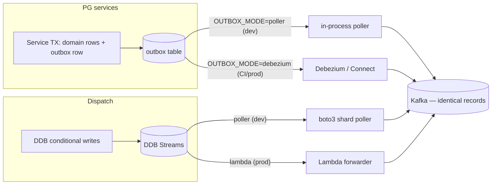

# Local Development Guide

**Audience**: engineers onboarding to SmartFoodOps Part A.
**Goal** (from the design plan §11): `git clone && make up && make seed` on a 16 GB laptop gives a working end-to-end order flow in under 15 minutes, with an honest path to run only what you're touching.

Related: [repo-structure.md](repo-structure.md) · `docs/ARCHITECTURE.md` · plan §11.

---

## 1. Prerequisites

| Requirement | Version | Notes |
|---|---|---|
| Docker + Compose v2 | recent | Allocate **≥6 GB** RAM to Docker for daily slim mode, **≥10 GB** to run the full stack (full stack ≈ 8–9 GB) |
| `uv` | latest | Python package/workspace manager — the only Python tooling you install globally |
| Python | 3.12 (proposed) | `uv` fetches it automatically; no pyenv needed |
| `make`, `git`, `curl`, `jq` | any | Demo scripts use `curl` + `jq` |
| VS Code (optional) | — | Launch configs for debugpy attach are planned *(W3)* — see §10 |

No AWS account, no credentials. DynamoDB is LocalStack; payments are the mock PSP; Temporal is the dev server.

---

## 2. Quickstart — your first 30 minutes

A numbered walkthrough of the plan's "first 30 minutes". Outputs shown are representative.

**1. Clone and start the core infrastructure (~3 min).**

```console
$ git clone <repo> smartfoodops && cd smartfoodops
$ make up
» starting profile: core (postgres redis kafka schema-registry
  temporal localstack mock-psp nginx)
» creating kafka topics ......... 8/8
» registering avro schemas ...... 8/8
» creating DDB tables from deploy/cdk/tables.py ... 7/7
✔ core up — gateway http://localhost:8080  temporal-ui http://localhost:8233
```

**2. Seed deterministic demo data.**

```console
$ make seed
» apps profile not running — starting it (seeds go through real service APIs)
» cities: Springfield (SPR), Shelbyville (SHE)
» 20 restaurants + menus/modifiers · 50 riders · demo users per role
✔ seed complete (idempotent — safe to re-run)
   customer@demo.smartfood.dev / demo1234demo
```

Seeds exercise the real registration/auth/menu APIs — not SQL inserts — so auth, validation, and the outbox all fire during seeding.

**3. Place an order end-to-end.**

```console
$ ./tools/demo/place-order.sh
» login customer@demo.smartfood.dev  ok (JWT)
» GET /v1/menus/{rid} .............. ok (v3)
» cart + checkout .................. ok
✔ order placed: order_id=c1-01J9GXA7... status=CONFIRMED total=$23.40
```

**4. Watch the saga in Temporal UI.** Open http://localhost:8233 and search for workflow `ord::{order_id}`. You'll see the activity chain: `PriceOrder (local) → ValidateAndReserve → AuthorizePayment → ConfirmOrder`, then the durable wait on the `restaurant_decision` signal — restaurant notification is not an activity; it flows via the Notification consumer of `OrderConfirmed` (action budget, ADR-0018). *(As built, W3: this path is live — the notification service consumes `OrderConfirmed` and materializes the restaurant's "new order" inbox row, surfaced by the polled Alerts bell in the FE header.)*

**5. Bring up observability and find the trace** *(W3 — the `obs` profile and `make up-obs` are not built yet)*.

```console
$ make up-obs        # otel-collector, Jaeger, Prometheus, Grafana (W3)
```

Jaeger (http://localhost:16686) → search tag `order_id={order_id}`. The trace stitches edge-bff → order → Temporal activities → Kafka consumers, because outbox rows carry `traceparent` and the publisher lifts it into Kafka headers.

**6. Inspect the raw event.** `make up-ui` starts Redpanda Console (http://localhost:8085). Browse `orders.events` and open the Avro-decoded `OrderPlaced` fact — note `event_id`, `aggregate_version`, `cell_id: c1`.

**7. Start fake riders and watch dispatch** *(W3 — dispatch and `rider-sim` are not built yet)*.

```console
$ uv run rider-sim --city SPR --riders 10
» 10 riders connected over WS, replaying GPS polylines @1Hz, accept-rate 0.8
```

Place another order (step 3); in Temporal UI the `DeliveryWorkflow` child appears, an offer goes out, a sim rider accepts, and `dispatch.events` shows `RiderAssigned`.

**8. Stream live tracking as the customer would** *(W3 — tracking-gateway is not built yet)*.

```console
$ curl -N localhost:8080/sse/track/{order_id}
event: snapshot   data: {"stage":"PICKED_UP","eta_min":9,...}
event: location   data: {"lat":...,"lng":...}        # every 2s en-route
```

(The real client first calls `POST /v1/track/ticket`; the demo script handles the ticket for you.)

**9. Break things on purpose.**

```console
$ make chaos                       # sets PSP failure knobs high, see §9 (make chaos-off restores)
$ uv run order-gen --rate 1 --card-mix "ok:0.2,tok_decline:0.4,tok_timeout:0.4"   # (W3 — order-gen
                                   # is not built yet; until then, re-run make demo or pay with
                                   # tok_decline/tok_timeout by hand)
```

In Temporal UI, watch failed workflows run their compensation stack (`VoidAuthorization → ReleaseReservation → CANCELLED`) instead of corrupting state.

**10. Start real work in slim mode.**

```console
$ make dev SVC=order
```

Runs the order service natively on your host with hot reload against the compose infra. This is the daily loop — next section.

---

## 3. Compose profiles & port map

Profiles: **core** (infra — rabbitmq joined in S10), **apps** (services), **ui** (consoles), plus **cdc** *(Debezium, deliberately split out at 1–1.5 GB)* and **obs**.

| Profile | Component | Host port | Notes |
|---|---|---|---|
| core | postgres:15 | 5432 | One database per service, created by `initdb/` scripts |
| core | redis:7 | 6380 | Host port (6379 squatted locally); in-network `redis:6379`. Single node; identical keys/TTLs/Lua as prod |
| core | rabbitmq:3-management | 5672 / **15672** | Celery broker (S10 receipts). Management UI at :15672 (guest/guest) — watch the `receipts.render` / `receipts.send` queues live |
| core | Kafka (KRaft, single broker) | **19092** | Dual listeners: `kafka:9092` in-network, `localhost:19092` from host — see §12 |
| core | Confluent Schema Registry | **8086** (host) → 8081 (in-network) | host-remapped: another local project intermittently serves 8081 on this machine; services use `http://schema-registry:8081` unchanged |
| core | Temporal dev server + UI | 7233 / 8233 | SQLite-persisted history (survives restarts) |
| core | LocalStack (DynamoDB + Streams) | 4566 | |
| core | mock-psp | 9080 | Failure-injection knobs, §9 |
| core | mock-mailer | 9081 | Receipt emails land here: `GET /mailer/outbox`. Knobs: `FAIL_RATE`, `POST /admin/fail_next`, magic `*@bounce.invalid` |
| apps | receipt-renderer / receipt-sender | 9109 / 9110 (in-network) | Celery workers (S10) — bare /metrics ports, scraped by Prometheus |
| core | nginx gateway (emulates ALB path rules) | **8080** | The single client entrypoint |
| cdc *(W3)* | Kafka Connect + Debezium | 8083 | Only needed for `OUTBOX_MODE=debezium` (§5) |
| obs *(W3)* | otel-collector | 4317 | OTLP gRPC |
| obs *(W3)* | Jaeger | 16686 | |
| obs *(W3)* | Prometheus | 9090 | |
| obs *(W3)* | Grafana | 3000 | |
| ui | Redpanda Console | 8085 | Kafka + Schema Registry browser |
| ui | Redis Commander | 8087 | Redis browser — sidebar entry per DB: db0 caches/tickets, db1 edge rate-limit, db2 rider world (`sfo:*`) |
| ui | DynamoDB Admin | 8088 | LocalStack DDB browser — `sfo_rider_state`, `sfo_deliveries`; items editable (dev feature) |

**App services** (profile `apps`) — each service's debugpy port is **app port + 1000**:

| Service | Port | Service | Port | Service | Port |
|---|---|---|---|---|---|
| edge-bff | 8000 | inventory | 8005 | notification | 8008 |
| identity | 8001 | order | 8006 | analytics | 8009 |
| catalog | 8002 | payment | 8007 | rider-gateway | 8010 |
| dispatch | 8012 | | | | |

(8011 stays reserved for a dedicated tracking-gateway if SSE ever leaves
the order service; dispatch took 8012 — analytics claimed 8009 in W3.)

Ports 8003 and 8004 are deliberately unused — the cart is client state (ADR-0017), and pricing is a library (`libs/smartfood-pricing`, ADR-0015) running inside the Order workers and the `/v1/quote` endpoint.

Clients always target `http://localhost:8080` (nginx). Its path rules mirror the ALB exactly: `/ws/rider/*` → rider-gateway, `/sse/track/*` → tracking-gateway, default → edge-bff. Compose DNS names match ECS Service Connect names (`http://order.sfo.local:8000` pattern), so **zero code differs between compose and ECS**.

**API docs for frontend work**: `http://localhost:8080/docs` (Swagger UI) / `http://localhost:8080/openapi.json` — the edge serves a **merged** spec: every service's OpenAPI, filtered to exactly what the gateway's allowlist routes (so `/v1/internal/*` never appears, and auth-required operations carry the bearer scheme). Cached once complete; `?refresh=1` rebuilds after a service adds endpoints. Per-service docs (`:8001/docs`, `:8002/docs`) remain for service-local debugging only — the FE contract is the merged one.

---

## 4. Slim mode — the daily workflow

The full stack is ≈ 8–9 GB, so **slim mode is the default**, not the exception. Async coupling means most services don't need their neighbors running — Kafka retains the facts, and consumers catch up whenever they start.

| Command | What it does | RAM |
|---|---|---|
| `make up` | `core` profile only + topics/schemas/tables | ~3 GB |
| `make dev SVC=order` | Run one service **natively on the host**, `uvicorn --reload`, wired to compose infra | +~150 MB |
| `make up-apps ONLY="payment inventory"` | Add just the containerized neighbors your flow needs | ~4 GB typical |
| `make up-m2` | The W2 order-lifecycle set: core + temporal, mock-psp, identity, catalog, edge-bff, inventory, order, order-worker, payment (~6–7 GB) |
| `make up-m3` | The `up-m2` set + notification, analytics, and the receipts pipeline (rabbitmq, localstack S3, mock-mailer, receipt-renderer, receipt-sender) |
| `make up-m4` | The `up-m3` set + dispatch and rider-gateway (DynamoDB tables self-create on LocalStack); `make riders` starts simulated couriers |
| `make up-cdc` *(W3)* | Add the `cdc` profile (Kafka Connect + Debezium) — needed for `OUTBOX_MODE=debezium` (§5) | +1–1.5 GB |
| `make up-obs` *(W3)* | Add the `obs` profile (otel-collector, Jaeger, Prometheus, Grafana) | — |
| `make up-ui` | Add the `ui` profile (Redpanda Console) | — |
| `make up-full` | Everything (all profiles) | 8–9 GB |
| `make down` / `make nuke` | Stop / stop + destroy volumes | — |

`make dev SVC=x` details:

- Loads the service's env (compose endpoints: `localhost:5432`, `localhost:19092`, `localhost:4566`, …) and runs `uv run uvicorn` with `--reload` watching both `services/x/app/` and `libs/` — **editing a shared lib hot-reloads every native service consuming it**.
- If the same service is running containerized, `make dev` stops that container; the nginx gateway falls back to `host.docker.internal:<port>` for that upstream so routed traffic reaches your host process (proposed mechanism).
- Typical order-path session: `make up && make up-apps ONLY="edge-bff identity catalog inventory payment" && make dev SVC=order`. Pricing needs no container — editing `libs/smartfood-pricing` hot-reloads inside the natively-run Order workers, which makes pricing rules unusually pleasant to iterate on.

Other daily targets: `make logs SVC=payment`, `make psql DB=order_db`, `make test`, `make cov` (adds the enforced 100% coverage gate), `make demo`, `make chaos` / `make chaos-off`. Planned *(W3)*: `make test-int`, `make bootstrap` (regenerate local JWT keypair). (The once-planned `make ddb` shell was superseded by the DynamoDB Admin UI — `make up-ui`, :8088.)

---

## 5. Dual-mode plumbing: OUTBOX_MODE and DISPATCH_FORWARDER

Two pieces of production plumbing are too heavy or too flaky to demand on every laptop. Both ship with a lightweight dev mode and a production mode, selected by env var. **Both modes emit byte-identical Kafka records** — same topic, key, Avro envelope, per-aggregate ordering — and CI runs the production mode to enforce parity, so you cannot drift.

| Knob | Dev default | Prod/CI mode | Why |
|---|---|---|---|
| `OUTBOX_MODE` | `poller` — in-process asyncio poller inside `smartfood-outbox` (`SELECT … FOR UPDATE SKIP LOCKED`) | `debezium` — Kafka Connect + Debezium reads the PG WAL (`cdc` profile) | Debezium/Connect alone costs 1–1.5 GB and adds startup latency; the poller keeps at-least-once + per-aggregate ordering |
| `DISPATCH_FORWARDER` | `poller` — boto3 shard-iterator poller reading LocalStack DDB Streams | `lambda` — DDB Streams → Lambda forwarder | LocalStack's Streams→Lambda trigger is unreliable; the poller reads the same stream directly |



Rules of thumb:

- Day-to-day: leave both on `poller`; you never start the `cdc` profile.
- Touching the outbox library, Debezium SMTs, or envelope code *(W3 — the `cdc` profile and `make up-cdc` are not built yet)*: `make up-cdc && OUTBOX_MODE=debezium make dev SVC=order` and verify both modes locally before pushing — CI will run `debezium` regardless.
- **No service ever writes Kafka directly** in either mode — producers are outbox/forwarder only. The dual-write gap stays closed on laptops too.

---

## 6. LocalStack & DynamoDB table init

Table definitions live as **plain Python dicts in `deploy/cdk/tables.py`** — the single source of truth:

- On AWS, real CDK constructs consume the dicts.
- Locally, `tools/seed/init_tables.py` feeds the same dicts to `boto3.create_table` against `localhost:4566` (invoked by `make up`).

No `cdklocal`, no CloudFormation emulation — both are slow and flaky, and the dict indirection removes the need. Adding a table = edit `tables.py`, `make nuke && make up` (or run `init_tables.py` directly; it skips existing tables). Tables created locally (deployed names, per the convention in [service-ownership.md](service-ownership.md)): `sfo-order-history`, `sfo-order-tracking`, `sfo-dispatch-deliveries`, `sfo-dispatch-rider-state`, `sfo-rider-locations`. *(This section is W3+ machinery — `tables.py`/`init_tables.py` land with dispatch, the first DynamoDB owner; today localstack runs with no tables. The planned `sfo-notification-log` is gone for good: notification shipped on PostgreSQL with natural-key dedupe, ADR-0021/service-ownership.)*

---

## 7. Seeding & demo credentials

`make seed` is **deterministic and idempotent**: all IDs are ULIDs from a seeded RNG, stable across `make nuke && make up && make seed`, and the ID constants are exported as a package for use in tests. Seeds go through the real service APIs (auth, validation, outbox all exercised). Data set: two cities — Springfield (`SPR`) and Shelbyville (`SHE`) — 20 restaurants with menus/modifiers, 50 riders on realistic street grids, and one demo user per role:

| User | Password | Role | Scope |
|---|---|---|---|
| `customer@demo.smartfood.dev` | `demo1234demo` | customer | — |
| `owner-<city>-<restaurant-slug>@demo.smartfood.dev` | `demo1234demo` | restaurant_admin (via self-serve grant) | their seeded restaurant |
| `rider@demo.local` (proposed) | `demo1234` | rider | first seeded SPR rider |
| `admin@demo.local` (proposed) | `demo1234` | system_admin | all (mutations audited) |

---

## 8. Simulators *(W3 — neither simulator is built yet; they arrive with dispatch)*

Dispatch is undevelopable without fake phones. Both simulators will be `tools/` workspace packages, run with `uv run`.

**`rider-sim`** — N WebSocket riders replaying GPS polylines at 1 Hz through the real rider-gateway, auto-accepting offers:

```console
$ uv run rider-sim --city SPR --riders 50 --accept-rate 0.8 --speed 5x
```

Use `--accept-rate 0` to exercise the offer cascade (15s/12s/12s), radius widening (3→6 km), and the surge/manual-dispatch escalations. Use `--speed 5x` to compress delivery timelines while debugging geofence arrival (`rider_arrived` at 75 m).

**`order-gen`** — real orders through the BFF using seeded-customer JWTs; doubles as the local load generator:

```console
$ uv run order-gen --rate 5 --card-mix "ok:0.9,tok_decline:0.05,tok_timeout:0.05"
```

Typical pairing for a realistic local world: `rider-sim --city SPR --riders 20` + `order-gen --rate 2`.

---

## 9. Mock PSP failure injection

The payment service talks to a hexagonal `PaymentGateway` port; locally the adapter is **mock-psp** (`:9080`). Two injection styles:

**Probabilistic env knobs** (set on the mock-psp container; good for soak/chaos):

| Env var | Effect |
|---|---|
| `DECLINE_RATE` | Fraction of authorizations declined |
| `TIMEOUT_RATE` | Fraction that hang past the activity timeout |
| `UNKNOWN_OUTCOME_RATE` | Fraction returning ambiguous outcome — later resolved via webhook, exercising reconciliation locally |
| `LATENCY_MS_P50` / `LATENCY_MS_P99` | Latency shaping |

**Magic card tokens** (deterministic; good for tests and demos): pay with `tok_decline`, `tok_timeout`, or `tok_unknown` and that transaction fails that way, regardless of the knobs — e.g. `CARD_TOKEN=tok_decline make demo`. (`order-gen --card-mix` will drive these at volume — *W3*.)

The invariant this machinery exists to prove (and CI asserts): **N injected timeouts must still yield ≤1 authorization per order** — the `{order_id}:auth` idempotency key and the read-before-execute handler make unknown-outcome retries safe.

---

## 10. Debugging

- **Hot reload**: containerized apps mount `app/` + `libs/` and run `uvicorn --reload`; native (`make dev`) does the same. A lib edit reloads every consumer.
- **debugpy**: start any service with `DEBUGPY=1` (works for both `make dev` and containers) — it listens on **app port + 1000** (order = 9006). A checked-in `.vscode/launch.json` with an attach configuration per service is planned *(W3)*; until then add your own attach config pointing at the port.
- **Temporal**: the dev server persists SQLite history, so **workers replay in-flight workflows after restart** — you can kill and restart the order service mid-saga and watch it resume. Use the UI (8233) to inspect activity failures/retries and to send signals manually (e.g. fake a `restaurant_decision`).
- **Data poking**: `make psql DB=order_db` (also `payment_db`, `catalog_db`, …), Redpanda Console (8085) for topics + schemas, `make logs SVC=x` for container logs. DynamoDB Admin (8088) browses LocalStack's tables and Redis Commander (8087) all three Redis DBs — both start with `make up-ui`.
- **Tracing locally** *(W3 — needs the `obs` profile / `make up-obs`)*: find any request in Jaeger by `order_id` tag; edge-bff stamps `X-Request-ID` and the root span.

---

## 11. Testing & chaos suite

| Target | Scope | Infra needed |
|---|---|---|
| `make test` / `make cov` | Unit tests, all packages; `cov` adds the **enforced 100% coverage gate** (also what CI runs) | none |
| `make cov` — workflow tier | Temporal `WorkflowEnvironment` **time-skipping** tests: every workflow branch exercised, timers skipped not slept — a 10-minute restaurant-decision timeout runs in milliseconds | none |
| `make demo` + `tools/demo/verify-live.sh` | **Manual live verification** against the real stack: `place-order.sh` drives the happy path to SETTLED; `verify-live.sh` is the cancel-path tier — customer cancel from PREPARING (202 → `customer_cancelled`) and owner reject (→ `restaurant_rejected`), asserting `cancel_reason` both times | `make up-m2` + `make seed` |
| `make test-int` *(W3)* | Integration tests against compose (`core` + `cdc`, **`OUTBOX_MODE=debezium`** — same file CI runs) | compose |
| `make test-int` — consumer scaffold *(W3)* | Per-consumer **duplicate-delivery + poison-message** tests, scaffolded by the `smartfood_kafka.testing` helpers *(As built, W3: shipped — `StubKafkaConsumer`, `StubSerde`, `RecordingHandler`, `StubDlq`, `StubMessage`)*; the scaffold ships with every new consumer, the asserts are yours | compose |
| `make chaos` / `make chaos-off` | Raise/restore the mock-psp failure knobs and self-verify them on the container; drive orders and watch compensations manually (an automated suite + nightly CI run is W3) | compose |

Two notes on tiers: **contract tests** (DTO/OpenAPI snapshot tests, so a changed response shape is a reviewed diff, never a silent client break) are planned *(W3)*. The **coverage gate is already at 100%** across all workspace packages — enforced by `make cov` (`--cov-fail-under=100` + `fail_under` in the root pyproject) and by CI, not the once-planned 85%-at-W3 staging.

The chaos suite's three headline scenarios (plan §11):

1. **Double-deliver every event** → payment ledger still balances, no duplicate notifications (proves consumer idempotency via `processed_events`).
2. **`TIMEOUT_RATE=1.0` window** → every affected workflow compensates (`Void → Release → CANCELLED`); none stuck, none corrupt.
3. **Kill Kafka Connect mid-run** → outbox drains with no gaps or reorders once it returns.

Plus the caching chaos check (plan §7): stop Redis mid-suite — checkout must still succeed and the money path must serve no 5xx (caches degrade, never corrupt).

Integration tests also assert the BFF's `Cache-Control`/`ETag`/`Vary` headers, since CloudFront is absent locally by design.

---

## 11.5 Local port conflicts (resolved)

Everything now runs on the canonical ports. Three things on this machine previously squatted on them and were stopped: Homebrew `postgresql@14`/`@17` (→ `brew services start postgresql@14` to revive), Homebrew `redis` (→ `brew services start redis`), a hand-run caddy proxy on 8000, and another Docker project's Redis (`docker start local-deployment-redis-1` to revive). If any of them comes back, our compose bring-up will fail with "port already allocated" — that's the tell.

## 12. Troubleshooting

| Symptom | Cause | Fix |
|---|---|---|
| `make up` fails: *port already in use* (8080, 5432, 6379…) | Another local PG/Redis/nginx, or a previous stack | `make down` first; find the squatter with `lsof -i :8080`; host ports are overridable via `deploy/compose/.env` (proposed) |
| Table init fails / `ResourceNotFoundException` on DDB calls | LocalStack not ready yet — init raced its startup | Check `curl localhost:4566/_localstack/health`; re-run `make up` (idempotent) or `uv run tools/seed/init_tables.py` |
| Kafka client connects, then times out on produce/consume or dials a weird host | **Listener confusion**: from your host use `localhost:19092`; from inside compose use `kafka:9092`. Using the wrong one "connects" to the bootstrap but then follows an unreachable advertised listener | Host tools/`make dev` → `localhost:19092`; containers → `kafka:9092`. Never mix. |
| Temporal: *nondeterminism* / *workflow task failed: history mismatch* after editing workflow code | Dev server **persists** SQLite history; your edited workflow code no longer replays the old history deterministically | In dev: terminate the in-flight workflow in the UI (or `make nuke` for a clean slate) and re-place the order. For real changes shipping to running workflows, use Temporal versioning/`patched()` |
| Events never reach Kafka (with `cdc` profile) | Debezium connector not registered/failed | `curl localhost:8083/connectors?expand=status`; or drop back to `OUTBOX_MODE=poller` while you work |
| `make seed` errors with connection refused | A service crashed during the auto-started `apps` profile (seeds call real APIs) | `make logs SVC=<failing>` then re-run `make seed` (idempotent) |
| Everything is slow / OOM-killed containers | Full stack on default Docker RAM | Full stack needs 8–9 GB in Docker; or work slim (§4) |
| SSE curl shows nothing | curl buffering | Use `curl -N`; verify a tracking ticket was issued (demo script does this) |
| 401s from services when calling them directly | You bypassed the edge — services trust `X-Auth-*` headers stamped by edge-bff and are not meant to be called raw | Go through `localhost:8080`; for isolated service testing use the test helpers that stamp headers |

---

*Anything here marked (proposed) is a local-dev detail not fixed by the design plan; treat the plan as authoritative if they ever diverge.*

## CDC lane (S6): Debezium instead of the poller

The dev poller and Debezium are two implementations of the same contract —
"outbox rows become Kafka events, exactly-once-ish, ordered per aggregate".
The poller is the dev default; the CDC lane exists to prove the production
path and to carry the one thing flows.md diagram 5 promises across it: the
`traceparent` column riding into a Kafka HEADER, so the async hop stays
stitched in Jaeger.

```bash
make up-cdc          # postgres already runs wal_level=logical; starts Connect (:8083)
make cdc-register    # PUT the order-outbox connector (idempotent)
```

Events stream to the PARALLEL namespace `cdc.c1.orders.events` (watch it in
the Kafka console :8085 — headers included). Parallel on purpose: the live
topics carry the poller's Avro DomainEvent envelope under Schema Registry
subjects, and Debezium's EventRouter emits a different value shape — routing
it at the same subjects would poison SR compatibility for every consumer.
The cutover (making `outbox_mode=debezium` real end-to-end) needs one of:
  1. a custom SMT that rebuilds the exact DomainEvent Avro envelope, or
  2. moving consumers' serde to Connect-managed schemas (a coordinated
     migration of every consumer group).
Both are deployment-scale changes, documented here so the choice is made
deliberately — not smuggled in at 4am.
