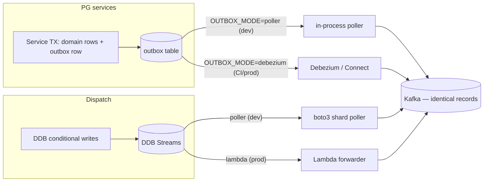

# Local Development Guide

**Audience**: engineers onboarding to SmartFoodOps Part A.
**Goal** (from the design plan §11): `git clone && make up && make seed` on a 16 GB laptop gives a working end-to-end order flow in under 15 minutes, with an honest path to run only what you're touching.

Related: [repo-structure.md](repo-structure.md) · `docs/ARCHITECTURE.md` · plan §11.

---

## 1. Prerequisites

| Requirement | Version | Notes |
|---|---|---|
| Docker + Compose v2 | recent | Allocate **≥6 GB** RAM to Docker for daily slim mode, **≥10 GB** to run the full stack (full stack ≈ 8–9 GB) |
| `uv` | latest | Python package/workspace manager — the only Python tooling you install globally |
| Python | 3.12 (proposed) | `uv` fetches it automatically; no pyenv needed |
| `make`, `git`, `curl`, `jq` | any | Demo scripts use `curl` + `jq` |
| VS Code (optional) | — | Checked-in launch configs for debugpy attach (§10) |

No AWS account, no credentials. DynamoDB is LocalStack; payments are the mock PSP; Temporal is the dev server.

---

## 2. Quickstart — your first 30 minutes

A numbered walkthrough of the plan's "first 30 minutes". Outputs shown are representative.

**1. Clone and start the core infrastructure (~3 min).**

```console
$ git clone <repo> smartfoodops && cd smartfoodops
$ make up
» generating local JWT keypair (make bootstrap)        # auto-run on first up (proposed)
» starting profile: core (postgres redis rabbitmq kafka schema-registry
  temporal localstack mock-psp nginx)
» creating kafka topics ......... 8/8
» registering avro schemas ...... 8/8
» creating DDB tables from deploy/cdk/tables.py ... 7/7
✔ core up — gateway http://localhost:8080  temporal-ui http://localhost:8233
```

**2. Seed deterministic demo data.**

```console
$ make seed
» apps profile not running — starting it (seeds go through real service APIs)
» cities: Springfield (SPR), Shelbyville (SHE)
» 20 restaurants + menus/modifiers · 50 riders · demo users per role
✔ seed complete (idempotent — safe to re-run)
   customer@demo.local / demo1234
```

Seeds exercise the real registration/auth/menu APIs — not SQL inserts — so auth, validation, and the outbox all fire during seeding.

**3. Place an order end-to-end.**

```console
$ ./tools/demo/place-order.sh
» login customer@demo.local ........ ok (JWT)
» GET /v1/menus/{rid} .............. ok (v3)
» cart + checkout .................. ok
✔ order placed: order_id=c1-01J9GXA7... status=CONFIRMED total=$23.40
```

**4. Watch the saga in Temporal UI.** Open http://localhost:8233 and search for workflow `ord::{order_id}`. You'll see the activity chain: `PriceOrder → ValidateAndReserve → AuthorizePayment → ConfirmOrder → NotifyRestaurant`, then the durable wait on the `restaurant_decision` signal.

**5. Bring up observability and find the trace.**

```console
$ make up-obs        # otel-collector, Jaeger, Prometheus, Grafana
```

Jaeger (http://localhost:16686) → search tag `order_id={order_id}`. The trace stitches edge-bff → order → Temporal activities → Kafka consumers, because outbox rows carry `traceparent` and the publisher lifts it into Kafka headers.

**6. Inspect the raw event.** `make up-ui` (proposed target for the `ui` profile) starts Redpanda Console (http://localhost:8085). Browse `orders.events` and open the Avro-decoded `OrderPlaced` fact — note `event_id`, `aggregate_version`, `cell_id: c1`.

**7. Start fake riders and watch dispatch.**

```console
$ uv run rider-sim --city SPR --riders 10
» 10 riders connected over WS, replaying GPS polylines @1Hz, accept-rate 0.8
```

Place another order (step 3); in Temporal UI the `DeliveryWorkflow` child appears, an offer goes out, a sim rider accepts, and `dispatch.events` shows `RiderAssigned`.

**8. Stream live tracking as the customer would.**

```console
$ curl -N localhost:8080/sse/track/{order_id}
event: snapshot   data: {"stage":"PICKED_UP","eta_min":9,...}
event: location   data: {"lat":...,"lng":...}        # every 2s en-route
```

(The real client first calls `POST /v1/track/ticket`; the demo script handles the ticket for you.)

**9. Break things on purpose.**

```console
$ make chaos                       # sets PSP failure knobs high, see §9
$ uv run order-gen --rate 1 --card-mix "ok:0.2,tok_decline:0.4,tok_timeout:0.4"
```

In Temporal UI, watch failed workflows run their compensation stack (`VoidAuthorization → ReleaseReservation → CANCELLED`) instead of corrupting state.

**10. Start real work in slim mode.**

```console
$ make dev SVC=order
```

Runs the order service natively on your host with hot reload against the compose infra. This is the daily loop — next section.

---

## 3. Compose profiles & port map

Profiles: **core** (infra), **cdc** (Debezium — deliberately split out, it costs 1–1.5 GB), **obs**, **apps**, **ui**.

| Profile | Component | Host port | Notes |
|---|---|---|---|
| core | postgres:15 | 5432 | One database per service, created by `initdb/` scripts |
| core | redis:7 | 6379 | Single node; identical keys/TTLs/Lua as prod |
| core | rabbitmq:3-management | 5672 / 15672 | Celery broker / management UI |
| core | Kafka (KRaft, single broker) | **19092** | Dual listeners: `kafka:9092` in-network, `localhost:19092` from host — see §12 |
| core | Confluent Schema Registry | 8081 | |
| core | Temporal dev server + UI | 7233 / 8233 | SQLite-persisted history (survives restarts) |
| core | LocalStack (DynamoDB + Streams) | 4566 | |
| core | mock-psp | 9080 | Failure-injection knobs, §9 |
| core | nginx gateway (emulates ALB path rules) | **8080** | The single client entrypoint |
| cdc | Kafka Connect + Debezium | 8083 | Only needed for `OUTBOX_MODE=debezium` (§5) |
| obs | otel-collector | 4317 | OTLP gRPC |
| obs | Jaeger | 16686 | |
| obs | Prometheus | 9090 | |
| obs | Grafana | 3000 | |
| ui | Redpanda Console | 8085 | Kafka + Schema Registry browser |

**App services** (profile `apps`) — each service's debugpy port is **app port + 1000**:

| Service | Port | Service | Port | Service | Port |
|---|---|---|---|---|---|
| edge-bff | 8000 | inventory | 8005 | notification | 8009 |
| identity | 8001 | order | 8006 | rider-gateway | 8010 |
| catalog | 8002 | payment | 8007 | tracking-gateway | 8011 |
| dispatch | 8008 | analytics | 8012 | | |

Ports 8003 and 8004 are deliberately unused — the cart is client state (ADR-0017), and pricing is a library (`libs/smartfood-pricing`, ADR-0015) running inside the Order workers and the `/v1/quote` endpoint.

Clients always target `http://localhost:8080` (nginx). Its path rules mirror the ALB exactly: `/ws/rider/*` → rider-gateway, `/sse/track/*` → tracking-gateway, default → edge-bff. Compose DNS names match ECS Service Connect names (`http://order.sfo.local:8000` pattern), so **zero code differs between compose and ECS**.

---

## 4. Slim mode — the daily workflow

The full stack is ≈ 8–9 GB, so **slim mode is the default**, not the exception. Async coupling means most services don't need their neighbors running — Kafka retains the facts, and consumers catch up whenever they start.

| Command | What it does | RAM |
|---|---|---|
| `make up` | `core` profile only + topics/schemas/tables | ~3 GB |
| `make dev SVC=order` | Run one service **natively on the host**, `uvicorn --reload`, wired to compose infra | +~150 MB |
| `make up-apps ONLY="payment inventory"` | Add just the containerized neighbors your flow needs | ~4 GB typical |
| `make up-cdc` | Add the `cdc` profile (Kafka Connect + Debezium) — needed for `OUTBOX_MODE=debezium` (§5) | +1–1.5 GB |
| `make up-obs` | Add the `obs` profile (otel-collector, Jaeger, Prometheus, Grafana) | — |
| `make up-ui` | Add the `ui` profile (Redpanda Console) | — |
| `make up-full` | Everything (all profiles) | 8–9 GB |
| `make down` / `make nuke` | Stop / stop + destroy volumes | — |

`make dev SVC=x` details:

- Loads the service's env (compose endpoints: `localhost:5432`, `localhost:19092`, `localhost:4566`, …) and runs `uv run uvicorn` with `--reload` watching both `services/x/app/` and `libs/` — **editing a shared lib hot-reloads every native service consuming it**.
- If the same service is running containerized, `make dev` stops that container; the nginx gateway falls back to `host.docker.internal:<port>` for that upstream so routed traffic reaches your host process (proposed mechanism).
- Typical order-path session: `make up && make up-apps ONLY="edge-bff identity catalog inventory payment" && make dev SVC=order`. Pricing needs no container — editing `libs/smartfood-pricing` hot-reloads inside the natively-run Order workers, which makes pricing rules unusually pleasant to iterate on.

Other daily targets: `make logs SVC=payment`, `make psql DB=orders`, `make ddb` (DynamoDB shell against LocalStack), `make test`, `make test-int`, `make chaos`, `make bootstrap` (regenerate local JWT keypair).

---

## 5. Dual-mode plumbing: OUTBOX_MODE and DISPATCH_FORWARDER

Two pieces of production plumbing are too heavy or too flaky to demand on every laptop. Both ship with a lightweight dev mode and a production mode, selected by env var. **Both modes emit byte-identical Kafka records** — same topic, key, Avro envelope, per-aggregate ordering — and CI runs the production mode to enforce parity, so you cannot drift.

| Knob | Dev default | Prod/CI mode | Why |
|---|---|---|---|
| `OUTBOX_MODE` | `poller` — in-process asyncio poller inside `smartfood-outbox` (`SELECT … FOR UPDATE SKIP LOCKED`) | `debezium` — Kafka Connect + Debezium reads the PG WAL (`cdc` profile) | Debezium/Connect alone costs 1–1.5 GB and adds startup latency; the poller keeps at-least-once + per-aggregate ordering |
| `DISPATCH_FORWARDER` | `poller` — boto3 shard-iterator poller reading LocalStack DDB Streams | `lambda` — DDB Streams → Lambda forwarder | LocalStack's Streams→Lambda trigger is unreliable; the poller reads the same stream directly |



Rules of thumb:

- Day-to-day: leave both on `poller`; you never start the `cdc` profile.
- Touching the outbox library, Debezium SMTs, or envelope code: `make up-cdc && OUTBOX_MODE=debezium make dev SVC=order` and verify both modes locally before pushing — CI will run `debezium` regardless.
- **No service ever writes Kafka directly** in either mode — producers are outbox/forwarder only. The dual-write gap stays closed on laptops too.

---

## 6. LocalStack & DynamoDB table init

Table definitions live as **plain Python dicts in `deploy/cdk/tables.py`** — the single source of truth:

- On AWS, real CDK constructs consume the dicts.
- Locally, `tools/seed/init_tables.py` feeds the same dicts to `boto3.create_table` against `localhost:4566` (invoked by `make up`).

No `cdklocal`, no CloudFormation emulation — both are slow and flaky, and the dict indirection removes the need. Adding a table = edit `tables.py`, `make nuke && make up` (or run `init_tables.py` directly; it skips existing tables). Tables created locally (deployed names, per the convention in [service-ownership.md](service-ownership.md)): `sfo-order-history`, `sfo-order-tracking`, `sfo-dispatch-deliveries`, `sfo-dispatch-rider-state`, `sfo-rider-locations`, `sfo-notification-log`.

---

## 7. Seeding & demo credentials

`make seed` is **deterministic and idempotent**: all IDs are ULIDs from a seeded RNG, stable across `make nuke && make up && make seed`, and the ID constants are exported as a package for use in tests. Seeds go through the real service APIs (auth, validation, outbox all exercised). Data set: two cities — Springfield (`SPR`) and Shelbyville (`SHE`) — 20 restaurants with menus/modifiers, 50 riders on realistic street grids, and one demo user per role:

| User | Password | Role | Scope |
|---|---|---|---|
| `customer@demo.local` | `demo1234` | customer | — |
| `restaurant@demo.local` (proposed) | `demo1234` | restaurant_admin | first seeded SPR restaurant |
| `rider@demo.local` (proposed) | `demo1234` | rider | first seeded SPR rider |
| `admin@demo.local` (proposed) | `demo1234` | system_admin | all (mutations audited) |

---

## 8. Simulators

Dispatch is undevelopable without fake phones. Both simulators are `tools/` workspace packages, run with `uv run`.

**`rider-sim`** — N WebSocket riders replaying GPS polylines at 1 Hz through the real rider-gateway, auto-accepting offers:

```console
$ uv run rider-sim --city SPR --riders 50 --accept-rate 0.8 --speed 5x
```

Use `--accept-rate 0` to exercise the offer cascade (15s/12s/12s), radius widening (3→6 km), and the surge/manual-dispatch escalations. Use `--speed 5x` to compress delivery timelines while debugging geofence arrival (`rider_arrived` at 75 m).

**`order-gen`** — real orders through the BFF using seeded-customer JWTs; doubles as the local load generator:

```console
$ uv run order-gen --rate 5 --card-mix "ok:0.9,tok_decline:0.05,tok_timeout:0.05"
```

Typical pairing for a realistic local world: `rider-sim --city SPR --riders 20` + `order-gen --rate 2`.

---

## 9. Mock PSP failure injection

The payment service talks to a hexagonal `PaymentGateway` port; locally the adapter is **mock-psp** (`:9080`). Two injection styles:

**Probabilistic env knobs** (set on the mock-psp container; good for soak/chaos):

| Env var | Effect |
|---|---|
| `DECLINE_RATE` | Fraction of authorizations declined |
| `TIMEOUT_RATE` | Fraction that hang past the activity timeout |
| `UNKNOWN_OUTCOME_RATE` | Fraction returning ambiguous outcome — later resolved via webhook, exercising reconciliation locally |
| `LATENCY_MS_P50` / `LATENCY_MS_P99` | Latency shaping |

**Magic card tokens** (deterministic; good for tests and demos): pay with `tok_decline`, `tok_timeout`, or `tok_unknown` and that transaction fails that way, regardless of the knobs. `order-gen --card-mix` drives these.

The invariant this machinery exists to prove (and CI asserts): **N injected timeouts must still yield ≤1 authorization per order** — the `{order_id}:auth` idempotency key and the read-before-execute handler make unknown-outcome retries safe.

---

## 10. Debugging

- **Hot reload**: containerized apps mount `app/` + `libs/` and run `uvicorn --reload`; native (`make dev`) does the same. A lib edit reloads every consumer.
- **debugpy**: start any service with `DEBUGPY=1` (works for both `make dev` and containers) — it listens on **app port + 1000** (order = 9006). Checked-in `.vscode/launch.json` has an attach configuration per service; set breakpoints, F5, pick the service.
- **Temporal**: the dev server persists SQLite history, so **workers replay in-flight workflows after restart** — you can kill and restart the order service mid-saga and watch it resume. Use the UI (8233) to inspect activity failures/retries and to send signals manually (e.g. fake a `restaurant_decision`).
- **Data poking**: `make psql DB=orders` (also `payments`, `catalog`, …), `make ddb` for LocalStack DynamoDB, Redpanda Console (8085) for topics + schemas, `make logs SVC=x` for container logs.
- **Tracing locally**: `make up-obs` then find any request in Jaeger by `order_id` tag; edge-bff stamps `X-Request-ID` and the root span.

---

## 11. Testing & chaos suite

| Target | Scope | Infra needed |
|---|---|---|
| `make test` | Unit tests, all packages (`uv run pytest` per workspace member) | none |
| `make test-int` | Integration tests against compose (`core` + `cdc`, **`OUTBOX_MODE=debezium`** — same file CI runs) | compose |
| `make chaos` | The chaos suite, runnable locally; CI runs it nightly | compose |

The chaos suite's three headline scenarios (plan §11):

1. **Double-deliver every event** → payment ledger still balances, no duplicate notifications (proves consumer idempotency via `processed_events`).
2. **`TIMEOUT_RATE=1.0` window** → every affected workflow compensates (`Void → Release → CANCELLED`); none stuck, none corrupt.
3. **Kill Kafka Connect mid-run** → outbox drains with no gaps or reorders once it returns.

Plus the caching chaos check (plan §7): stop Redis mid-suite — checkout must still succeed and the money path must serve no 5xx (caches degrade, never corrupt).

Integration tests also assert the BFF's `Cache-Control`/`ETag`/`Vary` headers, since CloudFront is absent locally by design.

---

## 12. Troubleshooting

| Symptom | Cause | Fix |
|---|---|---|
| `make up` fails: *port already in use* (8080, 5432, 6379…) | Another local PG/Redis/nginx, or a previous stack | `make down` first; find the squatter with `lsof -i :8080`; host ports are overridable via `deploy/compose/.env` (proposed) |
| Table init fails / `ResourceNotFoundException` on DDB calls | LocalStack not ready yet — init raced its startup | Check `curl localhost:4566/_localstack/health`; re-run `make up` (idempotent) or `uv run tools/seed/init_tables.py` |
| Kafka client connects, then times out on produce/consume or dials a weird host | **Listener confusion**: from your host use `localhost:19092`; from inside compose use `kafka:9092`. Using the wrong one "connects" to the bootstrap but then follows an unreachable advertised listener | Host tools/`make dev` → `localhost:19092`; containers → `kafka:9092`. Never mix. |
| Temporal: *nondeterminism* / *workflow task failed: history mismatch* after editing workflow code | Dev server **persists** SQLite history; your edited workflow code no longer replays the old history deterministically | In dev: terminate the in-flight workflow in the UI (or `make nuke` for a clean slate) and re-place the order. For real changes shipping to running workflows, use Temporal versioning/`patched()` |
| Events never reach Kafka (with `cdc` profile) | Debezium connector not registered/failed | `curl localhost:8083/connectors?expand=status`; or drop back to `OUTBOX_MODE=poller` while you work |
| `make seed` errors with connection refused | A service crashed during the auto-started `apps` profile (seeds call real APIs) | `make logs SVC=<failing>` then re-run `make seed` (idempotent) |
| Everything is slow / OOM-killed containers | Full stack on default Docker RAM | Full stack needs 8–9 GB in Docker; or work slim (§4) |
| SSE curl shows nothing | curl buffering | Use `curl -N`; verify a tracking ticket was issued (demo script does this) |
| 401s from services when calling them directly | You bypassed the edge — services trust `X-Auth-*` headers stamped by edge-bff and are not meant to be called raw | Go through `localhost:8080`; for isolated service testing use the test helpers that stamp headers |

---

*Anything here marked (proposed) is a local-dev detail not fixed by the design plan; treat the plan as authoritative if they ever diverge.*
